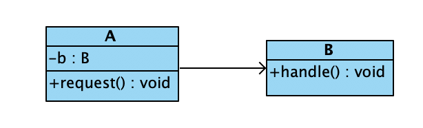

## 设计模式

每一个设计模式描述一个在我们周围不断重复发生的问题，以及该问题的解决方案的核心。这样，你就能一次一次地使用该方案而不必做重复劳动。

### 设计模式简介

GoF《Design Patterns: Elements of Reusable Object-Oriented Software》

| 设计模式 | 释义 | 
| :-----:| :---- | 
|[工厂模式](./src/factory/README.md)|定义一个用于创建对象的接口，让子类决定实例化哪一个类，工厂让一个类的实例化延迟到子类。|
|[抽象工厂模式](./src/abstractfactory)|提供一个创建一系列或者相互依赖的对象的接口，而无须指定他们具体的类。|
|[生成器模式](./src/builder/README.md)|将一个复杂的对象的构建与他的表示进行分离，使用同样的构建过程但可以创建不同的表示。|
|[原型模式](./src/prototype/README.md)|用原型实例指定创建对象的种类，并且通过拷贝这些原型创建新的对象。|
|[单例模式](./src/singleton/README.md)|保证一个类仅有一个实例，并提供一个访问它的全局访问点。|
|[责任链模式](./src/chain/README.md)|使多个对象都有机会处理请求，从而避免请求的发送者和接收者之间的耦合关系。将这些对象连成一条链，并沿着这条链传递该请求，直到有一个对象处理它为止。|
|[命令模式](./src/command/README.md)|将一个请求封装为一个对象，从而使你可用不同的请求对客户进行参数化；对请求排队或记录请求日志，以及支持可撤消的操作。|
|[解释器模式](./src/interpreter/README.md)|给定一个语言，定义它的文法的一种表示，并定义一个解释器，这个解释器使用该表示来解释语言中的句子。|
|[迭代器模式](./src/iterator/README.md)|提供一种方法顺序访问一个聚合对象中的各个元素，而又不需要暴露该对象的内部表示。|
|[中介者模式](./src/mediator/README.md)|用一个中介对象来封装一系列的对象交互。中介者使各对象不需要显示地相互引用，从而使其耦合松散，而且可以独立地改变它们之间的交互。|
|[备忘录模式](./src/memento/README.md)|在不破坏封装性的前提下，捕获一个对象的内部状态，并在该对象之外保存这个状态，这样以后就可将该对象恢复到原先保存的状态。|
|[观察者模式](./src/observer/README.md)|定义对象间的一种一对多的依赖关系，当一个对象的状态发生变化时，所有依赖于它的对象都得到通知并被自动更新。|
|[状态模式](./src/state/README.md)|允许一个对象在其内部状态改变时改变它的行为。对象看起来似乎修改了它的类。|
|[策略模式](./src/strategy/README.md)|定义一系列算法，把它们一个个封装起来，并且使它们可相互替换。本模式使得算法可独立于使用它的客户而变化。|
|[模版方法模式](./src/template/README.md)|定义一个操作中的算法的骨架，而将一些步骤延迟到子类中。模板方法使得子类可以不改变一个算法的结构即可重定义该算法的某些特定步骤。|
|[访问者模式](./src/visitor/README.md)|表示一个作用于某对象结构中的各个元素的操作。它使你可以在不改变各个元素的类的前提下定义作用于这些元素的新操作。 |
|[适配器模式](./src/adapter/README.md)|将一个类的接口转换成客户希望的另外一个接口。Adapter模式使得原本由于接口不兼容而不能一起工作的那些类可以一起工作。|
|[组合模式](./src/composite/README.md)|将对象组合成数形结构以表示“部分-整体”的层次结构。Composite使得用户对单个对象和组合对象的使用具有一致性。|
|[代理模式](./src/proxy/README.md)|为其他对象提供一种代理以控制对这个对象的访问。|
|[享元模式](./src/flyweight/README.md)|运用共享技术有效地支持大量细粒度的对象。|
|[外观模式](./src/facade/README.md)|为系统中的一组接口提供一个一致的界面，Façade模式定义了一个高层接口，这个接口使得这一子系统更加容易使用。|
|[桥接模式](./src/bridge/README.md)|将抽象部分与它的实现部分分离，使得它们都可以独立地变化。|
|[装饰模式](./src/decorator/README.md)|动态地给对象添加一些额外的职责。就功能来说装饰模式相比生成子类更为灵活。|

### 面向对象的几个基本原则

#### 抽象类和接口

- 抽象类可以有抽象方法也可以有非抽象方法
- 抽象类不能用new运算符创建
- 如果非抽象类继承了某个抽象类，那么必须实现里面所有的非抽象方法
- 抽象类声明的对象可以成为其子类向上转型的对象
- 接口中可以有public或者default类型的抽象方法，不可以有非abstract方法
- 如果一个类实现了一个接口，那么必须重写里面所有的abstract方法或者声明为abstract类
- 接口回调：可以把实现接口的类的对象的引用赋值给该接口声明的接口变量中

#### 开闭原则

- 设计对扩展开放，对修改关闭
- 对abstract类的修改关闭，对abstract子类的扩展开放

#### 多用组合少用继承

- 继承与复用

继承的优点是子类可以重写父类的方法，易于修改和扩展
缺点是：子类在编译时就确定下来，无法在运行期间改变从父类继承的方法和行为；子类和父类是强耦合关系，当父类方法的行为发生改变时，必然导致子类的方法发生改变；"白盒"复用，即父类的内部细节对子类是可见的

- 组合与复用

优点是："黑盒"复用使得当前对象所包含对象方法的细节对当前对象不可见；对象与所包含的对象属于弱耦合关系，修改当前对象所包含的类的代码，不必修改当前类的代码；当前对象可以在运行时动态指定所包含的对象；
缺点是：容易导致系统中的对象过多，为了能组合多个对象，必须仔细地对接口进行定义

- 高内聚-低耦合

如果类中的方法是一组相关的行为，那么该类是高内聚的；低耦合是尽量不要让一个类还有太多其他类的实例引用

#### 迪米特法则

如果两个类不必直接通信，那么这两个类不应当发生直接的相互作用，如果其中一个类需要调用另一个类的话可以引入第三个类解决

### UML类图

类图：\+表示public \#表示protected \-表示private

接口： 

#### 泛化关系

泛化关系就是指类的继承关系，父类用空心三角形表示

#### 关联关系

如果A类中的成员变量是用B类（接口）来声明的变量，那么A和B是关联关系，被关联的关系用黑色箭头指向或者没有指向

#### 依赖关系

A类中某个方法的参数是用B类来声明的变量或者某个方法返回的数据类型是B类型的，那么A和B属于依赖关系，A依赖于B
有时候A关联于B也成A依赖于B，使用虚线连接的箭头表示

#### 实现关系

如果一个类实现了另一个类的接口，那么类和接口属于实现关系，称类实现了接口

### 设计模式分类与介绍

#### 创建型设计模式

不让用户代码依赖与对象的创建或者排列方式，避免用户直接使用new创建对象

[工厂模式](./src/factory/README.md) 定义一个用于创建对象的接口，让子类决定实例化哪一个类，工厂让一个类的实例化延迟到子类。

Factory Pattern(Another Name: Virtual Constructor): Define an interface for creating an object, but let subclasses decide which class to instantiate. Factory Method lets a class defer instantiation to subclasses.

[抽象工厂模式](./src/abstractfactory) 提供一个创建一系列或者相互依赖的对象的接口，而无须指定他们具体的类。

Abstract Factory Pattern(Another Name:Kit): Provide an interface for creating families of related or dependent objects without specifying their concrete classes.

[生成器模式](./src/builder/README.md) 将一个复杂的对象的构建与他的表示进行分离，使用同样的构建过程但可以创建不同的表示。

Builder Pattern :Separate the construction of a complex object from its representation so that the same construction process can create different representations. 

[原型模式](./src/prototype/README.md) 用原型实例指定创建对象的种类，并且通过拷贝这些原型创建新的对象。
         
Prototype Pattern: Specify the kinds of objects to create using a prototypical instance, and create new objects by copying this prototype. 

[单例模式](./src/singleton/README.md) 保证一个类仅有一个实例，并提供一个访问它的全局访问点。
         
Singleton Pattern: Ensure a class only has one instance, and provide a global point of access to it. 

#### 行为型设计模式

涉及对象之间的交互通信，以及怎样合理的为对象分配职责，让设计富有弹性，易于维护和扩展

[责任链模式](./src/chain/README.md) 使多个对象都有机会处理请求，从而避免请求的发送者和接收者之间的耦合关系。将这些对象连成一条链，并沿着这条链传递该请求，直到有一个对象处理它为止。
          
Chain of Responsibility Pattern: Avoid coupling the sender of a request to its receiver by giving more than one object a chance to handle the request. Chain the receiving objects and pass the request along the chain until an object handles it.

[命令模式](./src/command/README.md) 将一个请求封装为一个对象，从而使你可用不同的请求对客户进行参数化；对请求排队或记录请求日志，以及支持可撤消的操作。

Command Pattern(Another Name: Action, Transaction): Encapsulate a request as an object, thereby letting you parameterize clients with different requests, queue or log requests, and support undoable operations.

[解释器模式](./src/interpreter/README.md) 给定一个语言，定义它的文法的一种表示，并定义一个解释器，这个解释器使用该表示来解释语言中的句子。
          
Interpreter Pattern: Given a language, define a representation for its grammar along with an interpreter that uses the representation to interpret sentences in the language. 

[迭代器模式](./src/iterator/README.md) 提供一种方法顺序访问一个聚合对象中的各个元素，而又不需要暴露该对象的内部表示。
          
Iterator Pattern (Another Name: Cursor): Provide a way to access the elements of an aggregate object sequentially without exposing its underlying representation.

[中介者模式](./src/mediator/README.md) 用一个中介对象来封装一系列的对象交互。中介者使各对象不需要显示地相互引用，从而使其耦合松散，而且可以独立地改变它们之间的交互。
          
Mediator Pattern: Define an object that encapsulates how a set of objects interact.Mediator promotes loose coupling by keeping objects from referring to each other explicitly, and it lets you vary their interaction independently.

[备忘录模式](./src/memento/README.md)  在不破坏封装性的前提下，捕获一个对象的内部状态，并在该对象之外保存这个状态，这样以后就可将该对象恢复到原先保存的状态。
          
Memento Pattern(Another Name: Token): Without violating encapsulation, capture and externalize an object’s internal state so that the object can be restored to this state later. 

[观察者模式](./src/observer/README.md) 定义对象间的一种一对多的依赖关系，当一个对象的状态发生变化时，所有依赖于它的对象都得到通知并被自动更新。
          
Observer Pattern(Another Name: Dependents, Publish-Subscribe): Define a one-to-many dependency between objects so that when one object changes state, all its dependents are notified and updated automatically.. 

[状态模式](./src/state/README.md) 允许一个对象在其内部状态改变时改变它的行为。对象看起来似乎修改了它的类。
         
State Pattern（Another Name: Objects for States）: Allow an object to alter its behavior when its internal state changes. The object will appear to change its class. 

[策略模式](./src/strategy/README.md) 定义一系列算法，把它们一个个封装起来，并且使它们可相互替换。本模式使得算法可独立于使用它的客户而变化。
         
Strategy Pattern(Another Name: Policy): Define a family of algorithms, encapsulate each one, and make them inter changeable. Strategy lets the algorithm vary independently from clients that use it. 

[模版方法模式](./src/template/README.md) 定义一个操作中的算法的骨架，而将一些步骤延迟到子类中。模板方法使得子类可以不改变一个算法的结构即可重定义该算法的某些特定步骤。
           
Template Method Pattern: Define the skeleton of an algorithm in an operation, deferring some steps to subclasses. Template Method lets subclasses redefine certain steps of an algorithm without changing the algorithm's structure. 

[访问者模式](./src/visitor/README.md) 表示一个作用于某对象结构中的各个元素的操作。它使你可以在不改变各个元素的类的前提下定义作用于这些元素的新操作。
          
Visitor Pattern: Represent an operation to be performed on the elements of an objectstructure. Visitor lets you define a new operation without changing the classes of the elements on which it operates. 

#### 结构型设计模式

涉及如何组合类和对象以形成更大的结构，和类有关的结构型模式涉及如何合理的使用继承，和对象有关的结构型模式涉及如何使用组合

[适配器模式](./src/adapter/README.md) 将一个类的接口转换成客户希望的另外一个接口。Adapter模式使得原本由于接口不兼容而不能一起工作的那些类可以一起工作。
          
Adapter Pattern(Another Name: Wrapper): Convert the interface of a class into another interface clients expect. Adapter lets classes work together that couldn't otherwise because of incompatible interfaces. 

[组合模式](./src/composite/README.md) 将对象组合成数形结构以表示“部分-整体”的层次结构。Composite使得用户对单个对象和组合对象的使用具有一致性。
         
Composite Pattern: Compose objects into tree structures to represent part-whole hierarchies. Composite lets clients treat individual objects and compositions of objects uniformly. 

[代理模式](./src/proxy/README.md) 为其他对象提供一种代理以控制对这个对象的访问。
         
Proxy Pattern: Provide a surrogate or placeholder for another object to control access to it. 

[享元模式](./src/flyweight/README.md) 运用共享技术有效地支持大量细粒度的对象。
        
Flyweight Pattern: Use sharing to support large numbers of fine-grained objects efficiently. 

[外观模式](./src/facade/README.md) 为系统中的一组接口提供一个一致的界面，Façade模式定义了一个高层接口，这个接口使得这一子系统更加容易使用。
         
Facade of Responsibility Pattern: Provide a unified interface to a set of interfaces in a subsystem.Facade defines a higher-level interface that makes the subsystem easier to use.

[桥接模式](./src/bridge/README.md) 将抽象部分与它的实现部分分离，使得它们都可以独立地变化。
         
Bridge Pattern(Another Name: Handle-Body): Decouple an abstraction from its implementation so that the two can vary independently. 

[装饰模式](./src/decorator/README.md) 动态地给对象添加一些额外的职责。就功能来说装饰模式相比生成子类更为灵活。
         
Decorator Pattern(Another Name: Wrapper): Attach additional responsibilities to an object dynamically. Decorators provide a flexible alternative to subclassing for extending functionality.

### 重构

[重构原则](./src/refactor/README.md)

### 架构真经

[架构真经](./src/architecture/架构真经.md)

### 大型网站架构

[大型网站架构](./src/architecture/README.md)

### 软件方法

[软件方法](./src/uml/业务建模.md)

### DDD

[领域驱动设计的原则](./src/DDD/领域驱动设计的原则与实践.md)

[领域驱动设计概览](./src/DDD/领域驱动设计概览.md)

[架构风格与参考架构](./src/DDD/架构风格与参考架构.md)

[架构模式实践](./src/DDD/架构模式实践.md)

### TDD

[测试驱动开发](./src/TDD/README.md)

### 其他经典模式

[回调模式](./src/callback/README.md)

