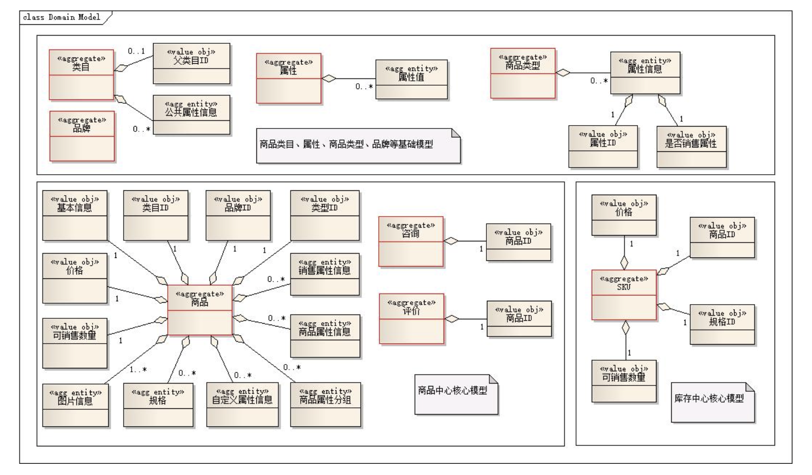

## 什么是领域驱动设计

### 从遇到问题开始

当人们要做一个软件系统时，一般总是因为遇到了什么问题，然后希望通过一个软件系统来解决。

比如，我是一家企业，然后我觉得我现在线下销售自己的产品还不够，我希望能够在线上也能销售自己的产品。所以，自然而然就想到要做一个普通电商系统，用于实现在线销售自己企业产品的目的。

再比如，我是一家互联网公司，公司有很多系统对外提供服务，面向很多客户端设备。但是最近由于各种原因，导致服务经常出故障。所以，我们希望通过各种措施提高服务的质量和稳定性。其中的一个措施就是希望能做一个灰度发布的平台，这个平台可以提供灰度发布的服务。然后，当某个业务系统做了一些修改并需要发布时，可以使用我们的灰度发布平台来非常方便的实现灰度发布的功能。比如在灰度发布平台上方便的定制允许哪些特定的客户端才会访问新服务，哪些客户端继续使用老服务。灰度发布平台可以提供各种灰度的策略。有了这样的灰度发布机制，那即便系统的新逻辑有什么问题，受影响的面也不会很大，在可控范围内。所以，如果公司里的所有对外提供服务的系统都接入了灰度平台，那这些系统的发布环节就可以更加有保障了。

总之，我们做任何一个软件系统，都是有原因的，否则就没必要做这个系统，而这个原因就是我们遇到的问题。所以，通过问题，我们就知道了我们需要一个什么样的系统，这个系统解决什么样的问题。最后，我们就很自然的得出了一个目标，即知道了自己要什么。比如我要做一个论坛、一个博客系统、一个电商平台、一个灰度发布系统、一个IDE、一个分布式消息队列、一个通信框架等等。

## DDD切入点1 - 理解概念

DDD的全称为Domain-driven Design，即领域驱动设计。下面我从领域、问题域、领域模型、设计、驱动这几个词语的含义和联系的角度去阐述DDD是如何融入到我们平时的软件开发初期阶段的。要理解什么是领域驱动设计，首先要理解什么是领域，什么是设计，还有驱动是什么意思，什么驱动什么。

### 什么是领域（Domain）？

前面我们已经清楚的知道我们现在要做一个什么样的系统，这个系统需要解决什么问题。我认为任何一个系统都会属于某个特定的领域，比如论坛是一个领域，只要你想做一个论坛，那这个论坛的核心业务是确定的，比如都有用户发帖、回帖等核心基本功能。比如电商平台、普通电商系统，这种都属于网上电商领域，只要是这个领域的系统，那都有商品浏览、购物车、下单、减库存、付款交易等核心环节。所以，同一个领域的系统都具有相同的核心业务，因为他们要解决的问题的本质是类似的。

因此，我们可以推断出，**一个领域本质上可以理解为就是一个问题域**，只要是同一个领域，那问题域就相同。所以，只要我们确定了系统所属的领域，那这个系统的核心业务，即要解决的关键问题、问题的范围边界就基本确定了。通常我们说，要成为一个领域的专家，必须要在这个领域深入研究很多年才行。因为只有你研究了很多年，你才会遇到非常多的该领域的问题，同时你解决这个领域中的问题的经验也非常丰富。很多时候，领域专家比技术专家更加吃香，比如金融领域的专家。

### 什么是设计（Design）？

DDD中的设计主要指领域模型的设计。为什么是领域模型的设计而不是架构设计或其他的什么设计呢？因为DDD是一种基于模型驱动开发的软件开发思想，强调领域模型是整个系统的核心，领域模型也是整个系统的核心价值所在。每一个领域，都有一个对应的领域模型，领域模型能够很好的帮我们解决复杂的业务问题。

从领域和代码实现的角度来理解，领域模型绑定了领域和代码实现，确保了最终的代码实现就一定是解决了领域中的核心问题的。因为：

- 领域驱动领域模型设计

- 领域模型驱动代码实现

我们只要保证领域模型的设计是正确的，就能确定领域模型可以解决领域中的核心问题；同理，我们只要保证代码实现是严格按照领域模型的意图来落地的，那就能保证最后出来的代码能够解决领域的核心问题的。这个思路，和传统的分析、设计、编码这几个阶段被割裂（并且每个阶段的产物也不同）的软件开发方法学形成鲜明的对比。

### 什么是驱动（Driven）？

上面其实已经提到了，就是：

1. 领域驱动领域模型设计
2. 领域模型驱动代码实现

这个就和我们传统的数据库驱动开发的思路形成对比了。DDD中，我们总是以领域为边界，分析领域中的核心问题（核心关注点），然后设计对应的领域模型，再通过领域模型驱动代码实现。而像数据库设计、持久化技术等这些都不是DDD的核心，而是外围的东西。

领域驱动设计（DDD）告诉我们的最大价值我觉得是：当我们要开发一个系统时，应该尽量先把领域模型想清楚，然后再开始动手编码，这样的系统后期才会很好维护。但是，很多项目（尤其是互联网项目，为了赶工）都是一开始模型没想清楚，一上来就开始建表写代码，代码写的非常冗余，完全是过程是的思考方式，最后导致系统非常难以维护。而且更糟糕的是，出来混总是要还的，前期的领域模型设计的不好，不够抽象，如果你的系统会长期需要维护和适应业务变化，那后面你一定会遇到各种问题维护上的困难，比如数据结构设计不合理，代码到处冗余，改BUG到处引入新的BUG，新人对这种代码上手困难等。而那时如果你再想重构模型，那要付出的代价会比一开始重新开发还要大，因为你还要考虑兼容历史的数据，数据迁移，如何平滑发布等各种头疼的问题。所以，就导致我们最后天天加班。

虽然，我们都知道这个道理，但是我也明白，人的习惯很难改变的，大部分人都很难从面向过程式的想到哪里写到哪里的思想转变为基于系统化的模型驱动的思维。我想，这或许是DDD很难在中国或国外流行起来的原因吧。但是，我想这不应该成为我们放弃学习DDD的原因，对吧！

### 概念总结：

1. 领域就是问题域，有边界，领域中有很多问题；
2. 任何一个系统要解决的那个大问题都对应一个领域；
3. 通过建立领域模型来解决领域中的核心问题，模型驱动的思想；
4. 领域建模的目标针对我们在领域中所关心的问题，即只针对核心关注点，而不是整个领域中的所有问题；
5. 领域模型在设计时应考虑一定的抽象性、通用性，以及复用价值；
6. 通过领域模型驱动代码的实现，确保代码让领域模型落地，代码最终能解决问题；
7. 领域模型是系统的核心，是领域内的业务的直接沉淀，具有非常大的业务价值；
8. 技术架构设计或数据存储等是在领域模型的外围，帮助领域模型进行落地；

## DDD切入点2 - 理解领域、拆分领域、细化领域

### 理解领域知识是基础

上面我们通过第一步，虽然我们明确了要做一个什么样的系统，该系统主要解决什么问题，但是就这样我们还无法开始进行实际的需求分析和模型设计，我们还必须将我们的问题进行拆分，需求进行细化。有些时候，需求方，即提出问题的人，很可能自己不清楚具体想要什么。他只知道一个概念，一个大的目标。比如他只知道要做一个股票交易系统，一个灰度发布系统，一个电商平台，一个开发工具，等。但是他不清楚这些系统应该具体做成什么样子。这个时候，我认为领域专家就非常重要了，DDD也非常强调领域专家的重要性。因为领域专家对这个领域非常了解，对领域内的各种业务场景和各种业务规则也非常清楚，总之，对这个领域内的一切业务相关的知识都非常了解。所以，他们自然就有能力表达出系统该做成什么样子。所以，要知道一个系统到底该做成什么样子，到底哪些是核心业务关注点，只能靠沉淀领域内的各种知识，别无他法。因此，假设你现在打算做一个电商平台，但是你对这个领域没什么了解，那你一定得先去了解下该领域内主流的电商平台，比如淘宝、天猫、京东、亚马逊等。这个了解的过程就是你沉淀领域知识的过程。如果你不了解，就算你领域建模的能力再强，各种技术架构能力再强也是使不上力。领域专家不是某个固定的角色，而是某一类人，这类人对这个领域非常了解。比如，一个开发人员也可以是一个领域专家。假设你在一个公司开发和维护一个系统已经好几年了，但是这个系统的产品经理（PD）可能已经换过好几任了，这种情况下，我相信这几任产品经理都没有比你更熟悉这个领域。

### 拆分领域

上面我们明白了，领域建模的基础是要先理解领域，让自己成为领域专家。如果做到了这点，我们就打好了坚实的基础了。但是，有时一个领域往往太复杂，涉及到的领域概念、业务规则、交互流程太多，导致我们没办法直接针对这个大的领域进行领域建模。所以，我们需要将领域进行拆分，本质上就是把大问题拆分为小问题，然后各个击破的思路。然后既然把一个大的领域划分为了多个小的领域（子域），那最关键的就是要理清每个子域的边界；然后要搞清楚哪些子域是核心子域，哪些是非核心子域，哪些是公共支撑子域；然后，还要思考子域之间的联系是什么。那么，我们该如何划分子域呢？我的个人看法是从业务相关性的角度去思考，也就是我们平时说的按业务功能为出发点进行划分。还是拿经典的电商系统来分析，通常一个电商系统都会包含好几个大块，比如：

- 会员中心：负责用户账号登录、用户信息的管理；
- 商品中心：负责商品的展示、导航、维护；
- 订单中心：负责订单的生成和生命周期管理；
- 交易中心：负责交易相关的业务；
- 库存中心：负责维护商品的库存；
- 促销中心：负责各种促销活动的支持；

上面这些中心看起来很自然，因为大家对电子商务的这个领域都已经非常熟悉了，所以都没什么疑问，好像很自然的样子。所以，领域划分是不是就是没什么挑战了呢？显然不是。之所以我们觉得子域划分很简单，是因为我们对整个大领域非常了解了。如果我们遇到一个冷门的领域，就没办法这么容易的去划分子域了。这就需要我们先去努力理解领域内的知识。所以，我个人从来不相信什么子域划分的技巧什么的东西，因为我觉得这个工作没有任何诀窍可以使用。当我们不了解一个东西的时候，如何去拆解它？当我们对整个领域有一定的熟悉了，了解了领域内的相关业务的本质和关系，我们就自然而然的能划分出合理的子域了。不过并不是所有的系统都需要划分子域的，有些系统只是解决一个小问题，这个问题不复杂，可能只有一两个核心概念。所以，这种系统完全不需要再划分子域。但不是绝对的，当一个领域，我们的关注点越来越多，每个关注点我们关注的信息越来越多的时候，我们会不由自主的去进一步的划分子域。比如，也许我们一开始将商品和商品的库存都放在商品中心里，但是后来由于库存的维护越来越复杂，导致揉在一起对我们的系统维护带来一定的困难时，我们就会考虑将两者进行拆分，这个就是所谓的业务垂直分割。

### 细化子域

通过上面的两步，我们了解了领域里的知识，也对领域进行了子域划分。但这样还不够，凭这些我们还无法进行后续的领域模型设计。我们还必须再进一步细化每个子域，进一步明确每个子域的核心关注点，即需求细化。我觉得我们需要细化的方面有以下几点：

1. 梳理领域概念：梳理出领域内我们关注的概念、概念的关系，并统一交流词汇，形成统一语言；
2. 梳理业务规则：梳理出领域内我们关注的各种业务规则，DDD中叫不变性（invariants），比如唯一性规则，余额不能小于零等；
3. 梳理业务场景：梳理出领域内的核心业务场景，比如电商平台中的加入购物车、提交订单、发起付款等核心业务场景；
4. 梳理业务流程：梳理出领域内的关键业务流程，比如订单处理流程，退款流程等；

从上面这4个方面，我们从领域概念、业务规则、交互场景、业务流程等维度梳理了我们到底要什么，整理了整个系统应该具备的功能。这个工作我觉得是一个非常具有创造性和有难度的工作。我们一方面会主观的定义我们想要什么；另一方面，我们还会思考我们要的东西的合理性。我认为这个就是产品经理的工作，产品经理必须要负起职责，把他的产品充分设计好，从各个方面去考虑，如何设计一个产品，才能更好的解决用户的核心诉求，即领域内的核心问题。如果对领域不够了解，如果想不清楚用户到底要什么，如果思考问题不够全面，谈何设计出一个合理的产品呢？

关于领域概念的梳理，我觉得可以采用四色原型分析法，这个分析法通过系统的方法，将概念划分为不同的种类，为不同种类的概念标注不同的颜色。然后将这些概念有机的组合起来，从而让我们可以清晰的分析出概念和概念之间的关系。[四色原型](http://www.cnblogs.com/netfocus/archive/2011/03/05/1971899.html)。

**注意：上面我说的这四点，重点是梳理出我们要什么功能，而不是思考如何实现这些功能，如何实现是软件设计人员的职责。**

## DDD切入点3 - 领域模型设计

这部分内容，我想学习DDD的人都很熟悉了。DDD原著中提出了很多实用的建模工具：聚合、实体、值对象、工厂、仓储、领域服务、领域事件。我们可以使用这些工具，来设计每一个子域的领域模型。最终通过领域模型图将设计沉淀下来。要使用这些工具，首先就要理解每个工具的含义和使用场景。不要以为很简单哦，比如聚合的划分就是一个非常具有艺术的活。同一个系统，不同的人设计出来的聚合是完全不同的。而且很有可能高手之间的最后设计出来的差别反而更大，实际上我认为是世界观的相互碰撞，呵呵。所以，要领域建模，我觉得每个人都应该去学学哲学知识，这有助于我们更好的认识世界，更好的理解事物的本质。

关于这些建模工具的概念和如何运用我就不多展开了，我博客里也有很多这方面的介绍。下面我再讲一下我认为比较重要的东西，比如到底该如何领域建模？步骤应该是怎么样的？

### 领域建模的方法

通过上面我介绍的细化子域的内容，现在再来谈该如何领域建模，我觉得就方便很多了。我的主要方法是：

1. 划分好边界上下文，通常每个子域（sub domain）对应一个边界上下文（bounded context），同一个边界上下文中的概念是明确的，没有任何歧义；

2. 在每个边界上下文中设计领域模型，具体的领域模型设计方法有很多种，如以场景为出发点的[四色原型](http://www.cnblogs.com/netfocus/archive/2011/03/05/1971899.html)分析法，或者我早期写的这篇[文章](http://www.cnblogs.com/netfocus/archive/2011/09/18/2180656.html)；这个步骤最核心的就是找出聚合根，并找出每个聚合根包含的信息；关于如何设计聚合，可以看一下[这篇文章](http://www.cnblogs.com/netfocus/p/3307971.html)；

   关于聚合：聚合是用来封装真正的不变性，而不是简单的将对象组合；聚合应该设计的尽量小；聚合之间的关联通过ID而不是对象引用；聚合内强一致性，聚合之间最终一致性；

3. 画出领域模型图，圈出每个模型中的聚合边界；

4. 设计领域模型时，要考虑该领域模型是否满足业务规则，同时还要综合考虑技术实现等问题，比如并发问题；领域模型不是概念模型，概念模型不关注技术实现，领域模型关心；所以领域模型才能直接指导编码实现；

5. 思考领域模型是如何在业务场景中发挥作用的，以及是如何参与到业务流程的每个环节的；

6. 场景走查，确认领域模型是否能满足领域中的业务场景和业务流程；

7. 模型持续重构、完善、精炼；

### 领域模型的核心作用：

1. 抽象了领域内的核心概念，并建立概念之间的关系；
2. 领域模型承担了领域内的状态的维护；
3. 领域模型维护了领域内的数据之间的业务规则，数据一致性；

下图是我最近做个一个普通电商系统的商品中心的领域模型图，给大家参考：

### 领域模型设计只是软件设计中的一小部分

需要特别注意的是，领域模型设计只是整个软件设计中的很小一部分。除了领域模型设计之外，要落地一个系统，我们还有非常多的其他设计要做，比如：

- 容量规划
- 架构设计
- 数据库设计
- 缓存设计
- 框架选型
- 发布方案
- 数据迁移、同步方案
- 分库分表方案
- 回滚方案
- 高并发解决方案
- 一致性选型
- 性能压测方案
- 监控报警方案

等等。上面这些都需要我们平时的大量学习和积累。作为一个合格的开发人员或架构师，我觉得除了要会DDD领域驱动设计，还要会上面这么多的技术能力，确实是非常不容易的。所以，千万不要以为会DDD了就以为自己很牛逼，实际上你会的只是软件设计中的冰山一角而已。