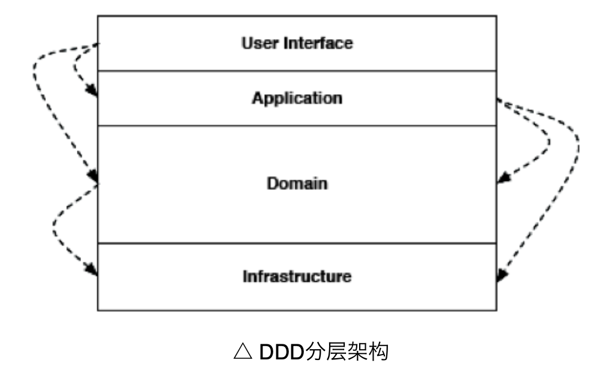
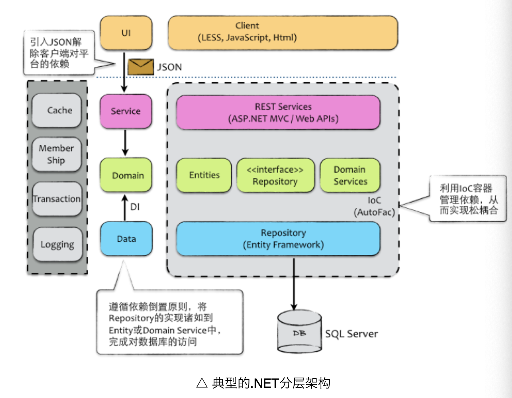
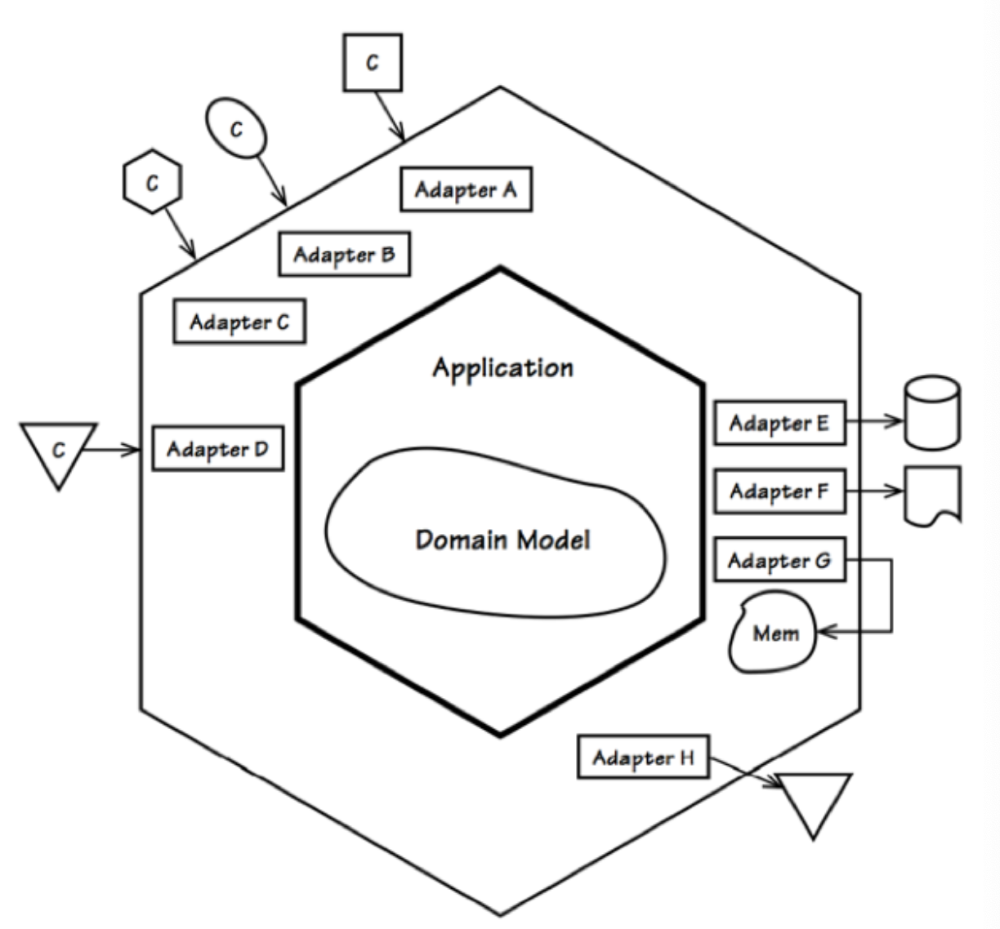
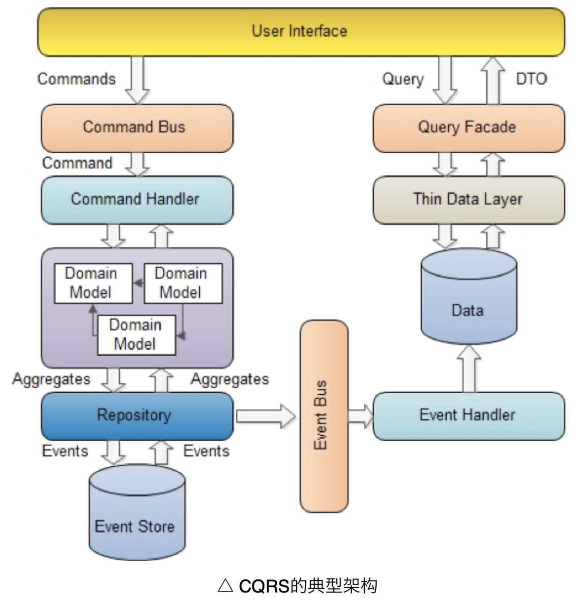

## 架构模式实践

### 分层架构模式

DDD中对传统三层架构进行改进，引入了独有的Application Layer,将数据访问层更名为Infrastructure Layer：

但是设计时从数据驱动开始，导致开发出所谓的"贫血模型"，对此.NET领域模型对此进行改进

### 六边形架构 Hexagonal Architecture

这种架构中，不同的客户通过平等的方式与系统进行交互，架构中存在的两个区域，分别是"外部区"和"内部区"，外部区，不同的客户均可以提交输入，内部系统用于获取持久化数据，并对程序输出进行存储，中途将输出转发到另外的地方（比如消息）。

六边形架构这种内外分离的方式，可以有效地把系统的核心领域与边界外的基础设施隔开，从而形成一种独立于框架，易于测试，与外部代理、UI以及数据库无关的应用架构。

### CQRS架构风格

CQRS（Command Query Responsibility Seperation，命令查询职责分离），这种设计可以更好地控制请求者的操作，可以反复发起，不担心对系统的影响，还可以为此提供缓存，可以反复发起，而不用担心对系统造成影响。

CQRS模式的风格时基于事件的异步状态机的模型，最核心的是Command, Event。Command是系统中会引起变化的活动，是一种命令的语气，Event描述了某件事情的发生，这是命令查询的结果，是一种数据改变结果的事实。Command和Event都有对应的Handler来处理。整个过程是一个状态机，Command会导致命令的转移，执行Aggregate的逻辑时，出发对应的Event。

