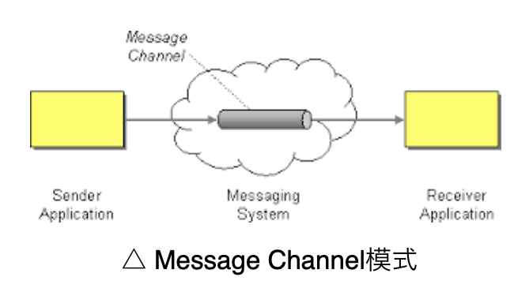
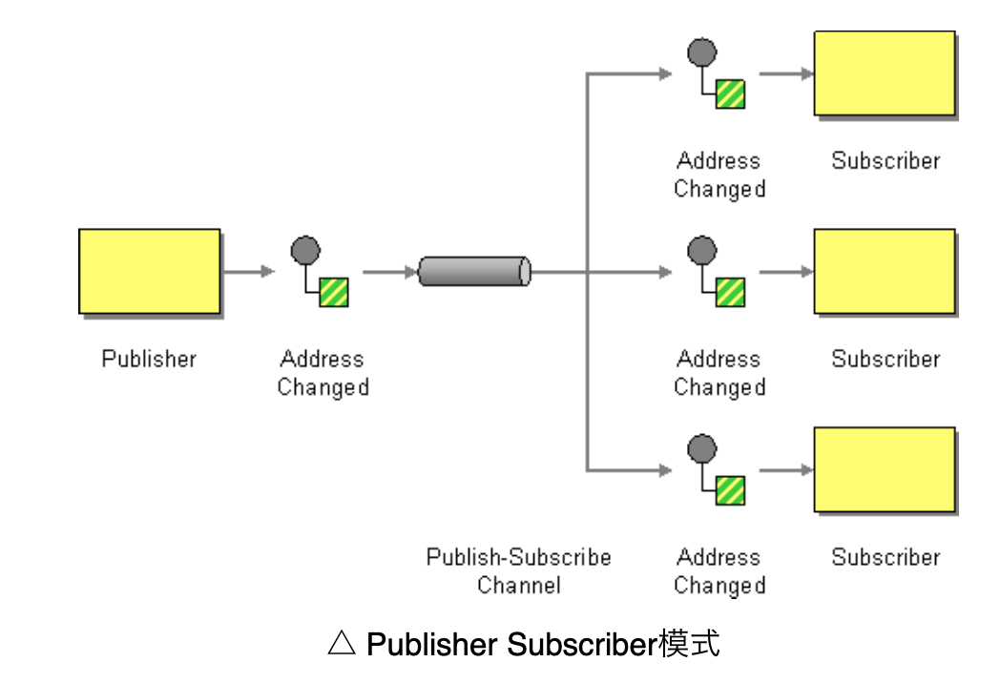
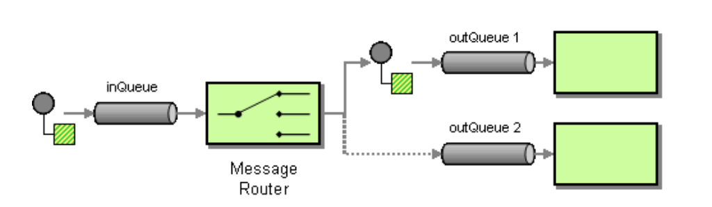
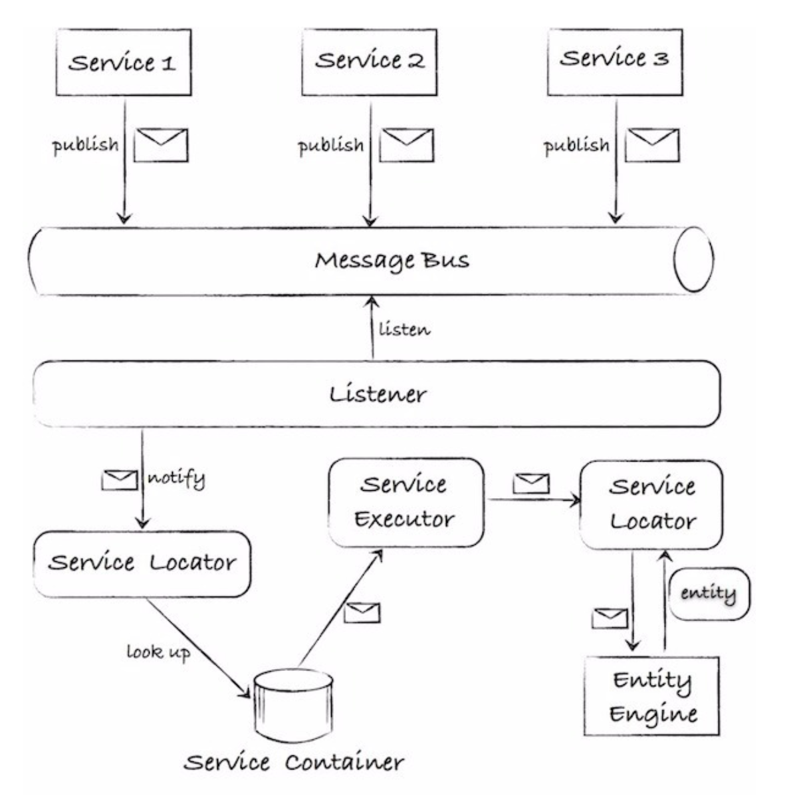
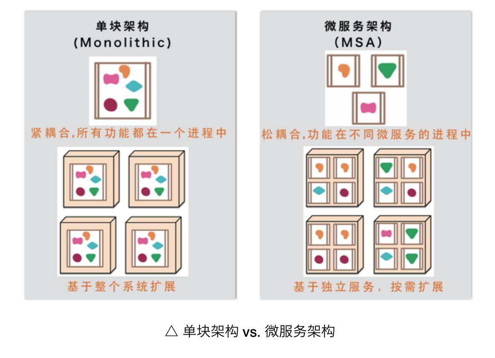
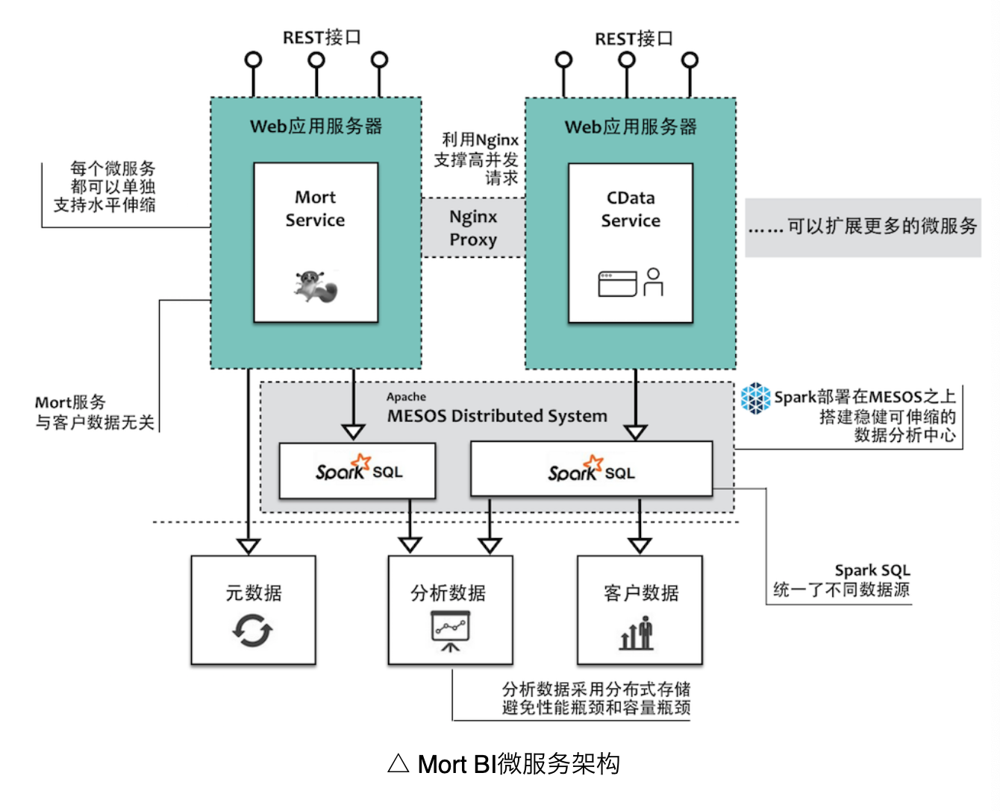
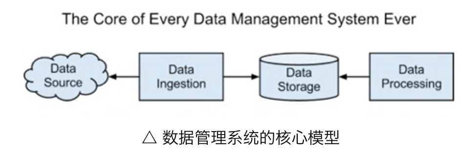
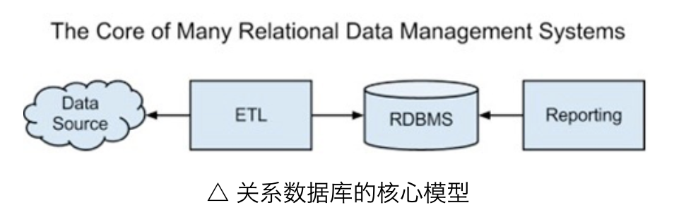
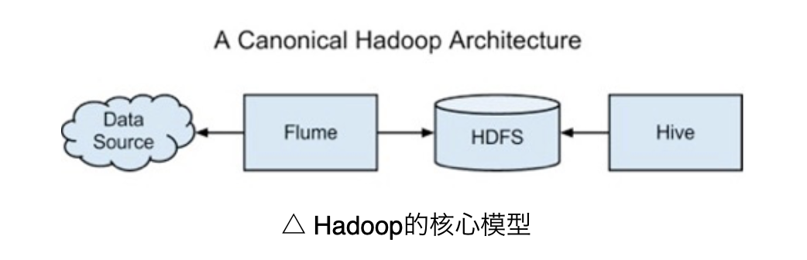

## 架构风格与参考架构

### REST架构风格

资源 Resource：代表服务器上的抽象资源

资源表述 Representation:资源某一个时刻的格式，例如HTML/JSON/文本

状态转移 State Transfer：客户端和服务器之间的转移

统一接口 Uniform Interface：操作资源的统一接口包含以下方法

- 7个HTTP方法：GET/POST/PUT/DELETE/PATCH/HEAD/OPTIONS
- HTTP头信息
- HTTP状态代码
- 一套标准的内容协商机制
- 一套标准的缓存机制
- 一套标准的客户端身份认证机制

超文本驱动 Hypertext Driven：将Web应用看作是一个由很多状态组成的有限自动机

### REST的主要特征

1. 面向资源（Resource Oriented）
2. 可寻址（Addressability）
3. 连通性（Connectedness）
4. 无状态（Statelessness）
5. 统一接口（Uniform Interface）
6. 超文本驱动（Hypertext Driven）

### 常见的分布式应用架构

1. 分布式对象（Distributed Objects,DO）常见的有.NET Rometing/EJB/RMI
2. 远程过程调用（Remote Procedure Call, RPC）常见的有SOAP/RPC/Hession/DWR
3. 表述性状态转移（Representation State Transfer， REST）常见的有HTTP/WebDav

REST与DO的区别：

REST支持抽象的工具是资源，DO支持的抽象工具是对象，DO的架构一般是和编程语言绑定的，跨语言交互实现起来非常复杂，而REST中的资源是独立于开发平台和编程语言的。

DO中没有统一接口的概念，不同的API，接口设计风格可以完全不同，DO中没有使用超文本，响应内容中只包含对象本身，REST使用了超文本，可以实现最大力度的交互，REST支持数据流和管道，DO不支持数据流和管道。DO风格会带来客户端和服务器端紧耦合，在三种架构风格中REST耦合度最小。

REST和RPC的区别：

RPC支持抽象的工具是过程，RPC中没有超文本，响应的内容只包含消息本身，RPC不支持操作与一对中间件的可见性，RPC没有超文本，响应内容只包含消息本身，RPC风格的耦合度比DO风格要小一些。

REST带来的利益：简单性、可伸缩性、松耦合

### 基于消息的分布式架构风格

常见的消息模式：

**消息通信模式（Message Channel）**

 消息通道作为客户端（消费者）和服务（生产者）之间引入的中间层，可以有效地解除二者之间的耦合，消息通道通常以队列的形式存在，这种先进先出的结构适合于MSMQ，IBM MQ，JBOSS MQ以及开源的RabbitMQ、Apache ActiveMQ

**发布者-订阅者模式（Publisher-Subscirber）**

消费者扮演了观察者的角色，一般情况下，发布者和订阅者都会被注册到用于传播变更的消息通道上，发布者会主动了解消息通道，使其能够将消息发送到通道中，消息通道一旦接收到消息，会主动调用注册在通道上的订阅者，进而完成对消息内容的消费。对于订阅者来说，有两种消息处理的方式：一种是广播机制，消息在出队列的同时要复制多份给订阅者；另一种方式是抢占式，遵循同步方式，在一段时间内只能有一个订阅者能够处理该消息。

**消息路由模式（Message Router）**

无论是Message Channel模式还是Publisher-Subscirber模式，队列都扮演着重要的角色，根据单一职责原则，这种职责分配是不合理的，不利于业务逻辑重用，既然这三种对象不承担这种职责，需要引入一个新的对象专门负责传递路径选择的功能，通过消息路由，可以配置路由规则制定消息传递的路径，提供了消息传递与处理的灵活性，也有利于提高系统的消息处理能力。同时路由对象有效地封装了寻找与匹配消息路径的逻辑，就好似一个调停者，负责协调消息、队列与路径寻址之间关系。

对于分布式系统架构而言，消息会作为最主要的通信方式，上图展现了基于消息的分布式架构。

需要满足的技术矩阵：

- 并发：选择的消息队列一定要很好地支持用户访问的并发性
- 安全：消息队列是否提供足够的安全机制
- 性能伸缩：不能让消息队列成为整个系统单一性能的瓶颈
- 部署：尽可能让消息队列的部署更加容易
- 灾备：不能因为意外的错误、故障或其他因素导致处理数据的丢失
- API易用性：处理消息的API必须足够简单、并能够很好地支持测试与扩展

### SOA单体架构与微服务架构

微服务通常有以下几个特征：

- 小，专注于做一件事
- 运行在独立的进程中
- 轻量级的通信进程
- 松耦合

### Mort微服务架构

Mort采用Spary作为REST架构，能够很好地支持REST服务，并与应用服务器完全解耦，可根据业务场景划分自治服务的边界，并将不同的服务部署在不同的应用服务器上，通过Nigix提供反向代理，并支持高并发请求。

CData服务负责与客户数据的交互，包括读取客户数据，导入客户数据，获取分析维度元数据信息，Mort Service作为核心服务，负责元数据管理以及执行数据分析与查询。

### 数据为中心的软件架构

数据管理系统最少包含三部分：data ingestion, data stroage和data analysis。

对于关系型数据库可以理解为：

Hadoop为核心的模型：

