---
typora-root-url:./
---

### 领域驱动设计

Domain Driven Design是将要解决的业务概念和业务规则转换成软件系统中的类型以及类型的属性与行为，通过合理运用面向对象的封装、继承、多态等设计要素，降低或隐藏整个系统的业务复杂性，并使得系统具有更好的扩展性，应对多变的业务。

### 领域驱动设计过程

领域驱动设计不是架构方法也不是设计模式，准确的说是一种思维方式，也是一组优先任务，它贯穿了整个软件开，发的生命周期，包括对需求的分析、建模、架构设计，甚至编码实现和测试重构。

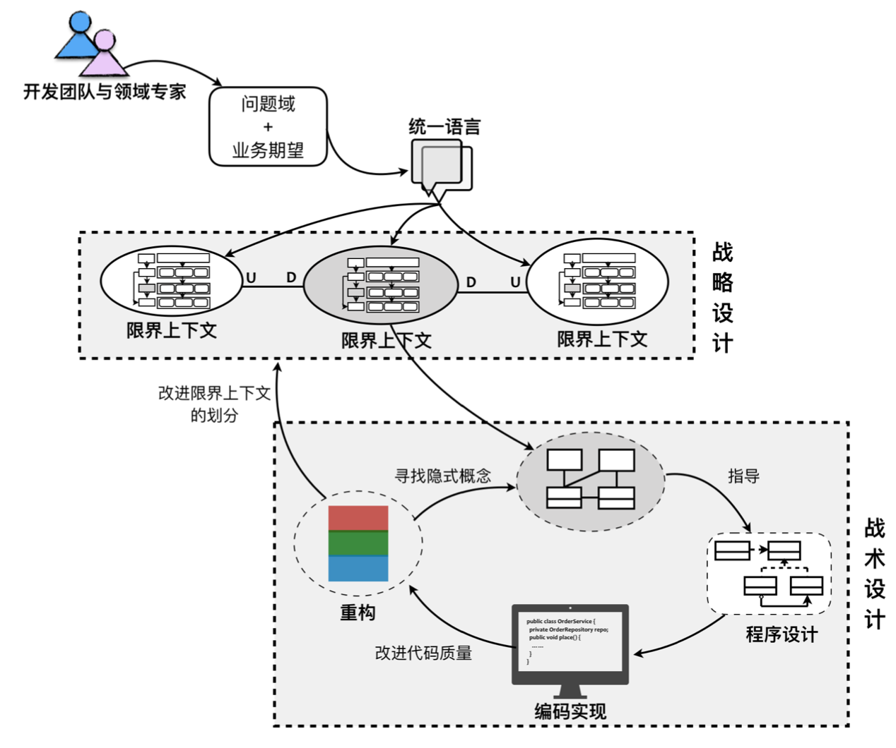

### 战略设计阶段

问题域方面：针对问题域，引入限界上下文和上下文映射对问题域进行合理的分解，识别出核心领域与子领域，并确定领域的边界以及他们之间的关系，维持模型的完整性。

架构方面：通过分层架构隔离关注点，将领域实现独立出来，可以更利用于领域模型的单一性和稳定性，引入六边形架构清晰地表达领域与技术基础设施的边界，CQRS模式则分离了查询场景和命令场景，针对不同场景选择使用同步和异步操作，提高架构的响应与性能。

领域驱动设计用以表示模型的主要要素包括：值对象（Value Object）、实体(Entity)、领域服务(Domain Service)、领域事件(Domain Event)、资源库(Reposity)、工厂(Factory)、聚合(Aggregate)、应用服务(Application Service)。

领域驱动设计围绕着领域模型进行设计，通过分层架构（Layered Architecture）将领域独立出来。表示领域模型的对象包括：实体、值对象和领域服务。领域逻辑都应该封装在这些对象中。这一严格的设计原则可以避免业务逻辑渗透到领域层之外，导致技术实现与业务逻辑的混淆。

聚合是一种边界，可以封装一到多个实体与值对象，并维持该边界之内的业务完整性。在聚合中，至少包含一个实体，且只有实体才能作为聚合根。聚合代表的是边界的概念，而非领域的概念，

工厂和资源库都是对领域对象生命周期的管理，哦那个厂负责对象的创建，往往用于封装复杂或者可能变化的创建逻辑，后者负责从存放资源库的位置（数据库、内存或者其他Web资源）获取、删除或者修改领域对象。

两个不同阶段的设计目标是保持一致的，他们是一个连贯的过程，彼此之间又相互指导与规范，并最终保持一个有效的领域模型和一个富有表现力的实现同时演进。

### 领域驱动设计要解决的问题

面对相对复杂的软件系统时，面临的问题有：

- 开发人员将业务逻辑的复杂度与技术实现的复杂度混淆在一起
- 问题域过于庞大而复杂，使得从问题域中寻找解决方案的挑战增加
- 随着需求的增长和变化，无法控制业务复杂度和技术复杂度

解决措施：

- 隔离业务复杂度和技术复杂度，确定业务逻辑和技术实现的边界
- 分层架构的关注点分离

属于业务逻辑的关注点放在领域层Domain Layer,将业务支撑逻辑的技术实现放在基础设施层Infrastructure Layer中。同时，领域驱动设计引入了应用层Application Layer，应用层扮演双重角色，一方面作为业务逻辑的外观Facade，暴露了能够体现use case的业务接口，另一方面也是业务逻辑与技术实现的粘合剂，实现二者之间的协作。

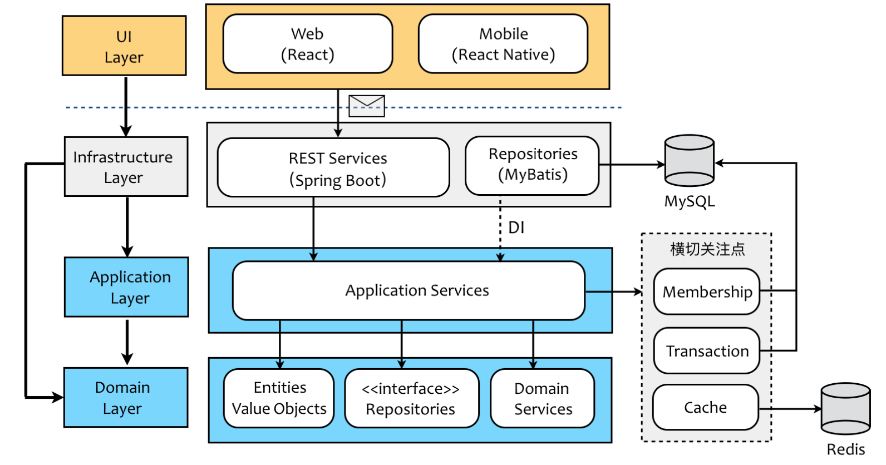

六边形架构的内外分离：通过内部的六边形边界与基础设施模块隔离开来，防止技术实现的复杂度污染到业务逻辑，保证了领域的整洁，边界还隔离变化产生的影响，如果我们在领域层或应用层抽象了技术实现的接口，再通过依赖注入将控制的方向倒转，业务内核就会变得更加稳定，不会因为技术选型或者其他决策变化导致领域代码的修改。

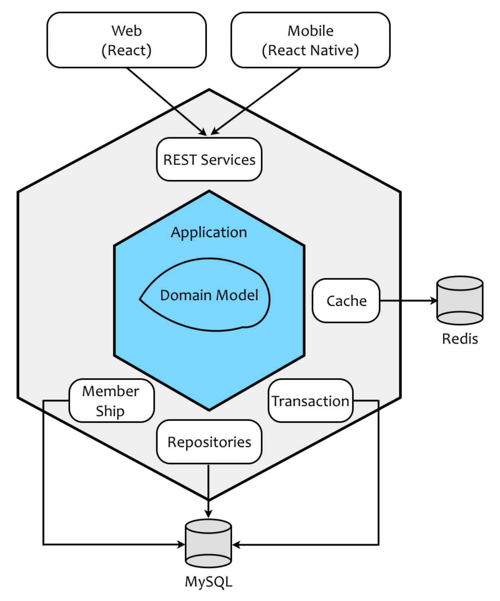

限界上下文采用分而治之的思想对问题域进行化解，有效控制问题域的规模，软件的六边形架构的逻辑是水平方向的划分，对于垂直方向的划分，是面向垂直业务的切割，便于控制软件的规模，可以将缓存设计为一个独立的子系统。

界限上下文可以定义为微服务，对外公开RET服务接口，UI作为展现层，可以作为客户端调用RESTful服务，每个服务是独立的并单独部署，保证了服务之间的边界，架构更加清晰。

### 领域模型是领域知识的抽象

领域模型表达了领域概念，领域规则以及领域概念之间的关系，一个好的领域模型是对统一语言的可视化表示，减少需求沟通可能该出现的歧义，通过提炼领域知识，并运用抽象的领域模型去表达，达到对领域逻辑的化繁为简，模型是封装，实现了对业务细节的隐藏，模型是抽象，题去了领域知识的共同特征，保留了面对变化时能够良好扩展的可能性。

瀑布式软件开发由需求、分析、设计、编码、测试、验收六个阶段组成，每个阶段有不同的任务，可能是设计或者开发任务或者召开需求评审会。

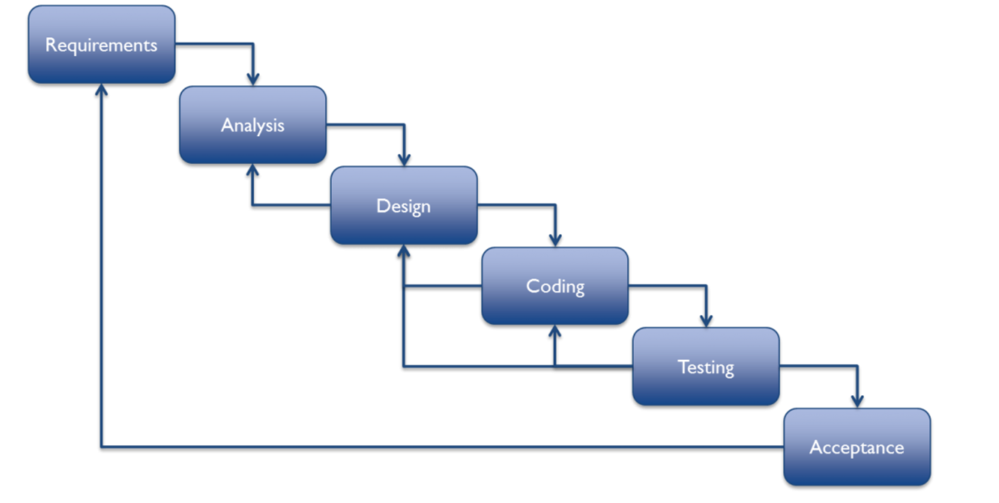

RUP清晰地划分了四个阶段：先启阶段、细化阶段、构造阶段以及交付阶段，每个阶段有不同的工作和迭代，例如业务建模、分析设计、配置与变更管理等。

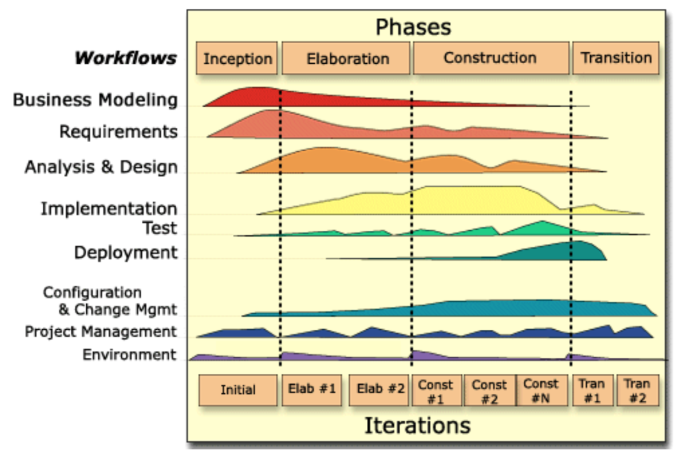

XP作为一种敏捷方法，采用了迭代的增量式开发，提倡为用户交付有价值的可运行软件，当架构的初期方案确定好后，就可以进入每次小版本的交付，每个小版本被划分为多个周期相同的迭代，在迭代过程中，要求执行一些特殊的活动，编写用户故事，故事点估算，验收测试。

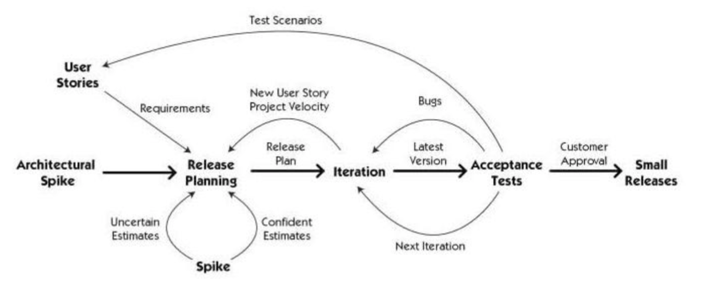

Scrum同样是增量式开发过程， 在项目开始之初，需要在准备阶段确定愿景、梳理业务用例、确定product backlog、制定发布计划以及组建团队。一旦确定Product backlog以及发布计划后，就进入sprint迭代阶段，这是一个固定时长的项目过程，需要召开计划会议、每日站会、评审会议以及回顾会议。

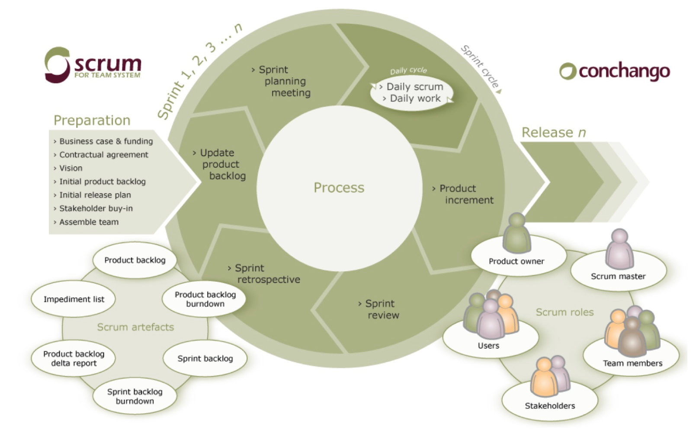

为此提炼出统一的领域模型

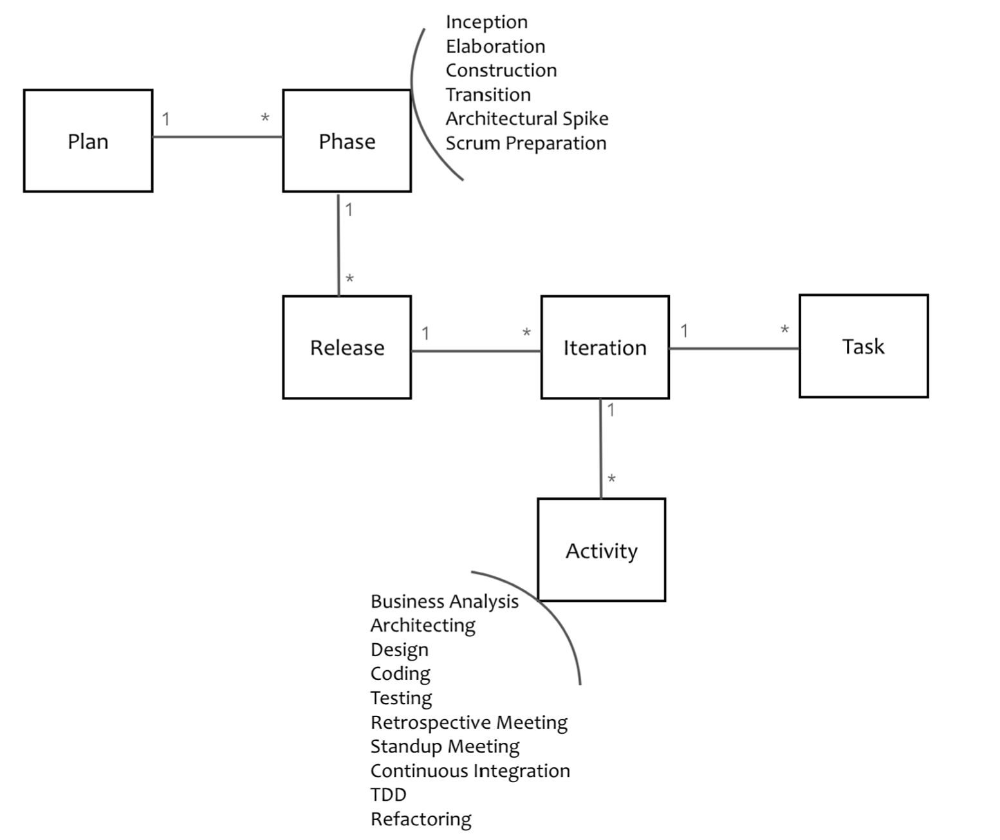

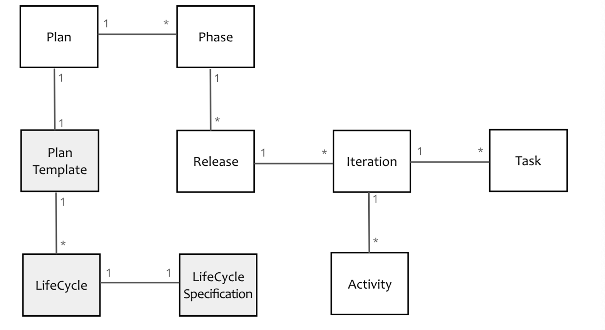

### 用户故事

"作为xx角色，我希望xx活动，以便于xx(业务价值)“。业务价值是需要需求分析师做一个好的故事讲述者，需要站在角色的角度不停地针对用户故事提问为甚么。

角色支持对产品功能的细分，而且它经常引出其他角色的需要以及相关的环境。

活动通常表述相关角色所需的"系统需求"；价值传达为什么需要进行相关的活动，也经常可以引领团队寻准能够提供相同价值而去更少工作量的替代活动。

敏捷实践要求需求人员与测试人员结对编写用户故事。一个完整的用户故事是可测试的。因此验收标准是用户故事不可缺少的部分。

### 测试驱动开发

测试驱动开发强调测试优先，但是实质是需求分析优先，任务分解优先，开发人员分析完成需求后，必须完成任务分解，再去写测试。要根据领域场景编写单元测试，站在调用者的角度去思考，即意图导向编程。

从调用者的角度，可以驱动我们思考如下目的：

- 如何命名被测试的类和方法，才能更好的表达设计者的意图，使测试具有更好的可读性；
- 被测试的对象必须简单，使得设计具有良好的测试性
- 测试使我们只关注接口，而非具体实现

编写测试方法时， 应该遵循Given-When-Then的模式，这种方式描述了测试的准备、期待的行为以及验收条件，驱动力体现如下：

- 编写Given时，驱动我们思考被测对象的创建，以及他与其他对象的协作
- 编写When时，驱动我们思考被测对象接口的方法命名，以及他需要接收的传入参数，考虑行为方式，是命令式还是查询式
- 编写Then时，驱动我们分析被测接口的返回值

### 统一语言

获得统一语言就是需求分析的过程，也是团队中各个角色就系统目标、范围与具体功能达成一致的过程。

在沟通需求时，团队每个人都使用相同的统一语言进行交流。尤其是基于模型的语言，是沟通能够达成一致的前提。

### 领域行为描述

领域行为是对业务过程的描述，体现了更加完整的业务需求以及复杂的业务规则：

- 从领域的角度而非实现角度描述领域行为
- 若涉及到领域术语，必须遵循术语表的规范
- 强调动词的精确，符合业务动作在该领域的合理性
- 要突出于领域行为有关的领域概念

用户故事中分配（assign）Sprint Backlog给团队成员就是一种领域行为，在特定的上下文由角色触发动作，由此产生的业务流程和操作结果。这种领域行为还是一种契约，明确表达了服务提供者与消费者之间的业务关系，明确了领域行为的前置条件、执行主语和宾语以及行为的执行结果。

### 提炼领域知识

通过对问题域的识别然后提炼领域知识，离不开团队各个角色的沟通与协作。需要双方的沟通、反馈、要达成对领域知识理解的共识。

我们对客户需求的理解，存在着三个方面的偏差：

- 从客户了解到的需求，并非最终用户的需求
- 若无有效的沟通方式，需求的理解会大相径庭
- 理解到的需求并没有揭示完整的领域知识，倒置领域建模与设计出现认知障碍

### 团队协作

先启阶段：

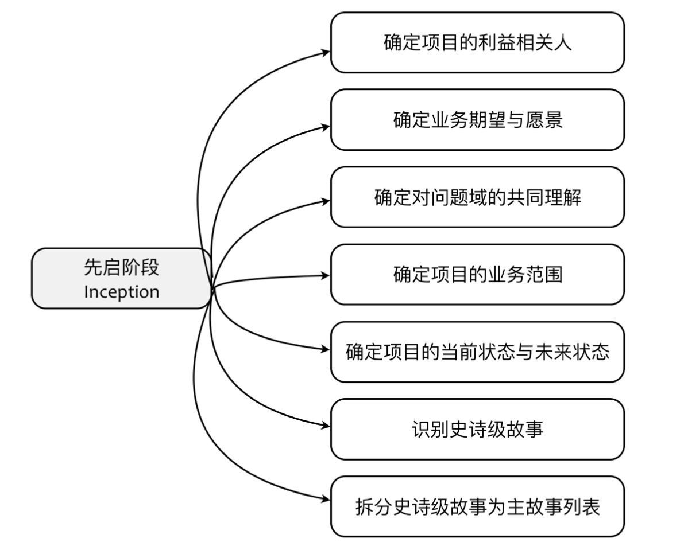

迭代开发阶段：

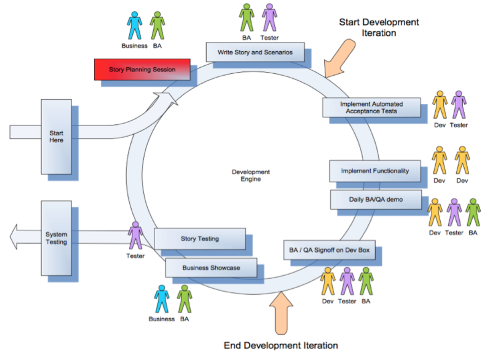

### 领域场景分析

遵循6w原则：Who, What, Why, Where, How

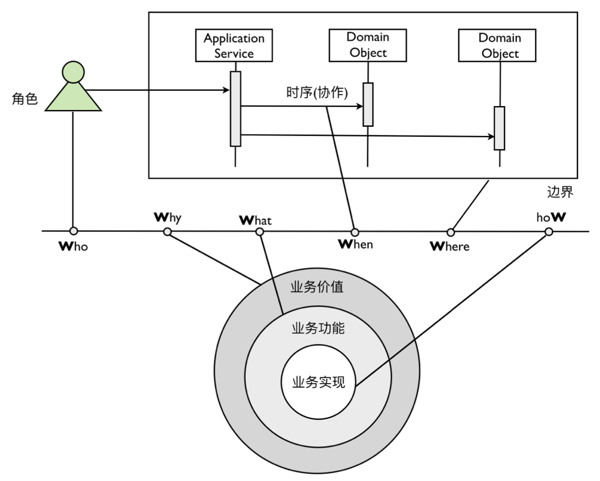

在6w模型中，我们将领域功能划分为三个层次：业务价值、业务功能和业务实现。

### 限界上下文实践的意义

如果细胞表示上下文，那么细胞膜就是限界上下文，Context表示业务流程中的片段，Context是动态的业务流程被边界Bounded静态的切分的产物。

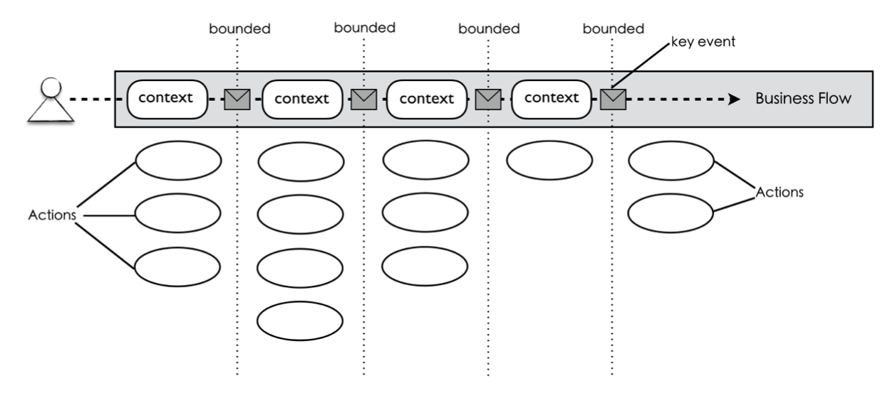

限界上下文的划分规则：

- 领域逻辑层面：限界上下文确定了开发团队的业务边界，维护了模型的完整性与一致性，从而降低了系统的业务复杂度
- 团队合作层面：限界上下文确定了开发团队的工作边界，建立了团队之间的合作模式，避免团队之间的沟通变得混乱，从而降低了系统的管理复杂度
- 技术实现层面：限界上下文确定了系统架构的应用边界，保证了系统层和上下文领域层各自的一致性，建立了上下文之间的集成方式，从而降低了系统的技术复杂度

### 限界上下文的边界

边界通过界限上下文来确定

逻辑边界：

- 命名空间级别：所有的界限上下文处在同一个模块中，编译后疏于同一个jar包
- 模块级别：在命名空间上是逻辑分离的，不同界限上下文术语同一个项目的不同模块，编译后生成各自的jar包，所谓的Module

越容易重用，越容易产生耦合。

物理边界：

当我们将界线上下文的边界定义为物理边界时，每个限界上下文就变成了一个个细粒度的微服务。

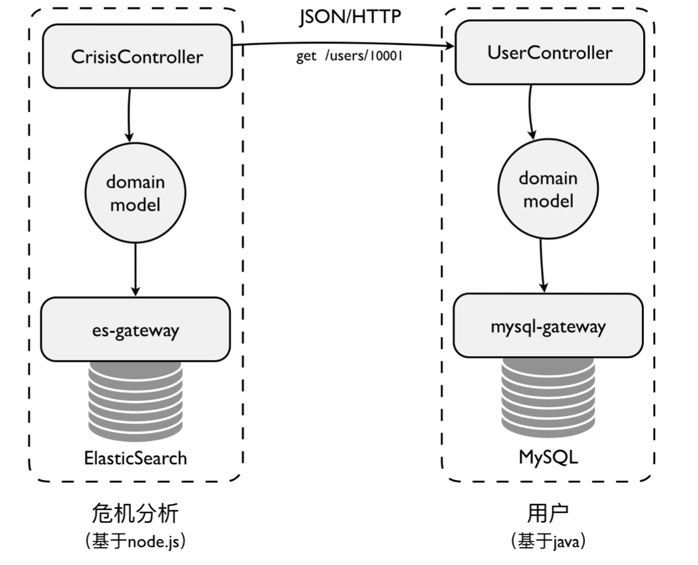

数据库共享：

数据库没有分库，可以保证事务的ACID，如果数据库方向变化与业务变化方向会不一致，这种不一致性体现在两个方面：

- 耦合：虽然业务上限界上下文之间是耦合的，但是在数据库层面依然存在强耦合的关系
- 水平伸缩：部署在应用服务器的应用服务可以根据限界上下文的边界单独进行水平伸缩，但是数据库无法做到

每个微服务的数据单独存储，但是服务的分离不绝对代表数据应该分离，数据库的样式与领域模型未必存在一对一的映射关系，在对数据库进行分库设计时，应该站在业务边界的角度去思考，因为分库的粒度太小，导致不必要的跨库关联。数据库设计时要避免两个表之间建立外键约束，防止后期不容易分库。

### 识别限界上下文

限界上下文是领域驱动设计中最难解释的原则，没有限界上下文（BC），就不能做领域驱动设计。其实归根结底就是边界，与面向对象设计中的职责分配其实是同一个意思，限界上下文的设计不是一蹴而就的，需要演化和迭代。

从业务边界识别界限上下文：明确了系统的问题和业务期望后，可以梳理出主要的业务流程，体现了各种参与者在这个过程中通过业务活动共同合作，业务流程结合了参与角色、业务活动和业务价值。业务流程是由多个用户角色参与的动态过程，业务场景是这些用户角色执行活动的静态上下文。

从语义角度去分析业务活动的描述：如果是相同的语义，可以作为归类的特征。主要是描述业务活动的动宾短语，例如：商品上架、商品下架等，但是有时候缺少精确的表达，这不是绝对正确的铁律。

在识别出来的同一界限上下文中，如果存在彼此矛盾的语言概念，应该进一步分解。

从功能角度去分析业务活动是否彼此关联和依赖，倘若是强相关（两个功能一个不能离开另一个而单独存在）的两个功能，可以作为归类特征。

从工作边界识别出限界上下文：项目经理将一个限界上下文分配给一个团队，涉及三个原则或者实践：2PTs规则，特性团队，康威定律，此时对限界上下文的估算变成了对分工的估算，一旦过大要果断切分。

从应用边界识别界限上下文：关注质量属性，如果把关乎质量属性的问题称之为将来可能发生的，其实就是风险。当用户增长到一定程度，如果划分合理可以对数据微服务平滑切换。

### 自治单元

自治满足四个特性：最小完备、稳定空间、自我履行、独立进化。自治单元就是界限上下文，映射到编码实现，可能是模块、组建或服务，是高内聚低耦合 的体现。

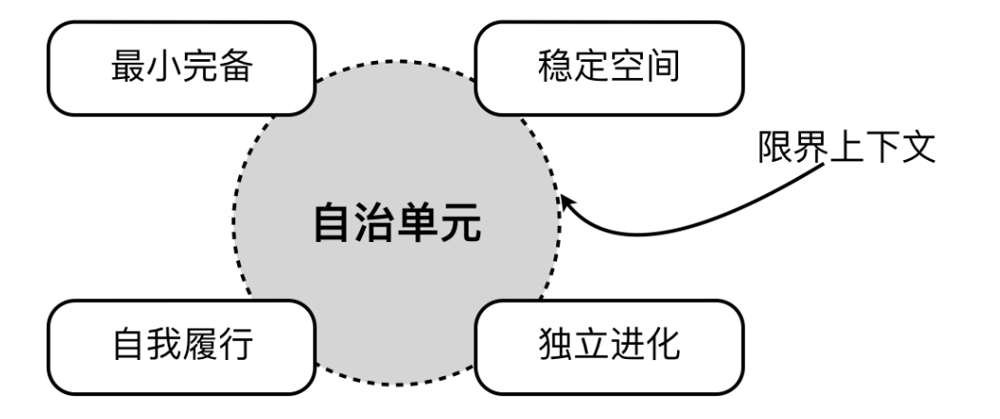

最小完备是指自治单元是履行职责是完整的，以完成业务价值最小功能集为设计边界，减少变化的可能。

自我履行意味着自治系统自身决定这个业务要不要做，智能判断行为是否应该履行。

稳定空间是指满足开放封闭原则，隐藏细节，开放抽象接口，减少外部变化对界限上下文的影响。设计设计属于自己的空间，保持私密性。

独立进化是指减少界限上下文的变化对外界的影响，意味着无论上游怎么变化，自身归然不动，对外暴露的接口不变。

### DDD分层架构

采用分层架构避免代码变成大泥球，复合单一指责原则。

经典的分层架构模型：用户界面层、应用层、基础设施层。

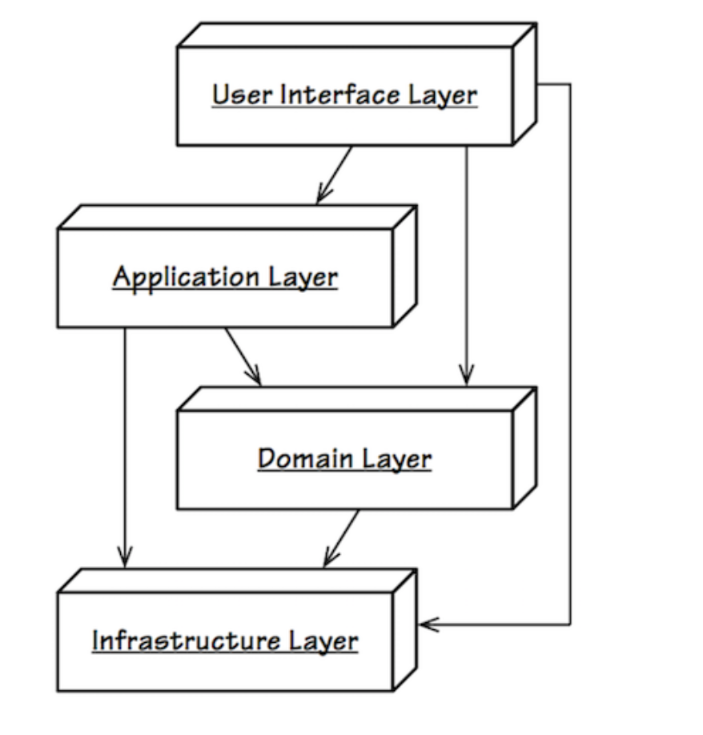

模型的核心就是领域层，所有的业务逻辑都应该在领域层实现：

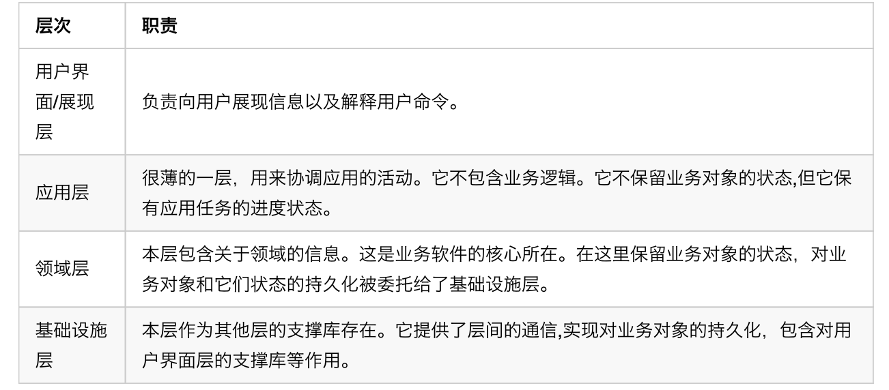

模型维持的原则：

- 高层模块不应该依赖于低层模块，二者都应该依赖于抽象
- 抽象不应该依赖于细节，细节应该依赖于抽象

### Clean Archhitecture

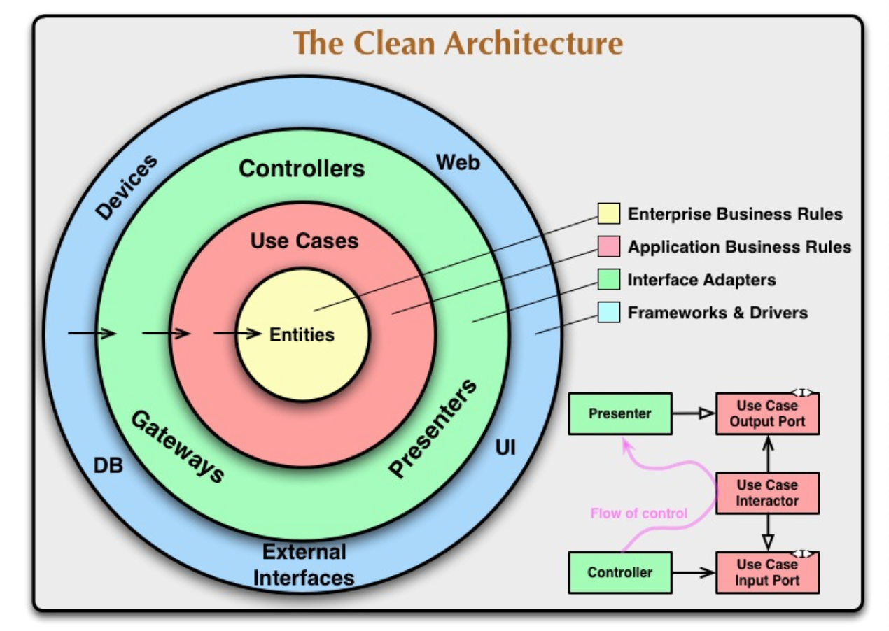

这是一个可测试的模型，无需依赖任何基础设施都可以对他进行测试，只需要通过边界对象发送和接收对应的数据结构即可，遵循稳定的依赖原则，不对变化或易于变化的事物形成依赖。特点：独立于框架、易于测试、与UI无关、与数据库无关、与任何外部代理无关。

因此我们应该改变依赖的方向，彻底解除领域层和基础设施层的耦合。

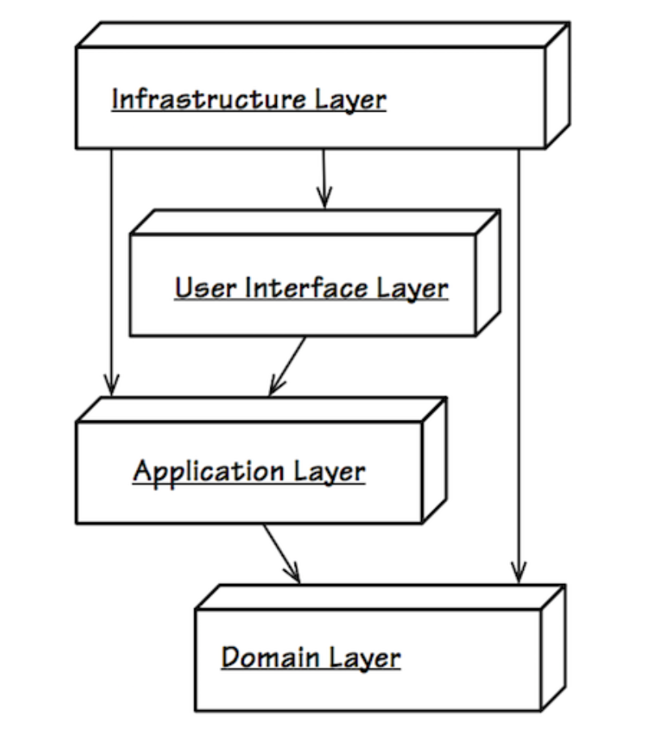

### 依赖注入解决贫血问题

在传统的三层架构中，我们常讲业务逻辑放在一个service对象中，而将反应概念的领域对象设计为仅仅包含熟悉的贫血对象，即Java中常常提到的JavaBean对象，至于DAO对象，则负责与数据库的交互，实现领域对象到数据库的DAO操作。由于领域层没有任何逻辑，这些对象都可以放到数据反问层。

 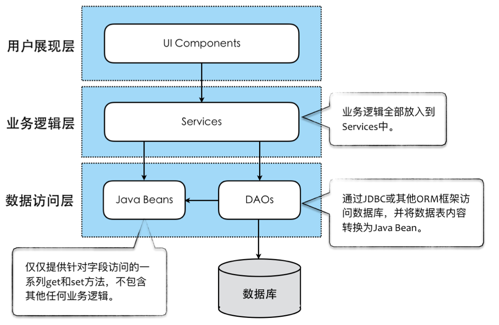

我们应根据领域模型对象持有的数据，合理的操作这些数据的行为分配给这些领域对象（Domain Model）,而不是纯粹的Service对象，由于领域模型包含了领域逻辑，就不能再放入到数据访问层（DDD中称为基础设施层）中，而是放到领域层。至于不属于任何领域对象的领域逻辑，仍然放到Service中。

我们要尽量避免设计出没有任何义务行为的贫血对象，这违背了面向对象的设计原则，导致增加了不必要的对象，而不是纯粹的Service对象，此外还有DAO对象需要操作这些领域模型对象，使得处于数据访问层的DAO对象必须依赖于领域层的领域模型对象。

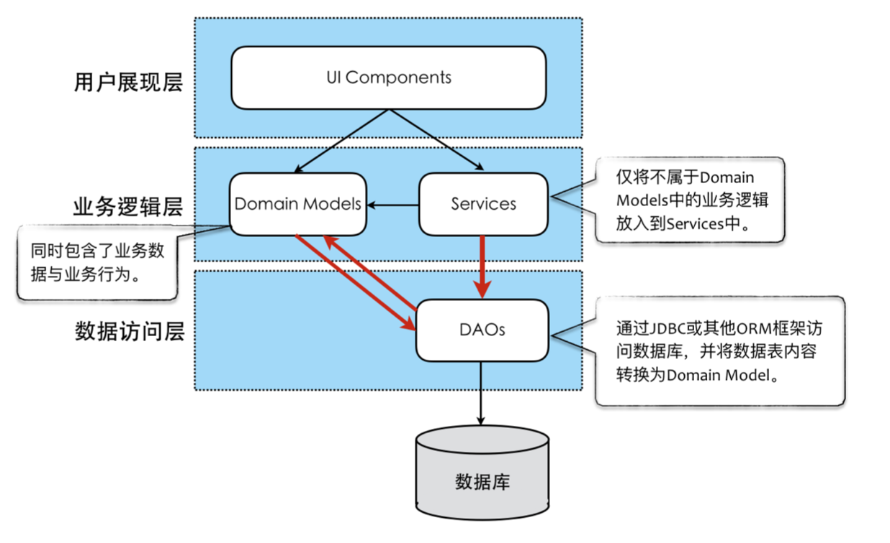

为了去除这种依赖，我们允许处于底层的基础设施依赖于领域层，却必须斩断领域层指向基础设施层的依赖关系，从而保持领域层的干净与纯粹。去除依赖方法为：

- 对DAO对象进行抽象，提取为接口，DDD中，DAO命名为Repository，并将其放入领域层
- 让基础设施层的持久化逻辑实现领域层的Repository接口
- 利用依赖注入在运行时将基础设施层的Repository实现注入到领域层

基础设施层的实现不只限于数据持久化，可能还包括对南向资源的访问，包括消息、文件处理、网络以及与第三方接口的集成。原则上，对于这些具体的技术实现都应该通过接口隔离，并利用依赖注入进行控制反转。

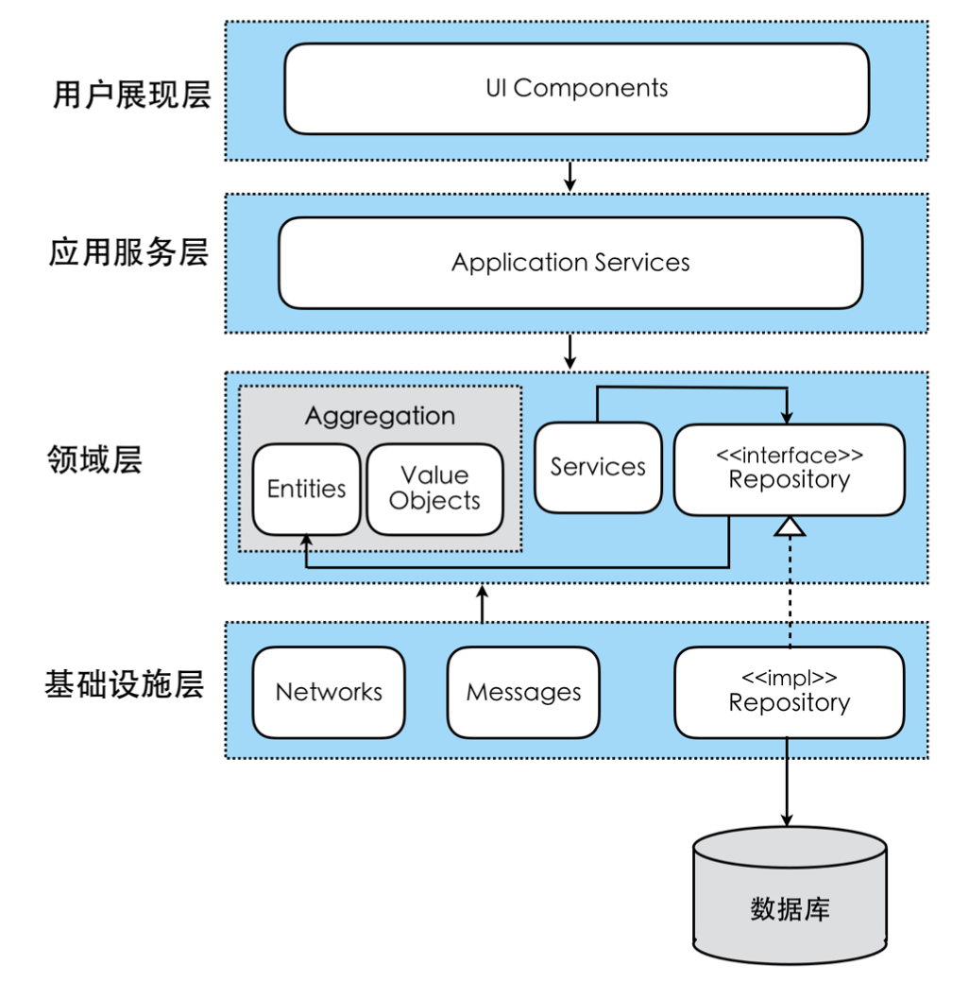

### 六边形架构

分层架构不足以形象的说明领域与技术之间的关注点分离，无法清晰表达，也不足以体现领域的核心位置。六边形架构不同的客户通过平等的方式与系统之间的交互，架构中存在外部区域和内部区域两个部分，内部区域获取持久化数据或者中途数据转发，外部区域负责与客户交互。

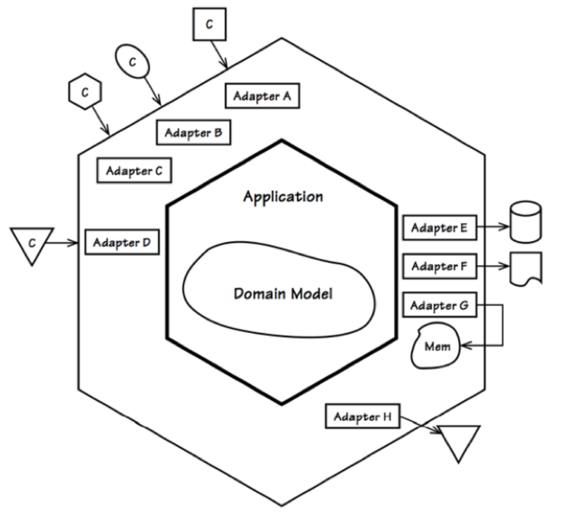

### 领域驱动设计与微服务架构

六边形架构体现了物理边界Bounded Context，BC之间的通信是在六边形的port中进行的。

微服务架构中，通信方式分为两种：编排和协同。松耦合的方式是协同，通过事件的方式，将服务的供应方（上游）与客户方（下游）视为事件的发布者与订阅者，每个微服务都是一个自治服务，只需要规划好需要发布的事件以及订阅的事件，无需关注协同关系的其他服务。

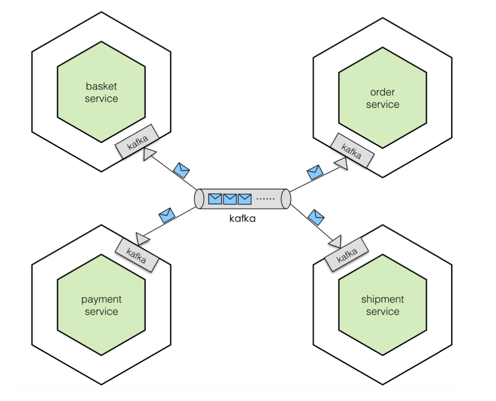

选择kafka作为消息传递通道，可以为不同的事件类别定义不同的主题。

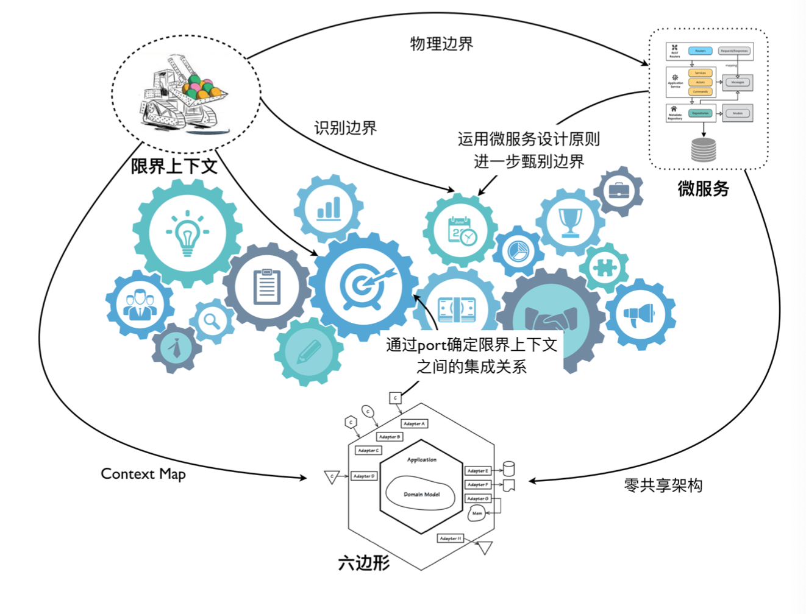

微服务中不用过分的住球纯粹的DRY，不要看代码是否重复，要看引起变化的是否是同一个，只需能保持独立的演化，重用是有代价的。