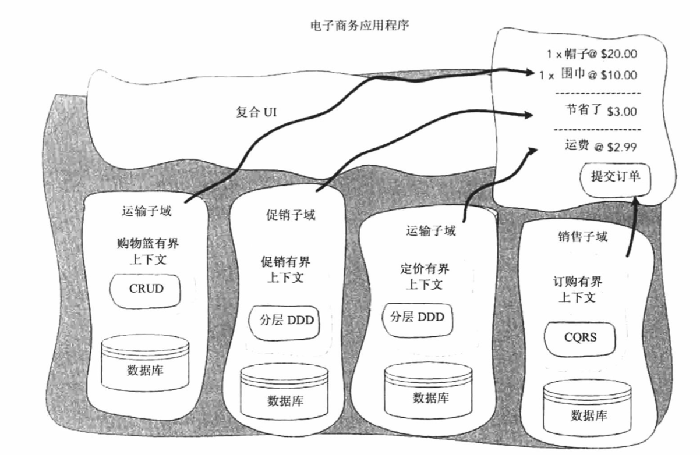

---

typora-root-url: ../DDD
---

# 领域驱动设计的原则与实践

## 什么是领域驱动设计

### DDD的战略模式

- 提炼问题域以揭示重要之处
- 创建一个模型以解决领域问题
- 使用公共语言开启建模协作
- 将模型域歧义和损坏隔离
- 理解上下文之间的关系

### DDD的战术模式

帮助创建用于复杂有界上下文的有效模型的模式集合。

适用于问题空间的DDD模式

适用于解空间的DDD模式

### 领域驱动设计的实践与原则

- 专注于核心领域
- 通过协作进行学习
- 通过探索和实验创建模型
- 通信
- 理解模型的适用性
- 让模型持续发展
- 领域驱动设计的常见误区

### 领域驱动设计的常见误区

- DDD不是以代码为中心的，战术模式是DDD的关键
- DDD是一套框架，在架构上具有不可知性
- DDD可能需要付出大量努力，需要迭代式的开发论和以业务为导向以及聪明的开发人员

### 要点总结

- 领域驱动设计DDD是一种开发思想体系，旨在管理为复杂问题域编写的软件的创作和维护工作
- DDD是模式、原则和实践的集合，可以被应用到软件设计以管理复杂性
- DDD两种模型：战略模型和战术模型
- 将大问题提炼成子域，并非系统所有部分都要精心设计
- 为每一个子域创建一个抽象模型以便管理领域问题
- 为保留模型的完整性，要在有界上下文中定义它
- DDD关注点：核心领域、协作、与领域专家进行探讨、实验研究生成有用的模型
- DDD是软件开发的一种以语言和领域为中心的方式

------

## 提炼问题域

### 知识提炼与协作

知识提炼是从问题域中提炼出相关信息的技术，其目的构建能够满足业务用例需求的有用模型。

知识提炼的方法：

- 通过通用语言（UL）达成共识
- 领域知识的重要性
- 业务分析员的角色
- 一个持续过程

### 与领域专家一起获得领域见解

- 问题空间会给出一组需求、输入和预期输出，这是业务相关人员提供的。解空间包含一个能满足需要的模型，这是领域专拣能够提供帮助的地方。
- 开发团队和领域专家一起工作，加深对问题的理解
- 开发团队与领域专家互动，这一更深层的设计简洁使得软件可用冰在业务过程变更时能够进行适应性调整、

### 有效提炼知识的模式

- 专注在最有意思的对话上
- 从用例开始，抓住真实情况的过程图
- 提出有力的问题
- 画UML草图
- CRC卡：类名称、类职责、与满足其目的相关且所需的类
- 延迟对模型中概念的命名
- 行动驱动开发BDD是基于测试驱动开发TDD的一种软件开发过程，专注于获取系统的行为，然后由外而内地驱动设计；BDD关注的是软件的行为，系统应该产生怎样的行为，DDD关注的是实现行为的软件核心的领域模型
- 快速成型，快速编码，有助于创建你的有力问题并帮助找到遗漏的用例
- 查看基于纸面的系统

### 查看现有的模型

- 不断尝试
- 理解意图：共享和理解隐含的愿景
- 事件风暴：研讨会活动旨在为业务和开发团队快速建立对问题域的理解
- 影响地图：创建了重点突出关键业务信息的类似思维导图
- 理解业务模型：业务模型包含大量有用的领域信息并且重点强调业务的根本目标
- 业务模型的9个模块：客户细分、价值提供、渠道、客户关系、营收来源、核心资源、核心活动、核心合作伙伴、成本结构
- 刻意发现，在初始阶段，团队应该付出努力识别出他们最不了解的部分
- 模型探讨漩涡：场景探讨、建模、考验模型、收集与记录、代码探究

### 要点

- 知识提炼是处理领域信息以识别出能用于构建有用模型的相关碎片知识的技术
- 知识是由开发人员与领域专家协作获得的，协作有助于弥补所有的知识漏洞并促成共识
- 共识是通过通用语言UL来达成的
- 知识提炼是一个持续的过程，协作和业务人的参与不应该局限于项目的初始阶段，深层简介和突破仅会产生为解决问题而进行的多次开发迭代以后
- 业务相关人员为你提供应用程序的需求，并非解答领域详细问题，核心或复杂的建模需要领域专家
- 围绕系统最重要的用例驱动知识提炼，寻求领域专家遍历系统用例的具体场景，以便帮助弥补知识漏洞
- 草图和事件风暴技术可视化你所学的知识，提升业务专家的协作并让知识的提炼环节更有趣
- 要有计划的修改模型，不要过于投入，因为知识提炼的突破可能会被废弃
- 提出有力的问题并了解业务意图
- 使用BDD专注于应用程序的行为，在代码中进行实验证明模型的有效性，需要对模型进行修改和反馈
- 尽早识别出团队的知识漏洞，启用刻意发现，消除解决不了的未知问题
- 查看行业中已有的处理过程和模型，避免重新发明车轮以及加速领域知识的获取

## 专注于核心领域

- 提炼用于分解大的问题以便找出核心、支撑和通用域
- 提炼有助于降低问题空间的复杂性
- 专注和精力应该投入到核心领域，在此处使用你最好的开发人员
- 核心领域是你编写软件的原因
- 需要考虑外包开发、采购支撑和通用域或者将初级开发人员放到支撑和通用域
- 一份领域愿景说明会解释对产品取得成功的核心内容的共识，使用领域专家、项目启动文档以及业务战略介绍来帮助发出领域愿景说明的通告
- 随着更多的了解问题，要规划核心领域内模型的变更，不要太过于重视一个解决方案，你的核心领域回宿舍时间的变化而变化
- 并非系统的每一个部分都要精心设计，将精力专注于核心领域上，对于一流的BBoM系统应该定义一个防止损坏边界来避免新代码变得与混乱的旧代码交织在一起

### 模型驱动设计

领域模型位于领域驱动设计的中心，该模型首先是作为分析模型在知识提炼环节通过开发团队和业务专家之间的协作共同完成的，表示一个非真实的问题域视图，这个试图仅仅是为了满足业务用例的需求。它是在团队沟通所用的共同语言以及团队绘制的图表中来描述的，当他作为代码实现来表示时，通过使用共同语言将其绑定到了分析模型，其实用性来自其能够描述领域中的复杂逻辑和决策以便处理业务用例，该模型仅包含于解决要创建额应用程序上下文中的问题有关内容，他需要与业务一道持续演化以保持其自身有用和有效性。

- 领域表示正在处理的问题域，反映的是当前局面切实面临的问题，领域模式是问题的抽象，表示一个非真实的问题域视图的代码实现来描述。
- 模型是由分析模型和代码模型来表示的，他们完全是一回事，分析模型有时也是业务模型，他是描述系统模型的构建集合，可以是非正式的UML，用于描述技术实现；DDD不提倡去分析模型，代码模型是领域模型的主要表现，会验证业务设想并快速凸显与分析模型不一致的地方。
- 分析模型只有在它保持与代码模型协同时才有用
- 代码是表述模型的主要形式，需要使用通用语言来约束它
- 开发UL的过程是DDD最重要的一环，因为它能够促进沟通和学习
- 必须明确定义领域专业术语以确保含义准确，因为沟通中使用的专业语言会被融入到代码实现中。
- 通用语言应该用于测试、命名空间、类名和方法
- 使用领域场景来证明模型的可用性并验证团队对领域的理解
- 仅为核心领域应用模型驱动设计并创建UL才能带来变化，不要将这些实践应用到整个应用程序

### 领域模型实现模式

领域层仅仅会组成应用程序的一小部分，不会渗入业务问题且不会让领域中已有的规则变模糊。

在应用程序内部以各种模式实现的多个领域模型：

- 领域层包含领域模型，且与基础架构和呈现问题相分离
- 领域模型可以使用多种领域逻辑模式来实现
- 一个大型项目可能有多个模型在发挥作用，因此也就有多个模式来表示领域逻辑
- 只要该模式能够将表示领域逻辑的代码与技术代码分开，那么就适合DDD
- 领域模型模式适合于复杂问题域，领域中的概念被封装为同时包含数据和行为的对象
- 事物脚本模式会在程序模块中组织所有的领域逻辑来满足业务事务或用例
- 表模块模式代表着以对象形式建模的数据，表模块可用于紧密反应底层数据结构的数据驱动模型
- 活动记录模式类似于表模块模式，它也是数据驱动的，但是他表示的是表中的行而不是表本身，它适合于具有低复杂性逻辑而又高度基于CRUD模型
- 贫血模型类似于领域模型模式，不过该模型不包含任何行为，纯粹是个对象状态，所有的行为都驻留在修改的服务类中
- 函数编程是构建领域模型的一种同样有效的方法
- 在使用函数编程时，可以将行为分组成聚合并应用于纯粹的不可变的数据结构

### 使用有界上下文维护领域模型的完整性

在代码中保护每个模型的完整性并且清晰定义其职责边界至关重要，这是通过将模型绑定到特定上下文来达成的，有界上下文是基于团队语言和实体构建来定义的，是一个模型可以保持一致性且富有意义，对于管理解空间中的复杂性至关重要。

CURD是创建、更新、读取、删除，用于描述一个系统具有少量仅形成一个数据模型的逻辑。

CQRS（Command Query Responsibility Segregation）表示命令查询职责分离，一个模型是构建来控制和处理命令的，另一个是构建来满足展现需要的。

复合UI是由松散耦合组建构成的一个用户接口。复合UI会在同一个网页上显示来自多个有界上下文的数据。

- 尝试将单个模型用于复杂问题域会导致代码变成大泥球
- 单个模型会增加团队之间的协作成本并且降低其交付业务价值的效率
- 对于在应用程序中发挥作用的每个模型来说，必须明确其上下文与其他团队就它进行沟通
- 一个有界上下文就是一个语言边界，他会隔离模型以免除UL中的歧义
- 有界上下文用于保护领域模型的完整性，有界上下文不是子域，子域
- 没有用于定义模型边界的规则，也就没有定义有界上下文的规则。
- 单个团队应该拥有一个有界上下文
- 架构模式死在有界上下文级别而飞应用程序级别应用的。如果有界上下文中没有复杂的逻辑，则可以使用简单的创建、读取、更新和删除架构
- 有界上下文中使用通用语言应该自主拥有从展现到领域逻辑，再到数据库和结构的完整代码堆栈
- 与子域不同的是，有界上下文是在应用程序内部强调分离模型的具体技术实现，有界上下文存在于解空间中，并且被标示为上下文中的显示领域模型

### 上下文映射

- 上下文映射会反应现有状况的样子。他会提供技术集成方法以及有界上下文之间关系的完整视图。如果没有他们，模型就会受损，而在继承让模型适用性的边界线变得模糊不清时，有界上下文会迅速变成泥球
- 防止损坏层会在与另一个上下文交互时为模型提供隔离，该层会通过提供一个上下文到另一个上下文的转译来确保不损害完整性
- 使用共享内核模式的集成可用于有重叠且共享一个公用模型的上下文
- 集成通过开放宿主服务公开一个外部API，而不是请求客户端将一个模型转换成另一个模型。通常来说。这会为客户端创建一个可使用的发布语言
- 有界上下文之间的关系应该从相互成为彼此的上游或者下游这方面来理解。上游上下文对下游上下文有影响
- 不为了共同目标工作或者不在同一项目上工作的两个团队之间的协作称为顾客-供应商关系。下游顾客可以与其上游供应商协作以集成上下文
- 遵从模式描述了上游与下游团队之间的关系，该模式中上游团队不会与下游团队协作，这就是当上游团队时第三方团队时通常出现的情景
- 合作伙伴关系模式描述了具有共同目标且通常在同一个项目上处理的却是两个不同上下文的两个团队
- 如果有界上下文的集成成本太高且没有其他可用的非技术方法，那么应该遵循分道扬镳的形式

### 应用程序架构

- DDD不需要特殊的架构，只要能将技术问题域业务问题分离的架构即可
- 分离应用程序的问题，通过对应用程序进行分层来将业务复杂性从技术复杂性中隔离出来
- 外围层依赖于内部层，内部层会公开外围层必须遵从和实现的接口，这一依赖倒置的形式将保护领域和应用层的完整性
- 领域层位于应用程序的核心位置，他是通过应用层从技术复杂性中隔离出来的
- 应用程序服务的基础是围绕业务用例，他们是领域层的客户端，他们将委托领域层来满足用例
- 应用程序服务应该对使用它们的客户端保持毫不知情的状态，客户端应遵从应用程序的API，该API能够支持有差异的客户端
- 应用程序服务层是有界上下文边界的具体体现

### 团队开始应用DDD通常遇到的问题

- DDD战术模式可以指导你通向创建有效领域模型之路，DDD这一方面是不断发展的，而实现的细节会被过度强调，该模式可能会有价值，但是这并不是DDD真正价值所在
- DDD远不止编码这么简单，与领域专家协作以进行知识提炼，以及对在通用语言中表述问题达成共识才是DDD的支柱
- 上下文就是一切，上下文和隔离将保持代码的完整性，他降低认知负荷并让模型具有特定用途
- 需要一个愿意学习该领域的聪明专注的团队
- 需要领域专家的参与，揭示更深层次的见解
- 将CRUD用于具有低复杂性的有界上下文
- 有界上下文和通用语言是DDD的基础
- DDD关乎为了在写作中找出一个有用的模型而进行学习、提炼以及探究的过程

### 应用DDD的原则、实践与模式

- 不要把DDD当作灵丹妙药来推广使用，要专注于与业务保持一致并且学习与正在为之构建的领域有关的更多知识
- 仅在需要时应用DDD原则，不要将其作为解决所有问题的工具
- 分解问题空间并专注于核心领域，这是应该投入精力最大的地方
- 在对解决方案建模之间，要捕获环境的现实情况，并理解发挥作用的其他模型和上下文
- 构建一个模型来满足功能场景，从最具风险或最复杂的场景开始，在此处利用好领域专家的事件，并且不要用简单的数据管理来打扰他
- 如果正在一个遗留环境中工作，要确保能保护你自己免受外部代码干扰，不要相信任何人，并且要强化边界，分割出一个区域以添加新的功能，不要试图清理所有内容
- 持续集成、改进和跳帧模型，不要止步于第一个好想法，通过尝试新的模型和解决方案来探究和实验，并且验证好的想法
- 不要作任何假设，保持事物简单性，推迟进行大的设计决策，等待复杂性或新的行为挑战解决方案
- 建模是一项团队活动，并且应该在团队停滞、遇到不确定的区域或者需要阐明的时候进行建模。

