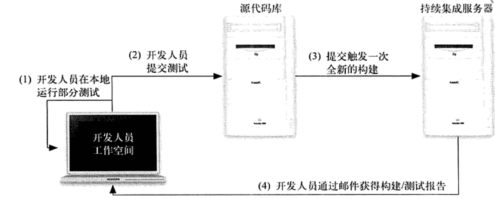

## 测试驱动开发

测试驱动开发（Test-Driven Development, TDD）,就是写代码只为了修复失败的测试。先写一个测试，然后写代码让测试通过。当我们结构有足够的方法保障测试时，我么可以放心的改动现有的设计而不必担心破坏已有的功能。

### 综述

糟糕的代码质量：

1. 在缺点的泥潭中挣扎
2. 维护困难，开发缓慢
3. 不能满足客户的需求

解决方案：测试驱动

使用TDD，能够保证所有的代码都是有用的，而且都会被测试覆盖。

花更少的时间修复缺陷

ATDD（Acceptance TDD，验收测试驱动开发），拉近了最终用户和开发人员的距离，这是生成优秀软件的必要条件

TDD优势：

1. 不在长时间调试代码
2. 对自己完成的工作有信心
3. 有更多的时间做其他事情

正确的做事：

- 测试-编码-重构
- 增量式开发
- 演进式设计
- 重构以保持代码的健康
- 保证软件的正常运行，快速获得反馈

TDD是一种设计和开发方法，能够帮助我们从项目开始就构建出可行的软件，以增量的方式添加新的功能，使软件在整个开发过程中都能够良好的工作。

### TDD入门

从需求到测试

1. 分解需求
2. 好的测试是原子化的、独立的
3. 依照测试列表工作
4. 意图编程：写代码时先假设其他部分的代码都已经存在，把注意力集中在能有的而不是已经有的东西上，让代码读起来更流畅，更容易理解和使用

写一个测试之后，也要添加失败的测试，首先通过编译，然后运行测试

广度优先，会集中实现高层的功能，过程中会暂时停用底层功能的伪实现

深度优先，会先实现底层的功能，把所有底层功能实现之后再实现高层的功能

最后记得清除伪实现，别忘了对代码进行重构，添加错误处理，把方法重构的更短一些，保持方法平衡，验证异常中的详细信息，也要实现性能测试。。

