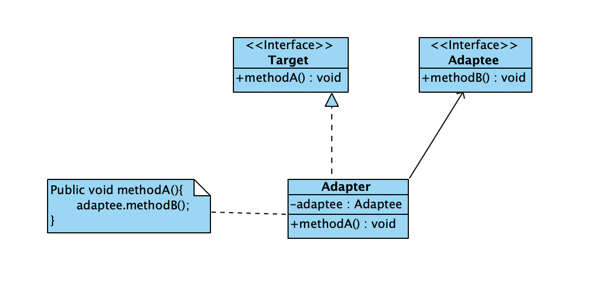
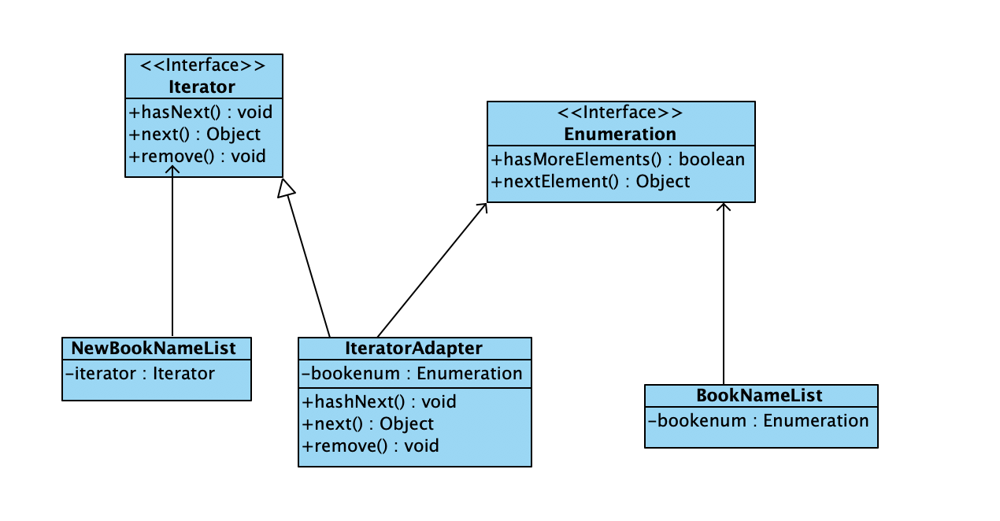

### 适配器模式

适配器模式就是将一个类的接口转换成客户希望的另一个接口的过程，能够使得原来不兼容的对象一起工作

### 结构如下

- 目标Target: 目标是一个接口，该接口是客户想要的接口
- 被适配者Adaptee: 被适配者是一个已经存在的接口或者抽象类，需要进行适配
- 适配器Adapter: 适配器是一个类，职责是对适配者的接口进行适配

如图所示



### 代码

目标（三项插座）
```java
public interface ThreeElectricOutlet {
    void connectElectricCurrent();
}

```

被适配者（两项插座）
```java
public interface TwoElectricOutlet {
    void connectElectricCurrent();
}
```

适配器
```java
public class ThreeElectricAdapter implements ThreeElectricOutlet{
    TwoElectricOutlet outlet;
    ThreeElectricAdapter(TwoElectricOutlet outlet){
        this.outlet = outlet;
    }
    @Override
    public void connectElectricCurrent(){
        outlet.connectElectricCurrent();
    }
}
```

具体使用
```java
public class Application {
    public static void main(String[] args) {
        ThreeElectricOutlet outlet;
        Wash wash = new Wash();
        outlet = wash;
        System.out.println("使用三相电源接通电流：");
        outlet.connectElectricCurrent();
        
        TV tv = new TV();
        ThreeElectricAdapter adapter = new ThreeElectricAdapter(tv);
        outlet = adapter;
        System.out.println("使用三相电源接通电流：");
        outlet.connectElectricCurrent();
    }
}

class Wash implements ThreeElectricOutlet{
    String name;

    public Wash() {
        this.name = "洗衣机";
    }

    public Wash(String name) {
        this.name = name;
    }

    public void turnOn(){
        System.out.println(name + "开始洗衣服");
    }

    @Override
    public void connectElectricCurrent() {
        turnOn();
    }
}

class TV implements TwoElectricOutlet{
    String name;

    public TV() {
        this.name = "电视机";
    }

    public TV(String name) {
        this.name = name;
    }

    public void turnOn(){
        System.out.println(name + "开始播放节目");
    }

    @Override
    public void connectElectricCurrent() {
        turnOn();
    }
}
```

双向适配器

```java
public class ThreeAndTwoElectricAdapter implements ThreeElectricOutlet, TwoElectricOutlet{
    
    TwoElectricOutlet twoElectricOutlet;
    ThreeElectricOutlet threeElectricOutlet;

    public ThreeAndTwoElectricAdapter(TwoElectricOutlet twoElectricOutlet, ThreeElectricOutlet threeElectricOutlet) {
        this.twoElectricOutlet = twoElectricOutlet;
        this.threeElectricOutlet = threeElectricOutlet;
    }

    public ThreeAndTwoElectricAdapter(ThreeElectricOutlet threeElectricOutlet, TwoElectricOutlet twoElectricOutlet) {
        this.twoElectricOutlet = twoElectricOutlet;
        this.threeElectricOutlet = threeElectricOutlet;
    }

    @Override
    public void connectElectricCurrent() {
        if(this instanceof ThreeElectricOutlet){
            // two是被适配的接口
            twoElectricOutlet.connectElectricCurrent();
        }
        if(this instanceof TwoElectricOutlet){
            // three是被适配的接口
            threeElectricOutlet.connectElectricCurrent();
        }
    }
}
```

### 优点

目标和适配者是完全解耦的关系

满足"开闭原则"，当添加一个实现Adaptee接口的新类时，不必修改适配器就可以进行适配

### 案例

Enumeration接口中有两个方法：hasMoreElements()和nextElements()

Iterator有三个方法：hasNext()，next(), remove()

目前有一个系统，里面有一个类BookNameList， 它使用了Vector方法存了很多书，但是为用户提供的是Vector枚举器，用户可以在该枚举器中查看图书的名称
现在该系统准备在NewBookNameList中使用LinkedList放入图书名称，但为了缩短周期，决定将已有系统的图书名称放入当前系统中，请使用适配器完成开发的任务

设计的类图如图所示：

