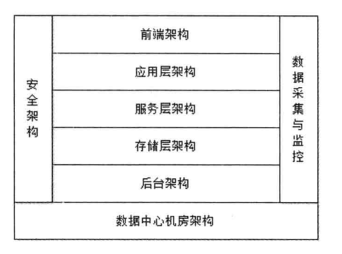
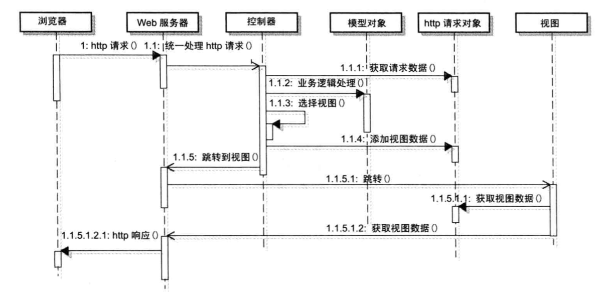

## 大型网站技术架构

内容摘自李智慧老师的《大型网站技术架构-核心原理与案例分析》，只可阅读禁止用于商业。

### 网站层次结构

网站架构层次

#### 前端架构

浏览器优化、CDN、动静分离，静态资源独立部署、图片服务、反向代理、DNS

#### 应用层架构

开发框架、页面渲染、负载均衡、Session管理、动态页面静态化、业务拆分、虚拟化服务器

#### 服务层架构

分布式消息、分布式服务、分布式缓存、分布式配置

#### 存储层架构

分布式文件、关系数据库、NoSQL数据库、数据同步

#### 后台架构

搜索引擎、数据仓库、推荐系统

#### 数据采集与监控

浏览器数据采集、服务器业务数据采集、服务器性能数据采集、系统监控、系统报警

#### 安全架构

Web攻击、数据保护

#### 数据中心机房架构

机房架构、机柜架构、服务器架构

### Web技术发展

CGI（通用网关接口）请求过程：

Java以线程的方式在Java Web容器中调用Servlet。

MVC将模型和视图分离

### 架构设计

[大型网站架构分演化](../../src/architecture/大型网站架构演化.md)

[大型网站架构分析](../../src/architecture/大型网站架构分析.md)

[大型网站架构模式](../../src/architecture/大型网站架构模式.md)

[大型网站核心架构要素](../../src/architecture/大型网站核心架构要素.md)

[高性能架构](../../src/architecture/高性能架构.md)

[高可用架构](../../src/architecture/高可用架构.md)

[可扩展架构](../../src/architecture/可扩展架构.md)

[网站伸缩性架构](../../src/architecture/网站伸缩性架构.md)

[安全性架构](../../src/architecture/安全性架构.md)

### 架构真经

[架构真经](../../src/architecture/架构真经.md)

### 架构师职责

规划产品路线、估算人力资源和时间自由、安排人员职责分工、确定计划里程碑点、知道工程师工作
过程风险评估与控制

一群优秀的人做一件他们热爱的事情，一定能取得成功。

寻找一个值得共同奋斗的目标，营造一个让大家都能最大限度发挥自我价值的工作氛围

事情成就了人，而不是人成就了事情，发掘人的优秀比发掘优秀的人更有意义

蓝图应该是表述清楚的，形象的，简单的

共同参与架构而不是凌驾于项目和项目组之上

学会妥协，架构师越早被遗忘，架构越成功

成就他人，让项目成员获得成长

发现问题，寻找突破：（不要急着作出成绩，而是尽快融入团队，了解业务后，再去寻找突破，不需要急着证明自己的能力
，很容易事与愿违）

提出问题，寻求支持：（把我的问题表述成我们的问题；给上级提封闭式问题，A or B,给下属提开放式问题；指出问题而不是批评人
，用赞同的方式提问题）

解决问题，达成绩效：（解决我的问题之前，先解决你的问题；适当的逃避问题）

