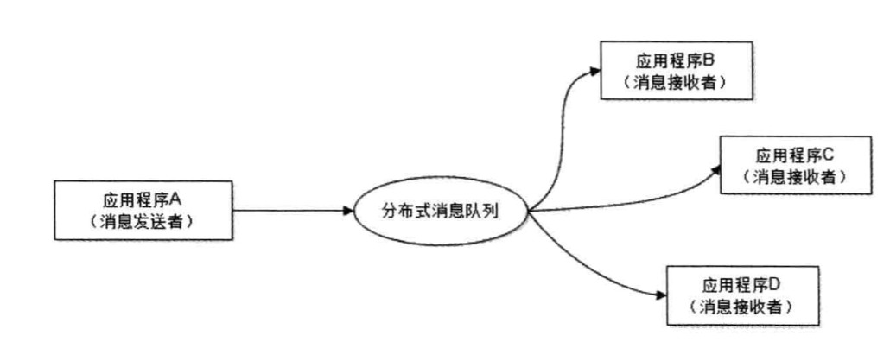
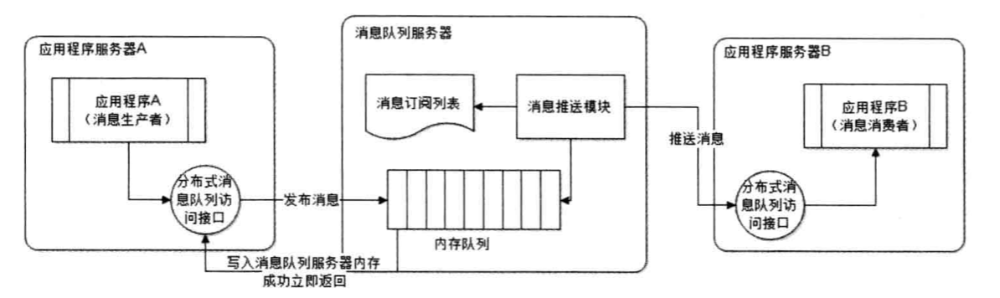
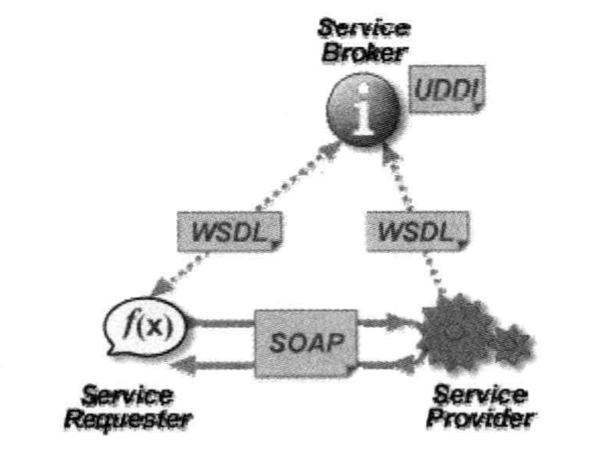
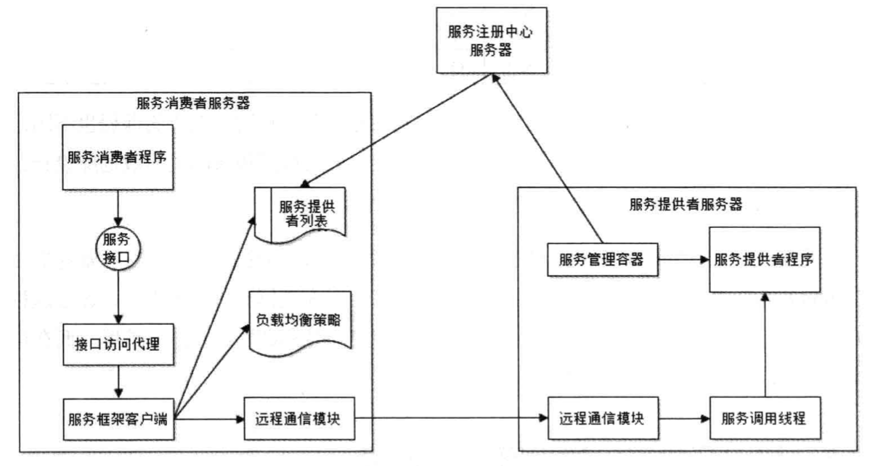

## 可扩展架构

扩展性是指对现有系统影响最小的情况下，系统功能可持续扩展或提升的能力，应用系统之间依赖和耦合较少，对需求的变更可以敏捷响应。
软件系统设计的时候要满足开闭原则，对扩展开放，对修改封闭。

（伸缩性是指系统通过增加自身资源规模的方式减少自己计算处理事务的能力，通常是指通过对集群进行扩展提高系统的吞吐量）

### 构建可扩展的网站架构

开发低耦合的系统是软件设计的目标之一。

软件架构师的价值在于如何将一个大系统切分成N个低耦合的子模块，这些模块包含横向的业务模块，也包含纵向的技术模块。

设计网站可扩展架构的核心思想是模块化，降低耦合性，提高模块的复用性。

模块分布式部署以后具体聚合的方式有分布式消息队列和分布式服务。

### 利用分布式消息队列降低系统耦合性

#### 事件驱动架构

通过在低耦合模块之间传输事件消息，保持模块的松散耦合，并借助事件消息的通信完成模块之间的合作，是一种生产者消费者模式的分布式消息队列。

消息队列采用发布-订阅模式，消息发送者发送消息，多个接受者进行接受或者订阅，实现了业务的解耦。

消息接收者在对消息进行过滤、处理和包装以后，构造成一个新的消息类型，将消息继续发送出去。

由于消息发送者不需要等待消息处理完成之后就可以返回，因此系统有着更好的响应延迟。

#### 分布式消息队列

队列是一种先进先出的数据结构，可以部署在独立的服务器上，通过远程使用分布式消息队列，进行消息的存取操作，可以实现分布式异步调用。

消息生产者远程访问接口将消息推送给消息队列服务器，消息队列服务器将消息写入本地内存队列以后立即返回成功给生产者，消息队列服务器根据消息订阅列表查找订阅该消息的
消费者应用，将消息队列中的消息按照FIFO原则发送给消费者程序。

伸缩性：由于消息队列服务器上的数据可以被即时处理，因此类似于无状态的服务器，伸缩性设计比较简单。新服务器可以直接加入消息队列集群

可用性：避免消费者进程处理缓慢，如果内存队列数据已满，可以写入磁盘，等内存队列消息处理完成之后，将磁盘内容加载到内存队列继续处理。

为了避免消息丢失，会等待消息处理成功之后再从服务器删除，消息队列服务器宕机之后，会选择分布式消息队列中的其他服务器发布消息。

#### 利用分布式服务打造可复用的业务平台

巨无霸系统的缺点：

1. 编译部署困难
2. 代码分支管理困难
3. 数据库连接耗尽
4. 新增业务困难

解决方法是拆分：将模块独立部署，降低耦合性。

1. 将一个大应用拆分成小应用（通过梳理业务，将较少相关的业务分离，成为独立的Web应用）
2. 将复用的业务拆分出来，独立部署为分布式服务（需要识别可复用的业务，设计服务接口，规范依赖关系）

#### Web Service与企业级分布式服务

服务提供者通过WSDL（Web服务描述语言）向注册中心（Service Broker）描述自身提供的服务接口属性，注册中心使用UDDI（统一描述、发现、集成）
发布服务提供者提供的服务，服务请求者从注册中心检索到信息服务以后，通过SOAP（简单对象访问协议）和服务提供者通信，使用相关服务。

缺点：

1. 臃肿的注册与发现机制
2. 低效的XML序列化
3. 开销相对较高的HTTP远程通信
4. 复杂的部署与维护手段

#### 大型网站分布式服务的需求与特点

1. 负载均衡

2. 失效转移

3. 高效的远程通信
 
4. 整合异构系统

5. 对应用最少侵入

6. 版本管理

7. 实时监控

#### 分布式服务框架设计

大型网站高效的分布式服务框架构建SOA（面向服务的体系架构）

Dubbo远程服务通信模块支持多种通信协议和数据序列化协议，使用NIO作为通信框架，具有较高的网络通信性能

消费者：通过服务接口使用服务，可以本地调用，可以远程调用

注册中心：加载服务提供者列表，根据配置的负载均衡策略请求某台服务提供者

### 可扩展的数据结构

设计关系型数据库的时候要指定表的Schema(字段，名称，数据类型)，不容易做到可扩展

NoSQL数据库使用的ColumnFamily列族最早在Google的Bigtable中使用过，使用时无需指定字段，可以随意扩展

### 利用开放平台建立生态

开放平台是指网站内部与外部交互的接口，外部需要面向众多的第三方开发者，内部需要面对网站内的众多业务服务

1. API接口

暴漏给开发者的一组API，可以是Restful、WebServices、RPC等

2. 协议转换

将各种API转换成内部可以识别的形式

3. 安全

需要身份识别，权限控制，流量控制

4. 审计

监控、计费

5. 路由

将开放平台的各种访问路由映射为内部服务
 
6. 流程

将一组服务组成一组新服务，隐藏细节

