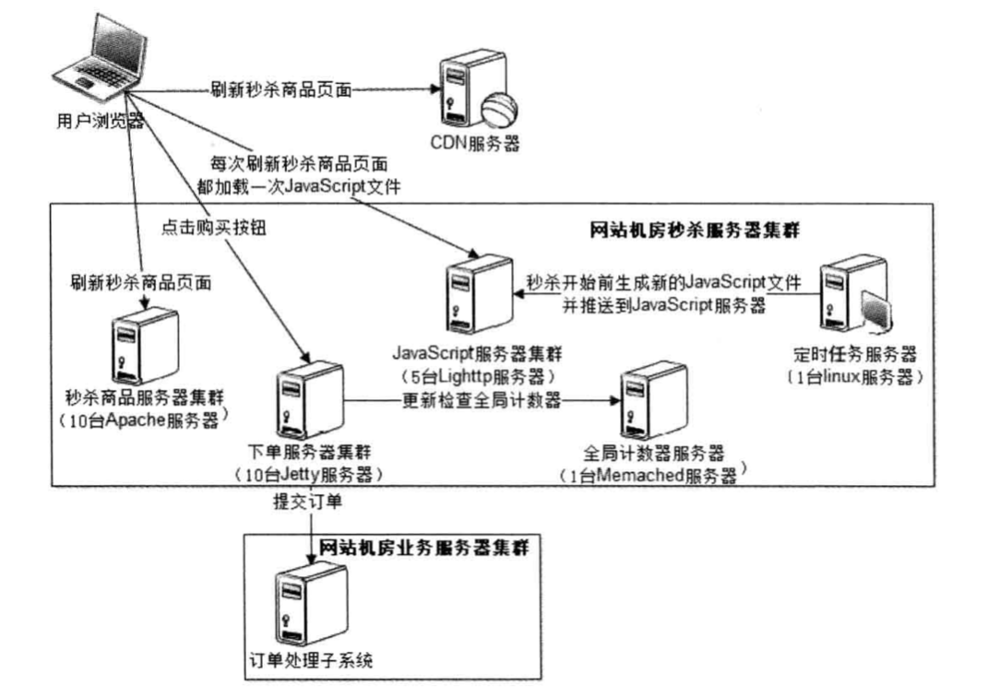

## 大型网站架构案例

### 淘宝网

早期淘宝架构：Linux+Apache+MySQL+PHP(LAMP)

好处是：

1. 开源、免费成本低

2. 文档多，可以从社区获得技术支持

3. 需求变更快，好上手，学习周期短

4. 发展不顺及时关闭，减少沉没成本

04年，放弃原来的LAMP架构，转而使用Java做开发平台，Oracle做后端数据库，系统架构采用MVC和ORM框架
自己开发MVC框架Webx,ORM采用IBatis。

采用Antx：管理配置项，对网站的开发、测试、发布很重要。

应用服务器采用Weblogic,数据库使用Oracle，需要IBM小型机和EMC存储设备

后来放弃EJB，引入Spring，使用免费的JBoss代替收费的Weblogic,后来使用Jetty代替JBoss,应用服务器只需要一个Servlet容器。

目前开源了一些技术系统

| 项目 | 描述  |
| :--------:   | :----- |
|Tair | 分布式key/value存储引擎，分为持久化和非持久化两种 |
|TFS |一个分布式文件系统，适用于海量小文件存储 |
|OceanBase | 分布式数据库系统，支持千亿级别的读写事务 | 
|TDDL |对应用透明的分库分表层和具有众多特性的动态数据源 | 

后来放弃了OIE这些昂贵的设备和软件，使用开源的MySQL和NoSQL系统，事物发展的否定之否定和螺旋上升的普遍规律。

### 维基百科

维基百科目前网站架构LAMP,其他技术组建也是开源免费，因为Wikipedia是非盈利的

- GeoDNS: 基于开源域名服务器软件BIND的增强版本，可将域名解析到离用户最近的服务器。

- LVS：基于Linux的开源负载均衡服务器

- Squid: 基于Linux得到开源反向代理服务器

- Lighttpd: 开源的应用服务器，轻量、快速

- PHP：免费的Web应用服务器

- Memcached: 无中心高性能开源分布式缓存系统，稳定、可靠

- Lucene: 由Apache出品，Java开发的开源全文搜索引擎

- MySQL: 开源关系数据库管理系统

#### 维基百科性能优化策略

Wikipedia前端性能优化：

指DNS、CDN、反向代理服务、静态资源服务等

前端核心是反向代理服务器Squid集群，大约部署10台服务器，请求通过LVS负载均衡
分发到没太Squid服务器上，热点词条被缓存在这里，大量请求可以直接返回响应，请求无需发送到Apache服务器，减轻应用负载压力
Squid缓存不能命中的请求再通过LVS发送到Apache应用缓存服务器，如果词条更新，应用服务器使用Invalidation Notification服务通知缓存失败，重新访问应用服务器更新词条

CDN缓存的几个准则：

- 页面内存不能包含动态信息，以免缓存很快失效或者过时
- 每个内容页面有唯一的REST风格的URL，以便CDN快速查找避免重复缓存
- HTML响应头写入缓存控制信息，判断缓存的有效期

Wikipedia服务端性能优化：

PHP运行模块复杂笨重，需要消耗较多的资源，性能优化如下：

- 使用APC，是PHP字节码缓存模块，加速代码执行，减少资源消耗

- 使用Imagemagick进行图片处理和转化

- 使用Tex进行文本格式化，将科学公式转换成图片

- 替换PHP字符串查找函数strtr()，优化算法性能

Wikipedia后端性能优化：

包括缓存、存储、数据库等被应用服务器依赖的都称为后端服务

后端优化主要手段是缓存，将热点数据缓存在分布式缓存系统的内存上，加速应用服务器的数据读写速度，减轻存储和数据库服务压力。

- 热点数据直接缓存在服务器内存，数据量小但是读写频率高
- 缓存数据的内容应该是服务器可以直接利用的格式，HTML减轻后端解析压力
- 使用缓存服务器存储session对象
- 相比数据库，Memcached持久化代价很小

Wikipedia优化如下：

- 使用较大的服务器内存，增加内存可以改善MySQL性能
- 使用RAID0磁盘阵列加速访问磁盘，但是降低了可靠性，一块硬盘坏了，整个数据不完整
- 将数据库事务一致性设置在较低的水平，加快宕机恢复速度
- 如果Master宕机，那么应用立即切换至Slave数据库，同时关闭数据库写服务，用业务后退解决技术问题

### 海量分布式存储系统Doris的高可用架构设计分析

Doirs是一个海量分布式KV存储系统，设计的目标是支持中高等规模高可用，可伸缩的KV存储集群，跟主流的NoSQL系统和HBase相比，具有相似的性能和线性伸缩能力

高可用：任何时候都可以进行读写访问，无论出了什么故障

高可靠：任何情况数据不会丢失

#### 分布式存储系统的高可用架构

系统架构层面保证高可用的主要手段是冗余：服务器热备份，数据多份存储，可以使
系统进行灵活的失效转移(Failover)，保证系统的高可用

系统整体分为三部分：

- 应用程序服务器：是存储系统的客户，对系统发起数据操作请求
- 数据存储服务器：是存储系统的核心，负责存储数据、响应应用服务器的数据操作请求
- 管理中心服务器：由两台机器组成的主-主热杯小规模服务器，主要负责集群的管理，进行心跳检测，故障恢复处理等

副本数目越多，可用性级别越高，需要的服务器也越多，为了便于管理，需要将服务器划分多个序列从而对数据进行存储

应用服务器写入数据是，根据集群配置和应用可用性级别使用路由算法在每个序列中计算得到一台服务器，同时并发将数据写入服务器
，读数据时，从需要随机选择一个序列，根据服务器编号和地址即可读取。

#### 故障解决方案

| 故障 | 原因  | 特点 |
| :--------:   | :----- | :----- |
|瞬时故障 | 网络终端，服务器垃圾回收，后台线程繁忙停止数据访问响应 | 故障时间短，秒级甚至毫秒级可自行恢复|
|临时故障 |交换机宕机、网卡松动、内存损坏、CPU过载、系统升级、停机维护等| 故障需要人工干预，更换硬件或则重启机器|
|永久故障 | 硬盘损坏，数据丢失 | 可以更换硬盘但是丢失的数据无法恢复| 

#### Doris故障解决方案

临时故障时，读写服务选择可用的服务器，等坏机器恢复后从正常机器上对恢复期间的数据进行迁移

### 网站秒杀系统架构设计

#### 技术挑战

- 对现有业务造成冲击
- 高并发下应用、数据库负载
- 突然增加网络和服务器带宽
- 到点下单

#### 应对策略

- 独立部署，避免拖垮整个网站
- 秒杀商品页面静态化
- 租秒杀活动网络带宽（与CDN服务器协商）
- 动态生成随机下单页面的URL

#### 架构设计

使用JavaScript脚本控制，在秒杀的时候刷新页面，不让请求到达服务器

控制下单页面的入口，只有少数用户可以进入下单服务器，其他用户直接进入秒杀哦结束的页面，只允许第一个提交的订单发送到订单子系统

### 故障案例分析

#### 写日志引发的故障

log的level设置为全局debug，导致简单的请求产生大量的log文件，消耗完磁盘。

经验：

- 应用程序日子与第三方组建日志分别配置
- log级别至少是warn，检查log输出代码的调用
- 关闭第三方组建的日志输出

#### 高并发访问数据库引发的故障

某条SQL被首页频繁调用，导致数据库Load高

经验：

- 首页不应该访问数据库，需要从缓存服务器或者搜索引擎服务器加载
- 首页大部分静态

#### 高并发锁引发的故障

某个单例对象多处用了synchronized,所有的并发请求都被锁住，一般情况下操作很快，但是某个远程调用也被加了synchronized，导致被长时间锁住，所有用户线程都在等待

经验：谨慎使用锁

#### 缓存引发的故障

关闭了太多缓存服务器，导致数据库访问量大增，应该谨慎管理缓存服务器

#### 应用启动不同引发的故障

后台服务为准备好之前，前台应用服务无法进行

#### 大文件读写独占磁盘引发的故障

图片需要使用存储，有些大文件的操作被独占，导致其他用户操作缓慢

经验：根据不同用途分类存储文件，大文件单独存储

#### 滥用生产环境引发故障

对线上生产环境进行压力测试，占用了大部分宽带

经验：网站的生产环境，尤其是数据库，不能随意执行，否则不好订正数据

#### 不规范的流程引发故障

为了测试方便注释了缓存的代码，导致直接访问数据库

经验：代码提交前，严格diff，加强code review

#### 不好的习惯引发故障

构造了Null对象，引发NullPointException

经验：对对象进行空指针判断，使用空对象模式进行调用

