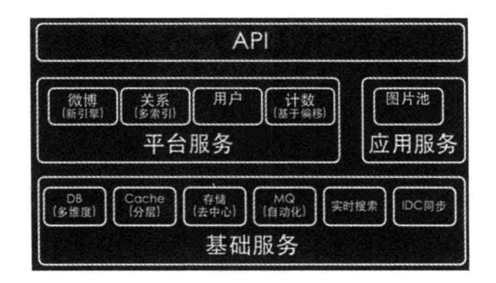

### 大型网站架构模式

每一个模式描述了一个在我们周围不断重复发生的问题以及该问题解决方案的核心，从而减少重复工作。

#### 网站架构模式

1. 分层

参考计算机网络7层协议、计算机硬件操作系统以及软件的的分层调用

| 分层 | 职责  |
| :--------:   | :----- |
|应用层 |负责具体业务和视图的展示，如网站首页和搜索展示页面 |
|服务层 |为应用层提供服务支持，如用户管理、商品管理等 |
|数据层 |提供数据存储和访问服务，如数据库、缓存、文件和搜索等 | 

分层的优缺点：

优点：

1.1 便于开发和分工，后期便于维护

1.2 各层之间独立，可以根据不同的层进行演进和升级，甚至不同的层可以部署在不同机器上

缺点：

1.1 需要合理规划层次和边界，增加了工作量

1.2 跨层调用和逆向调用会产生问题

2. 分割

分层是在软件横向方向进行切割，分割是在纵向进行切分，比如将购物和支付、广告等业务进行分割，设置成不同的微服务

随着网站功能越来越大，功能会越来越复杂，需要将不同的功能和服务分割开来，包装成高内聚和低耦合的模块单元，有猪油软件的开发和维护
也便于分布式部署，提高网站的并发能力和功能扩展能力。

3. 分布式

对于大型网站，分层和分割都是为了切分后的模块便于分布式部署，通过远程调用协同工作。分布式可以是用更多的计算机
完成同样的功能，通过对硬件上的扩展，提高网站的计算能力。

但是分布式意味着服务必须通过网络进行调用，可能会因为一台服务的宕机导致其他服务不可用，降低网站的可用性，同时数据在不同服务器上的数据一致性也不好保证
，这对业务的正确性和流程有一定的影响，使得维护起来较为复杂。

常见的分布式解决方案有：

| 分布式服务 | 特点  |
| :--------:   | :----- |
|分布式应用和服务 |将分层和分割后的应用和服务模块分布式部署，改善网站性能和并发性、加快开发和部署速度、减少数据库连接消耗，增强复用性，便于业务扩展 |
|分布式静态资源 |网站静态图片部署，采用独立的域名，减轻服务器压力，使用独立的域名对浏览器进行缓存，加快访问速度，便于维护和扩展 |
|分布式数据和存储 |海量数据进行分布式存储，除了对传统的关系数据库进行分布式部署以外，一些NoSQL产品也是分布式的 | 
|分布式计算|应用、服务、实时数据计算都是计算，一些业务后台处理、网站和搜索引擎的构建、数据分析和统计大多采用Hadoop和MapReduce分布式计算框架进行批处理计算|

服务器实时更新的分布式配置，分布式环境下实现并发和协同的分布式锁，支持云存储的分布式文件系统等。

4. 集群

分布式将分层和分割的应用独立部署，但是用户集中访问的模块需要将独立部署的服务器集群化，即多台服务器部署相同应用构成一个集群，通过负载均衡对外提供服务。

集群是为了更好的提供并发性，用户增多时，加入新的机器，某台机器故障时转移请求到其他服务器，提高可用性。

5. 缓存

缓存是为了将数据放在距离计算更近的位置上以加快处理速度。改善软件性能的一种手段，比如CPU计算的cache缓存，页面调度中的缓存

| 常见的缓存 | 特点  |
| :--------:   | :----- |
|CDN |内容分发网络，部署在距离终端用户最近的网络服务商，用户请求先到达网络服务商，以最快的速度发挥静态资源 |
|反向代理 | 属于网站前端的一部分，当请求到达网站的数据中心时，最先访问的就是反向代理服务器，这里缓存网站的静态资源，无需将请求继续转发给应用服务器就能返回给用户|
|本地缓存 | 应用服务器本地缓存热点数据，可以直接通过内存访问，无需访问数据库| 
|分布式缓存| 当网站庞大时，需要对本地缓存进行扩展，将数据缓存在一个专门的分布式集群中，通过网络通信进行访问|

使用缓存的条件:

5.1 数据访问热点不均衡，某些数据被频繁访问，数据应该放在缓存中

5.2 某个时间段内有效的数据，不会很快过期，否则会造成脏读

缓存可以加快访问速度，减少后端压力和存储压力，需要按照数据的访问频率合理设计。

6. 异步

业务之间的消息传递不是同步进行的，而是将业务分成多个阶段，每个阶段通过共享数据的方式异步执行。
单一服务器可以通过多线程共享内存队列的方式实现异步，分布式系统中通过分布式消息队列实现异步。
异步架构是生产者消费者模式，二者不直接调用，从而进行解耦，功能可以随意变化不受影响，易于扩展。

特点：

6.1 提高系统的可用性

消费者服务器异常后，消息会队列中堆积，等回复之后再去消费

6.2 加快网站的响应速度

业务写入消息队列后不通过消费者服务器即可返回结果，延迟小

6.3 消除并发访问高峰

出现突发事件或者促销活动时，可以放入消息队列中，等到消费者服务器依次处理

7. 冗余

数据冗余备份，当服务器宕机时，可以快速切换，实现高可用

数据库定期备份，实现冷备份，为了保证在线的高可用，实现主从分离实现热备份

为了抵御不可抗据力对机房的破坏，需要设置灾难备份的数据中心

8. 自动化

发布自动化管理：自动化代码管理、自动化测试、自动化安全检测、自动化部署

监控自动化：自动化监控、自动化报警、自动化失效转移、自动化失效恢复、自动化降级、自动化分配资源

9. 安全性

密码和手机校验码进行身份认证，交易信息进行加密，使用验证码防止机器人攻击，对于SQL注入等进行编码转换处理，对于垃圾信息进行过滤，对交易模式和交易信息进行风险控制

#### 架构模式的应用

微博的系统架构如下：

分为三个层次：

1. 基础服务层： 提供数据库、缓存、存储、搜索等数据服务

2. 中间层: 平台服务和应用服务层、将核心服务分割为独立模块，通过依赖调用共享数据

3. 业务层API：通过各种客户端（Web,APP）和第三方应用构成一个完整的生态系统

分割后的服务和技术模块进行分布式部署，每个模块部署在独立的集群上，通过远程调用进行访问。

早期架构中，采用同步推模式，用户发表微博之后，将这条微博插入数据库所有粉丝的订阅列表，后期采用推拉结合的模式，用户写入消息队列后立即返回，将当前在线用户进行迅速推送，非在线用户登录后根据关注列表进行拉取

由于微博频繁刷新，采用多级缓存策略，热门微博缓存在所有服务器上，提高访问性能

为了保证整体性能，采用多个数据中心，用户就近访问，加快访问速度，同时也是数据冗余备份的一种方式，提高了可用性。

自动化工具提高了系统的开发效率，安全审核策略对垃圾内容和僵尸粉进行过滤。

