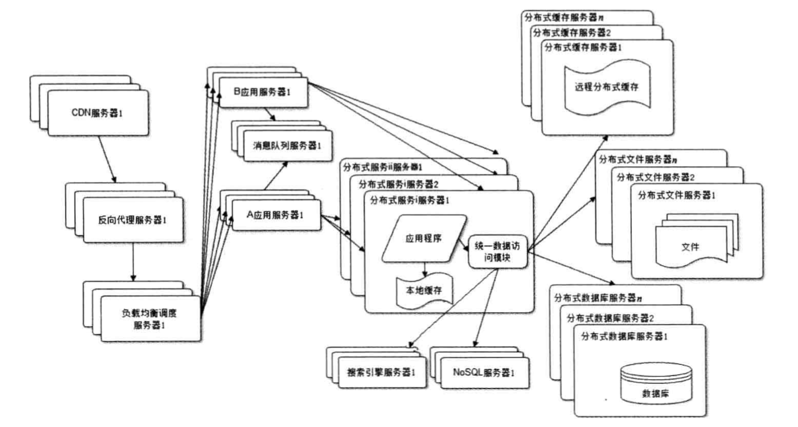

### 大型网站架构演化

#### 大型网站软件系统的特点

1. 高并发、大流量
2. 高可用
3. 海量数据
4. 用户分布广泛、网络情况复杂
5. 安全环境恶劣
6. 需求快速变更、发布频繁变更
7. 渐进式发展

#### 架构演化的几个阶段

| 不同阶段的架构 | 遇到的瓶颈 |  解决方案/特点 |
| :--------:   | :-----  | :---- |  
| 初始阶段网站架构        |  用户业务都比较少      | 单机模式，应用程序、文件、数据库都在一台服务器上（Linux+PHP+Apache+MySQL）|
| 应用服务和数据服务分离   | 越来越多的用户导致性能变差、存储空间不足    | 需要应用服务器（CPU）、文件服务器（大硬盘）、数据库服务器（快速磁盘检索+缓存/更快的硬盘和内存）
| 使用缓存改善网站性能| 应用和数据分离后，随着用户增多，数据库压力太大导致访问延迟，用户体验受影响，而80%的业务访问集中在20%的数据上 | 把经常访问的数据缓存在内存中，改善数据库的写入性能, 缓存分为本地缓存和分布式缓存，本地缓存访问速度更快，但是数量有限容易和应用程序内存竞争，远程分布式缓存可以采用集群的方式，理论上不受内存容量限制|
| 使用应用服务器集群改善网站的并发能力 | 在网站高峰期，应用服务器会收到瓶颈| 增加一台服务器分担原有单机的压力，采用负载均衡调度服务器，讲来自用户浏览器的访问请求分发到应用服务器集群中|
| 数据库读写分离 |网站使用缓存后，绝大部分读操作可以不通过数据库就能完成，但是仍然存在缓存不命中或者缓存过期的情况需要访问数据库| 主流数据库大部分采用主从热备的功能，通过配置主从关系讲一台服务器的数据更新到另一台上，实现数据库的读写分离，改善数据库负载压力|
| 使用反向代理和CDN加速网站响应| 随着业务发展用户规模越来越大，不同地区的网站访问速度不同，延迟越高用户流失量越大|采用CDN和反向代理的基本原理都是缓存，CDN部署在网络商提供的机房里，是的用户访问网站时从距离自己最近的网络商机房获取数据，反向代理部署在网站的中心机房里，当用户请求到达中心机房后，首先访问的服务器是反向代理服务器，如果反向代理服务器缓存着用户数据，那么直接返回给用户。目的都是加快访问速度，减轻后端服务器压力|
| 使用分布式文件系统和分布式数据库系统| 单一服务器满足不了大型网站持续增长的业务需求 | 在单表数据规模非常庞大的时候，讲数据库拆分，不同的业务部署到不同的物理服务器上，需要使用分布式文件数据库和分布式文件系统|
| 使用NoSQL和搜索引擎| 随着业务的复杂，对数据的存储和检索需求也越来越复杂 |采用NoSQL和搜索引擎，对可伸缩的分布式特性具有更好的支持，通过一个同时的数据访问模块访问各种数据，减轻应用程序管理诸多数据源的麻烦|
| 业务拆分| 通过分而治之的方式管理各个不同的网站业务| 将订单、广告、支付等业务分开，查分成不同的应用进行独立部署和维护，可以通过消息队列的形式对数据进行分发，也可以通过一个数据存储系统来关联|
| 分布式服务| 随着业务拆分的越来越小，存储系统越来越大，部署和维护越来越困难 |把公共的业务提取出来独立部署，由可复用的业务连接数据库，提供公共业务服务，能够有效解决跨数据中心的实时数据同步，建设云计算平台，将计算作为一种基础资源出售，中小网站不再用关心技术架构的问题，只需要按需付费，即可获得更大的存储空间和计算资源|

#### 较为完善的网站技术架构图

#### 大型网站的技术演化思路

1. 随着网站所需灵活应对，逐步演化
2. 驱动大型网站的主要力量是业务的发展
3. 不要一味追随大公司解决方案
4. 不要为了技术而技术，脱离了实际需求
5. 不要企图用技术解决所有的问题
6. 计算、存储、网络资源部署在云上、弹性伸缩
