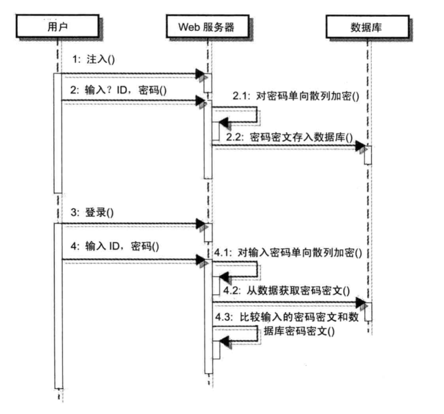
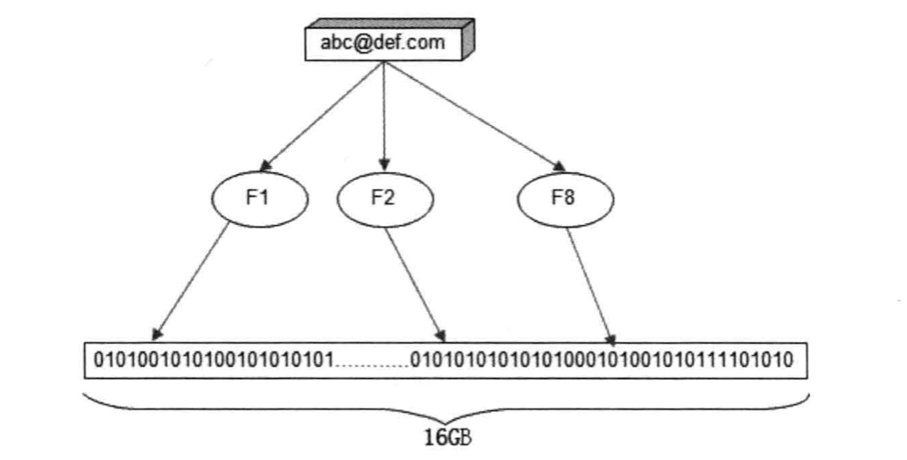
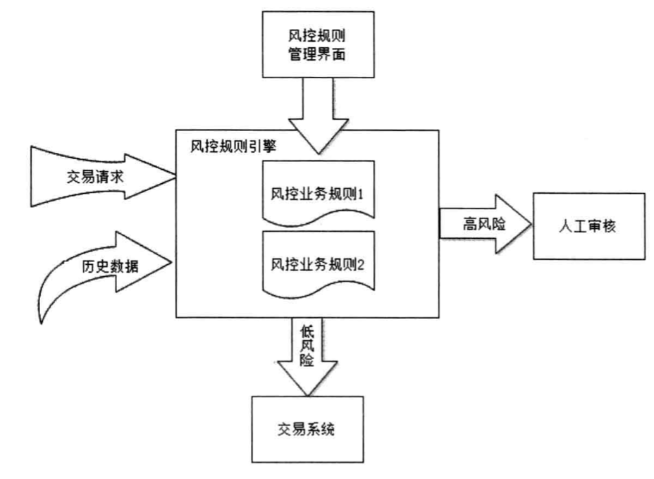
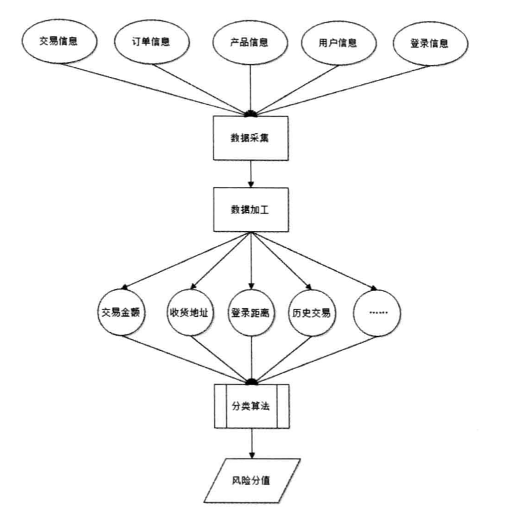

## 安全性架构

### 网站防御

#### XSS攻击

CSS攻击即跨站脚本攻击（Cross Site Script），指黑客通过篡改网友，注入恶意的HTML脚本，在用户浏览网页
时，控制用户浏览器进行恶意操作。

常见的XSS攻击有两种，一种是反射型，攻击者诱导用户点击恶意脚本。 另一种是持久型XXS攻击，黑客提交含有恶意脚本的请求，保存在被攻击的Web站点的数据库

常见的解决方案：

1. 消毒

对网页脚本内容进行转义和匹配

2. HttpOnly

禁止页面JavaScript访问带有HttpOnly属性的Cookie

#### 注入攻击

**SQL注入**
在HTTP请求中注入恶意的SQL命令

1. 如果网站采用开源软件搭建，容易被攻击
2. 错误回显：通过故意构造非法参数，使得服务器异常信息输出到浏览器
3. 盲注：关闭错误回显之后，不容易猜测数据库结构

解决方式：

1. 消毒：和防XSS攻击一样，过滤关键的SQL字段

2. 参数绑定：使用Ibatis、Hibernate等实现SQL预编译和参数绑定

**CSRF攻击**
跨站点请求伪造，攻击者通过跨站请求，以合法的用户身份进行非法操作，利用浏览器Cookie或者服务器Session策略

1. 表单Token

表单Token通过在请求中增加随机数的办法攻击组织者获得所有请求参数

2. 验证码

避免用户不知情的情况下伪造请求

3. Referer check

通过检查请求来源，实现图片防盗链

**其他攻击和漏洞**

1. Error Code

跳转500页面，防止黑客攻击

2. HTML注释

避免在PHP，JSP中进行程序注释

3. 文件上传

避免在头像上传时传入恶意的可执行程序，只允许上传可靠类型

4. 路径遍历

遍历系统为开放的文件和目录（防御方法是将JS CSS文件部署在独立的服务器）

**Web应用防火墙**

使用ModSecurity探测攻击并保护Web程序

**网站安全漏洞扫描**

### 信息加密技术及密钥管理

#### 单向散列加密
通过对不同输入长度的信息进行散列计算，得到固定长度的输出。

容易被彩虹表等手段进行猜测式破解

为了加强单项散列计算的安全性，可以给散列算法加盐，增加破解难度

常见的单向加密算法有 MD5， SHA

#### 对称加密

加密和解密的都是同一个密钥

一般用在安全交换和存储的场合，比如Cookie加密和通信加密

算法简单，加密解密销量高，系统开销小，适合对大量数据的加密

常见的有DES算法、RC算法

#### 非对称加密

加密和解密使用的不是同一密钥

一般是公钥加密私钥解密，及时秘文被窃取也无法还原

用于数字签名，因为信息具有不可抵赖性

常见的有RSA算法

#### 密钥安全管理

一种是将密钥和算法挡在独立的服务器上或者做成硬件设施，另一种是将加密算法放在应用系统，密钥放在杜立德服务器，密钥切分成多个存储在不同的机器上，保证安全性也改善性能

### 信息过滤与反垃圾

#### 文本匹配

对文件进行消毒处理，比如用Trie算法，本质是一个有限状态自动机；另一种是通过构造多级Hash表进行文本匹配

#### 分类算法

贝叶斯算法进行垃圾邮件分类

#### 黑名单

将报告的垃圾邮箱加入黑名单

使用布隆过滤器代替Hash表

通过一个二进制列表和一组随机数映射函数实现

使用8个随机映射函数（F1，F2,...F8）得到0-16G范围内的8个随机数，从而将改邮箱地址映射到16GB存储空间的8个位置上，然后将这些位置设为1。

### 电子商务风险控制

#### 风险

1. 账户风险

2. 买家风险

恶意竞争，欺诈退款
 
3. 卖家风险

出售违禁商品

4. 交易风险

信用卡盗刷、支付欺诈

#### 风控

包括自动和人工两种，机器自动识别为高风险的交易和信息会发给风控人员进行审核。

1. 规则引擎

当交易某些指标满足一定的条件时，可以认为时高风险欺诈，比如金额、登录距离太大、来自诈骗高发地区、登陆地与收获地不符等

一种方法时在业务逻辑中通过编程的方式使用if else进行规则匹配，但是代码量比较大，需要不断修改

所以一般使用规则引擎处理，业务规则由运营人员进行页面编辑，需要修改规则时，自动化处理

2. 统计模型

随着规则的增加，会出现规则冲突，难以维护的现象，规则越多，性能越差，因此可以使用复杂的机器学习统计模型进行分类，对历史交易数据进行训练，得到风险分值

可以先用统计模型进行模糊识别，然后不精确的进行欺诈规则匹配

