## Scalability Rules - 50 Principles for Scaling Web Sites

## Reduce the Equation

### Rule 1 Don’t Overengineer the Solution

- What: Guard against complex solutions during design.
- When to use: Can be used for any project and should be used for all large or complex systems or projects.
- How to use: Resist the urge to overengineer solutions by testing ease of understanding with fellow engineers.
- Why: Complex solutions are costly to implement and have excessive long-term costs.
- Key takeaways: Systems that are overly complex limit your ability to scale. Simple systems are more easily and cost effectively maintained and scaled.

### Rule 2 Design Scale into the Solution (D-I-D Process)

- What: An approach to provide JIT (Just In Time) Scalability. When to use: On all projects; this approach is the most cost effective (resources and time) to ensure scalability.
- How to use:  Design for 20x capacity.  Implement for 3x capacity.  Deploy for ~1.5x capacity.
- Why: D-I-D provides a cost effective, JIT method of scaling your product.
- Key takeaways: Teams can save a lot of money and time by thinking of how to scale solutions early, implementing (coding) them a month or so before they are needed, and implementing them days before the customer rush or demand.

### Rule 3 Simplify the Solution 3 Times Over

- What: Used when designing complex systems, this rule simplifies the scope, design, and implementation.
- When to use: When designing complex systems or products where resources (engineering or computational) are limited.
- How to use:  Simplify scope using the Pareto Principle.  Simplify design by thinking about cost effectiveness and scalability.  Simplify implementation by leveraging the experience of others.
- Why: Focusing just on “not being complex” doesn’t address the issues created in requirements or story and epoch development or the actual implementation.
- Key takeaways: Simplification needs to happen during every aspect of product development.

### Rule 4 Reduce DNS Lookups

- What: Reduce the number of DNS lookups from a user perspective.
- When to use: On all Web pages where performance matters.
- How to use: Minimize the number of DNS lookups required to download pages, but balance this with the browser’s limitation for simultaneous connections.
- Why: DNS lookups take a great deal of time, and large numbers of them can amount to a large portion of your user experience.
- Key takeaways: Reduction of objects, tasks, computation, and so on is a great way of speeding up page load time, but division of labor must be considered as well.

### Rule 5 Reduce Objects Where Possible

- What: Reduce the number of objects on a page where possible. 
- When to use: On all web pages where performance matters. 
- How to use: Reduce or combine objects but balance this with maximizing simultaneous connections. Test changes to ensure performance improvements. Why: The number of objects impacts page download times.
- Key takeaways: The balance between objects and methods that serve them is a science that requires constant measurement and adjustment; it’s a balance between customer usability, usefulness, and performance.

### Rule 6 Use Homogenous Networks

- What: Don’t mix the vendor networking gear.
- When to use: When designing or expanding your network. 
- How to use:Do not mix different vendors’ networking gear (switches and routers).Buy best of breed for other networking gear (firewalls, load balancers, and so on).
- Why: Intermittent interoperability and availability issues simply aren’t worth the potential cost savings.
- Key takeaways: Heterogeneous networking gear tends to cause availability and scalability problems. Choose a single provider.

## Distribute Your Work

At the heart of the AKF Scale Cube are three simple axes, each with an associated rule for scalability.The cube is a great way to represent the path from minimal scale (lower-left front of the cube) to near infinite scalability (upper-right back corner of the cube). Sometimes, it’s easier to see these three axes without the confined space of the cube. 

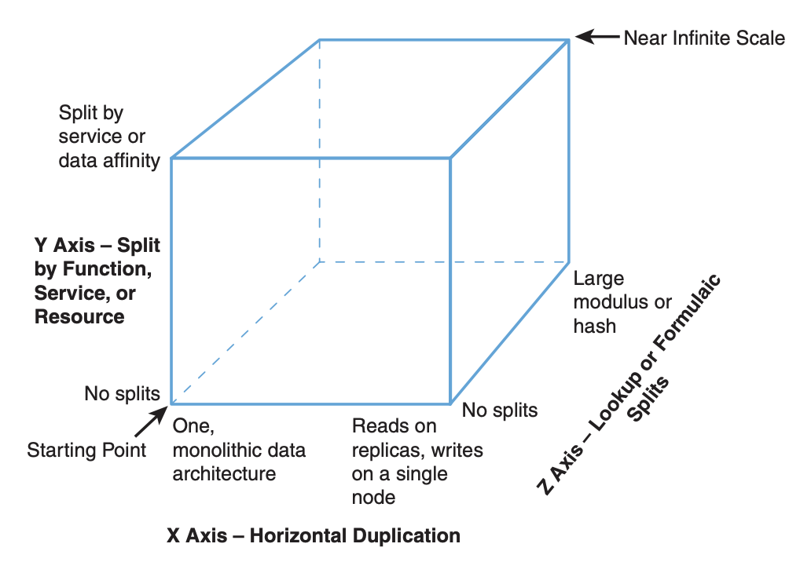

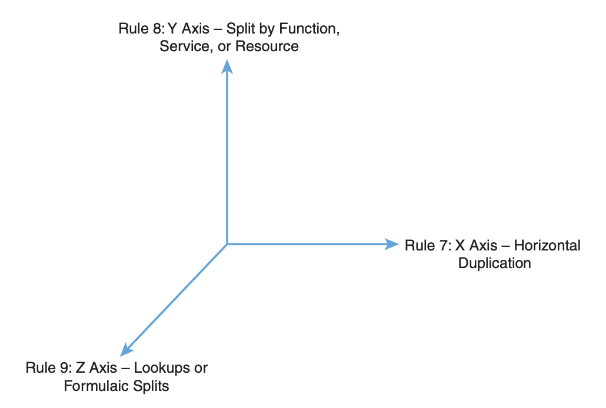

### Rule 7 Design to Clone Things (X Axis)

- What: Typically called horizontal scale, this is the duplication of services or databases to spread transaction load.
- When to use: Databases with a very high read to write ratio (5:1 or greater—the higher the better). Any system where transaction growth exceeds data growth. 
- How to use: Simply clone services and implement a load balancer. For databases, ensure the accessing code understands the difference between a read and a write.
- Why: Allows for fast scale of transactions at the cost of duplicat- ed data and functionality.
- Key takeaways: X axis splits are fast to implement and can allow for transaction, but not data scalability.

### Rule 8 Design to Split Different Things (Y Axis)

- What: Sometimes referred to as scale through services or resources, this rule focuses on scaling data sets, transactions, and engineering teams.
- When to use: Very large data sets where relations between data are not necessary. Large, complex systems where scaling engineering resources requires specialization.
- How to use: Split up actions by using verbs or resources by using nouns or use a mix. Split both the services and the data along the lines defined by the verb/noun approach.
- Why: Allows for efficient scaling of not only transactions, but very large data sets associated with those transactions.
- Key takeaways: Y axis or data/service-oriented splits, allow for efficient scaling of transactions, large data sets, and can help with fault isolation.

### Rule 9 Design to Split Similar Things (Z Axis)

- What: This is very often a split by some unique aspect of the customer such as customer ID, name, geography, and so on.
- When to use: Very large, similar data sets such as large and rap- idly growing customer bases.
- How to use: Identify something you know about the customer, such as customer ID, last name, geography, or device and split or partition both data and services based on that attribute.
- Why: Rapid customer growth exceeds other forms of data growth or you have the need to perform fault isolation between certain customer groups as you scale.
- Key takeaways: Z axis splits are effective at helping you to scale customer bases but can also be applied to other very large data sets that can’t be pulled apart using the Y axis methodology.

We maintain that three simple rules can help you scale nearly everything.There are undoubtedly more ways to scale systems and platforms, but armed with these three rules, few if any scale related problems will stand in your way:

- Scale by cloning: Cloning or duplicating data and services allows you to scale transactions easily.
- Scale by splitting different things: Use nouns or verbs to identify data and services to separate. If done properly, both transactions and data sets can be scaled efficiently.
- Scale by splitting similar things: Typically these are customer data sets. Set customers up into unique and separated shards or swimlanes (see Chapter 9,“Design for Fault Tolerance and Graceful Failure,” for swimlane definition) to enable transaction and data scaling.

## Design to Scale Out Horizontally

### Rule 10: Design Your Solution to Scale Out—Not Just Up

- What: Scaling out is the duplication of services or databases to spread transaction load and is the alternative to buying larger hardware, known as scaling up.
- When to use: Any system, service, or database expected to grow rapidly.
- How to use: Use the AKF Scale Cube to determine the correct split for your environment. Usually the horizontal split (cloning) is the easiest.
- Why: Allows for fast scale of transactions at the cost of duplicat- ed data and functionality.
- Key takeaways: Plan for success and design your systems to scale out. Don’t get caught in the trap of expecting to scale up only to find out that you’ve run out of faster and larger systems to purchase.

### Rule 11: Use Commodity Systems (Goldfish Not Thoroughbreds)

- What: Use small, inexpensive systems where possible.
- When to use: Use this approach in your production environment when going through hyper growth.
- How to use: Stay away from very large systems in your produc- tion environment.
- Why: Allows for fast, cost-effective growth.
- Key takeaways: Build your systems to be capable of relying on commodity hardware and don’t get caught in the trap of using high-margin, high-end servers.

### Rule 12：Scale Out Your Data Centers

- What: Design your systems to have three or more live data cen- ters to reduce overall cost, increase availability, and implement disaster recovery.
- When to use: Any rapidly growing business that is considering adding a disaster recovery (cold site) data center.
- How to use: Split up your data to spread across data centers and spread transaction load across those data centers in a “mul- tiple live” configuration. Use spare capacity for peak periods of the year.
- Why: The cost of data center failure can be disastrous to your business. Design to have three or more as the cost is often less than having two data centers. Make use of idle capacity for peak periods rather than slowing down your transactions.
- Key takeaways: When implementing disaster recovery, lower your cost of disaster recovery by designing your systems to leverage three or more live data centers. Use the spare capacity for spiky demand when necessary.

Split of data center replication

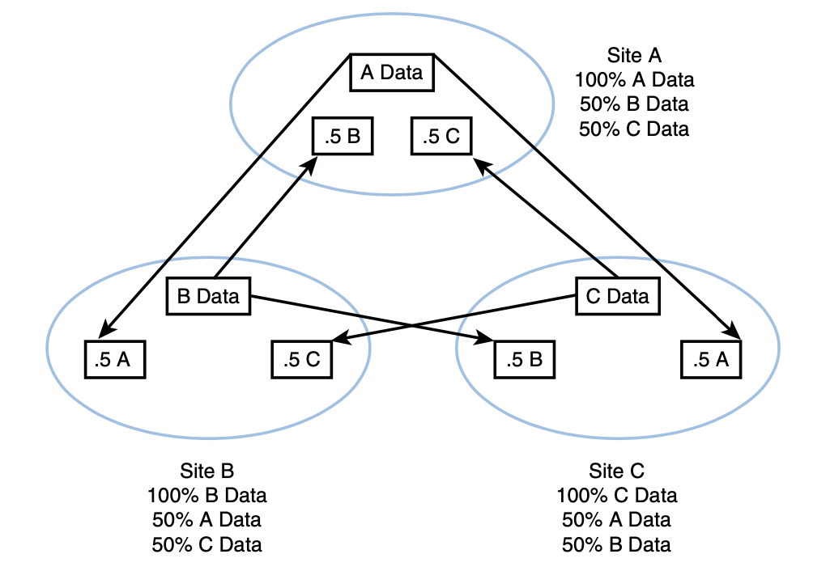

Two data center configuration, “hot and cold” site

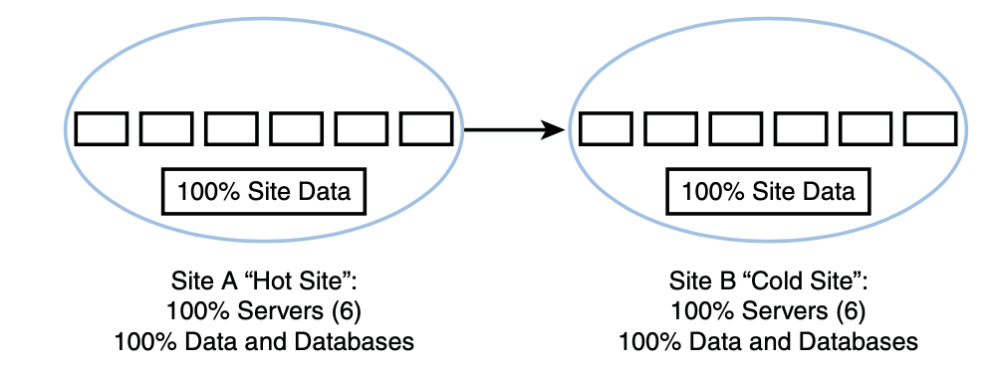

Three data center configuration, three hot sites

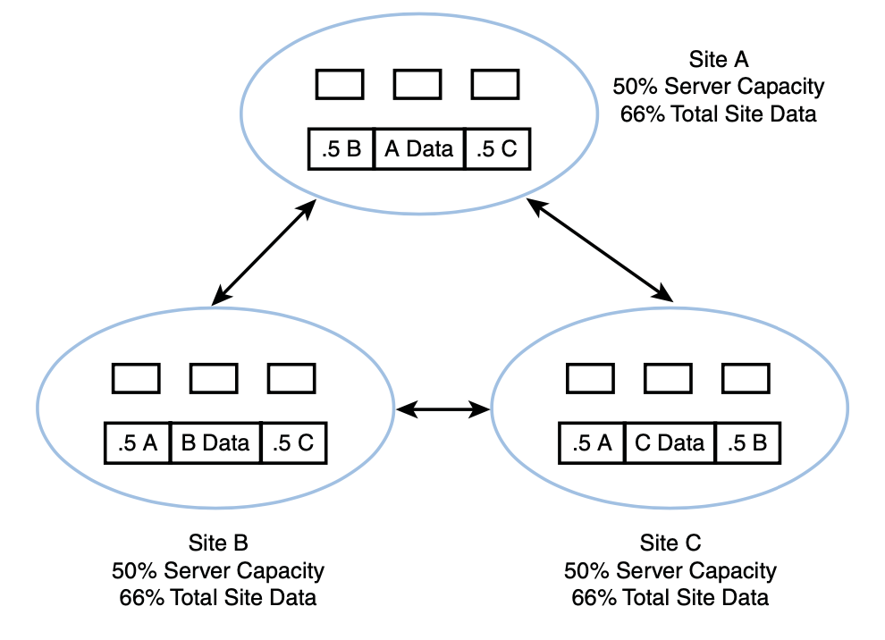

### Rule 13: Design to Leverage the Cloud

- What: This is the purposeful utilization of cloud technologies to scale on demand.
- When to use: When demand is temporary, spiky, and inconsistent and when response time is not a core issue in the product.
- How to use: Make use of third-party cloud environments for temporary demands, such as large batch jobs or QA environments during testing cycles. Design your application to service some requests from a third-party cloud when demand exceeds a certain peak level.
- Why: Provisioning of hardware in a cloud environment takes a few minutes as compared to days or weeks for physical servers in your own collocation facility. When utilized temporarily this is also very cost effective.
- Key takeaways: Design to leverage virtualization and the cloud to meet unexpected spiky demand.

### Rule 14: Use Databases Appropriately

- What: Use relational databases when you need ACID properties to maintain relationships between your data. For other data stor- age needs consider more appropriate tools.
- When to use: When you are introducing new data or data struc- tures into the architecture of a system.
- How to use: Consider the data volume, amount of storage, response time requirements, relationships, and other factors to choose the most appropriate storage tool.
- Why: An RDBMS provides great transactional integrity but is more difficult to scale, costs more, and has lower availability than many other storage options.
- Key takeaways: Use the right storage tool for your data. Don’t get lured into sticking everything in a relational database just because you are comfortable accessing data in a database.

Cost and limits to scale versus relationships:

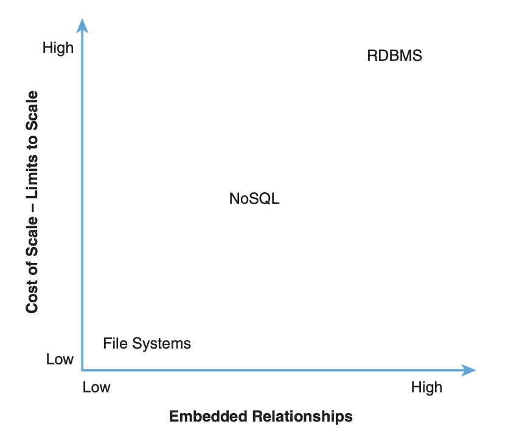

Flexibility versus relationships:

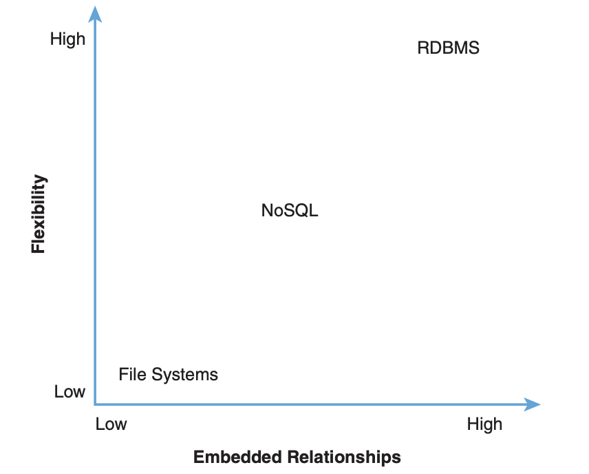

Solution decision cube:

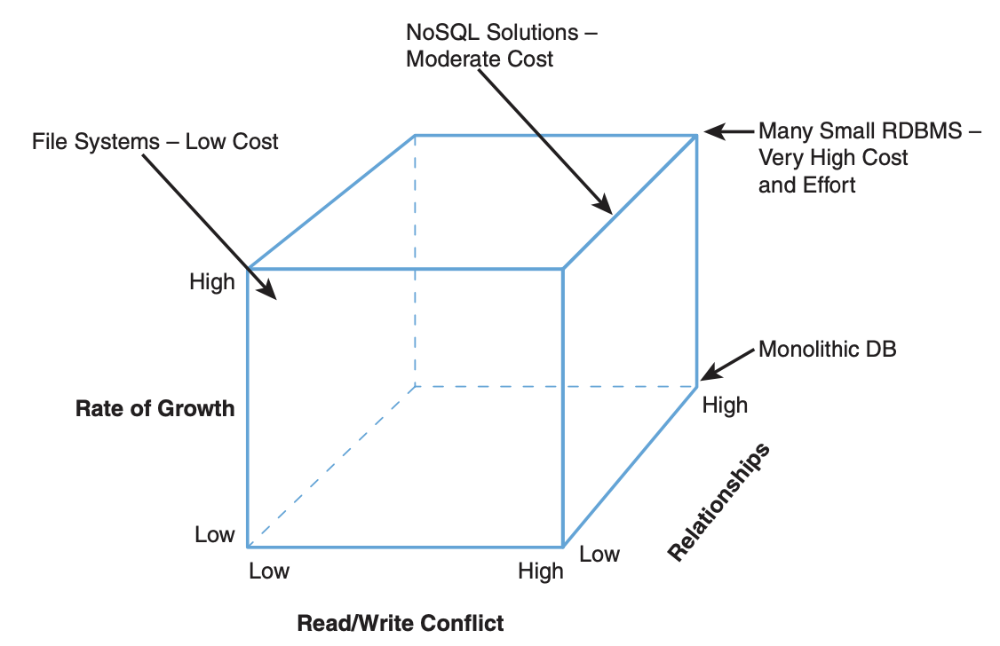

### Rule 15: Firewalls, Firewalls Everywhere!

- What: Use firewalls only when they significantly reduce risk and recognize that they cause issues with scalability and availability.
- When to use: Always.
- How to use: Employ firewalls for critical PII, PCI compliance, and so on. Don’t use them for low-value static content.
- Why: Firewalls can lower availability and cause unnecessary scal- ability chokepoints.
- Key takeaways: While firewalls are useful, they are often over- used and represent both an availability and scalability concern if not designed and implemented properly.

### Rule 16: Actively Use Log Files

- What: Use your application’s log files to diagnose and prevent problems.
- When to use: Put a process in place that monitors log files and forces people to take action on issues identified.
- How to use: Use any number of monitoring tools from custom scripts to Splunk to watch your application logs for errors. Export these and assign resources for identifying and solving the issue.
- Why: The log files are excellent sources of information about how your application is performing for your users; don’t throw this resource away without using it.
- Key takeaways: Make good use of your log files, and you will have fewer production issues with your system.

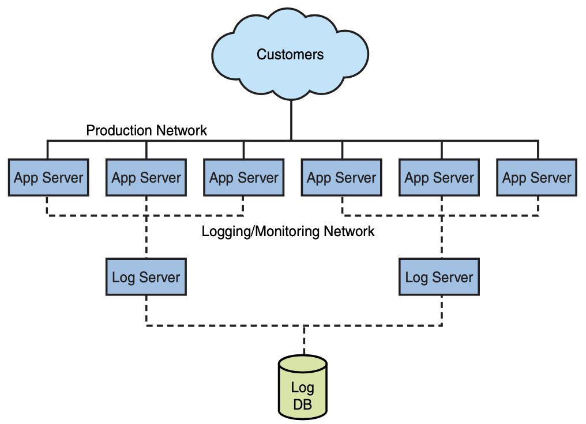

## Don’t Duplicate Your Work

### Rule 17: Don’t Check Your Work

- What: Avoid checking things you just did or reading things you just wrote within your products.
- When to use: Always (see rule conflict in the following explanation).
- How to use: Never read what you just wrote for the purpose of validation. Store data in a local or distributed cache if it is required for operations in the near future.
- Why: The cost of validating your work is high relative to the unlikely cost of failure. Such activities run counter to cost- effective scaling.
- Key takeaways: Never justify reading something you just wrote for the purposes of validating the data. Read and act upon errors associated with the write activity instead. Avoid other types of reads of recently written data by storing that data locally.

Here is a bulleted checklist of questions you can answer and steps you can take to eliminate reading what you just wrote and blocking the user transaction to do so:
1. Regulatory/legal requirement
2. Competitive differentiation
3. Asynchronous completion

### Rule 18: Stop Redirecting Traffic

- What: Avoid redirects when possible; use the right method when they are necessary.
- When to use: Use redirects as little as possible.
- How to use: If you must have them, consider server configurations instead of HTML or other code-based solutions.
- Why: Redirects in general delay the user, consume computation resources, and are prone to errors.
- Key takeaways: Use redirects correctly and only when necessary.

### Rule 19: Relax Temporal Constraints

- What: Alleviate temporal constraints in your system whenever possible.
- When to use: Any time you are considering adding a constraint that an item or object maintains a certain state between a user’s actions.
- How to use: Relax constraints in the business rules.
- Why: The difficulty in scaling systems with temporal constraints is significant because of the ACID properties of most RDBMSs.
- Key takeaways: Carefully consider the need for constraints such as items being available from the time a user views them until the user purchases them. Some possible edge cases where users are disappointed are much easier to compensate for than not being able to scale.

These requirements are expressed in the acronym CAP:
- Consistency—The client perceives that a set of operations has occurred all at once.
- Availability—Every operation must terminate in an intended response.
- Partition tolerance—Operations will complete, even if individual components are unavailable.

What has been derived as a solution to this problem is called BASE, an acronym for architectures that solve CAP and stands for Basically Available, Soft State, and Eventually Consistent. By relaxing the ACID properties of consistency we have greater flexibility in how we scale. A BASE architecture allows for the databases to become consistent, eventually.

Summary:

We offered three rules in this chapter that deal with not duplicating your work. Start by not double checking yourself. You employ expensive databases and hardware to ensure your systems properly record transactions and events. Don’t expect them not to work.We all have the need for redirection at times, but excessive use of this tool causes all types of problems from user experience to search engine indexing. Finally, consider the business requirements that you place on your system.Temporal constraints of items and objects make it difficult and expensive to scale. Carefully consider the real costs and benefits of these decisions.

## Use Caching Aggressively

### Rule 20: Leverage Content Delivery Networks

- What: Use CDNs (content delivery networks) to offload traffic from your site.
- When to use: Ensure it is cost justified and then choose which content is most suitable.
- How to use: Most CDNs leverage DNS (Domain Name Services or Domain Name Servers) to serve content on your site’s behalf.
- Why: CDNs help offload traffic spikes and are often economical ways to scale parts of a site’s traffic.
- Key takeaways: CDNs are a fast and simple way to offset spiki- ness of traffic as well as traffic growth in general. Make sure you perform a cost-benefit analysis and monitor the CDN usage.

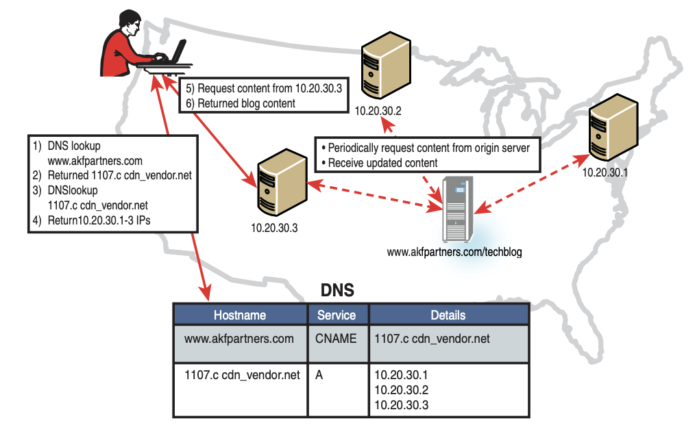

### Rule 21: Use Expires Headers

- What: Use Expires headers to reduce requests and improve the scalability and performance of your system.
- When to use: All object types need to be considered.
- How to use: Headers can be set on Web servers or through application code.
- Why: The reduction of object requests increases the page performance for the user and decreases the number of requests your system must handle per user.
- Key takeaways: For each object type (IMAGE, HTML, CSS, PHP, and so on) consider how long the object can be cached for and implement the appropriate header for that timeframe.

### Rule 22: Cache Ajax Calls

- What: Use appropriate HTTP response headers to ensure cacheability of Ajax calls.
- When to use: Every Ajax call but those absolutely requiring real time data that are likely to have been recently updated.
- How to use: Modify Last-Modified, Cache-Control, and Expires headers appropriately.
- Why: Decrease user perceived response time, increase user satisfaction, and increase the scalability of your platform or solution.
- Key takeaways: Leverage Ajax and cache Ajax calls as much as possible to increase user satisfaction and increase scalability.

### Rule 23: Leverage Page Caches

- What: Deploy page caches in front of your Web services. When to use: Always.
- How to use: Choose a caching system and deploy.
- Why: Decrease load on Web servers by caching and delivering previously generated dynamic requests and quickly answering calls for static objects.
- Key Takeaways: Page caches are a great way to offload dynamic requests and to scale cost effectively.

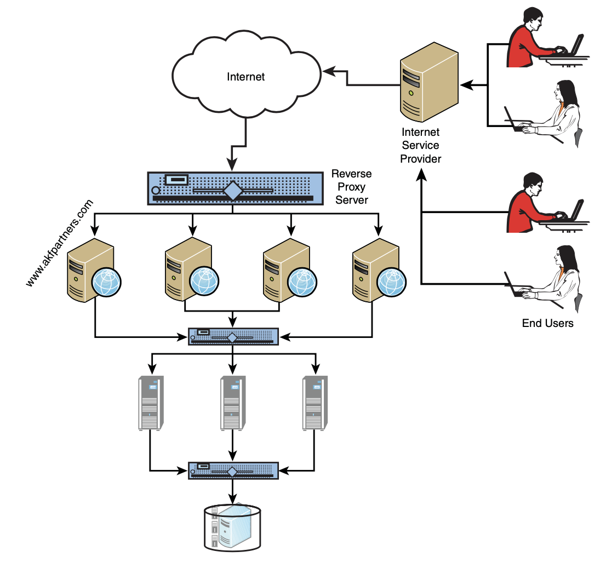

### Rule 24: Utilize Application Caches

- What: Alleviate temporal constraints in your system whenever possible.
- When to use: Any time you are considering adding a constraint that an item or object maintains a certain state between a user’s actions.
- How to use: Relax constraints in the business rules.
- Why: The difficulty in scaling systems with temporal constraints is significant because of the ACID properties (see definition in Chapter 2, “Distribute Your Work”) of most RDBMSs (Relational Database Management Systems).
- Key takeaways: Carefully consider the need for constraints such as items being available from the time a user views it until they purchase. Some possible edge cases where users are disap- pointed are much easier to compensate for than not being able to scale.

### Rule 25: Make Use of Object Caches

- What: Implement object caches to help your system scale. 
- When to use: Any time you have repetitive queries or computations.
- How to use: Select any one of the many open source or vendor supported solutions and implement the calls in your application code.
- Why: A fairly straightforward object cache implementation can save a lot of computational resources on application servers or database servers.
- Key takeaways: Consider implementing an object cache any- where computations are performed repeatedly, but primarily this is done between the database and application tiers.

### Rule 26: Put Object Caches on Their Own “Tier”

- What: Use a separate tier in your architecture for object caches. 
- When to use: Any time you have implemented object caches. 
- How to use: Move object caches onto their own servers.
- Why: The benefits of a separate tier are better utilization of mem- ory and CPU resources and having the ability to scale the object cache independently of other tiers.
- Key takeaways: When implementing an object cache it is sim- plest to put the service on an existing tier such as the applica- tion servers. Consider implementing or moving the object cache to its own tier for better performance and scalability.

The advantage of separating these tiers is that you can size the servers appropriately in terms of how much memory and CPU are required, and you can scale the number of servers in this pool independently of other pools. Sizing the server correctly can save quite a bit of money since object caches typically require a lot of memory—most all store the objects and keys in memory—but require relatively low computational processing power.You can also add servers as necessary and have all the additional capacity utilized by the object cache rather than split- ting it with an application or Web service.

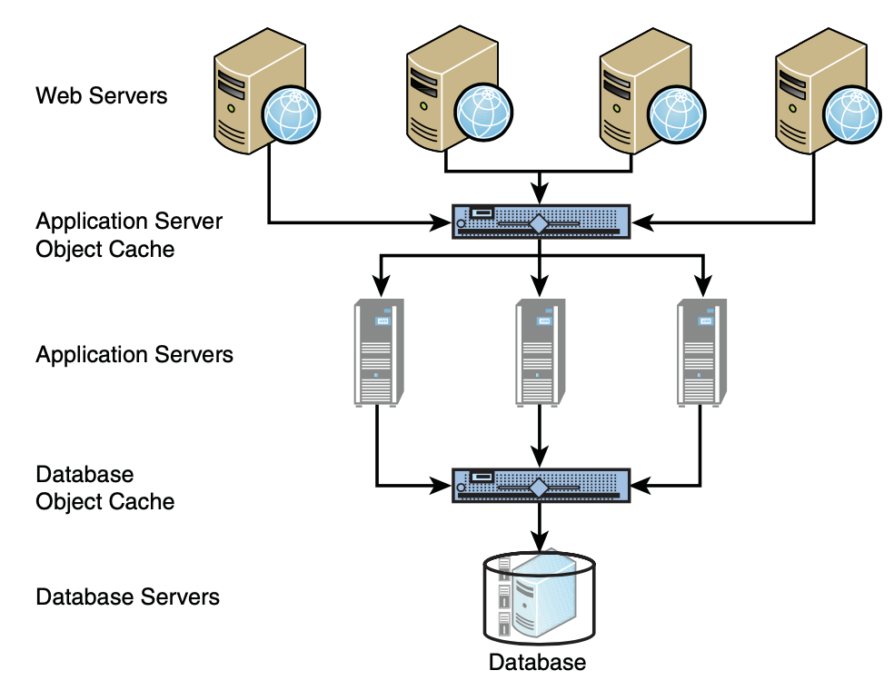

### Learn from Your Mistakes

#### Rule 27: Learn Aggressively

- What: Take every opportunity to learn.
- When to use: Be constantly learning from your mistakes as well as successes.
- How to use: Watch your customers or use A/B testing to deter- mine what works. Use postmortems to learn from incidents and problems in production.
- Why: Doing something without measuring the results or having an incident without learning from it are wasted opportunities that your competitors are taking advantage of.
- Key takeaways: Be constantly and aggressively learning. The companies that learn best, fastest, and most often are the ones that grow the fastest and are the most scalable.

#### Rule 28: Don’t Rely on QA to Find Mistakes

- What: Use QA to lower the cost of delivered products, increase engineering throughput, identify quality trends, and decrease defects—not to increase quality.
- When to use: Whenever you can get greater throughput by hiring someone focused on testing rather than writing code. Use QA to learn from past mistakes—always.
- How to use: Hire a QA person anytime you get greater than one engineer’s worth of output with the hiring of a single QA person.
- Why: Reduce cost, increase delivery volume/velocity, decrease the number of repeated defects.
- Key takeaways: QA doesn’t increase the quality of your system, as you can’t test quality into a system. If used properly, it can increase your productivity while decreasing cost and most impor- tantly it can keep you from increasing defect rates faster than your rate of organization growth during periods of rapid hiring.

