## 网站伸缩性架构

网站的伸缩性是指不需要改变网站的软硬件设施，仅仅改变服务器的数量就可以扩大或者缩小网站的服务处理能力

当网站的访问量爆发式增长时引入更多的服务器满足性能，当不需要这么多机器时，减少服务器的数目节约成本。

### 网站伸缩性设计

伸缩性设计可以分为两类，一类是根据功能进行物理分离实现伸缩，一类是单一功能通过集群实现伸缩，前者通过不同服务器部署不同的服务，后者是多台服务器部署相同的服务。

#### 不同功能进行物理分离实现伸缩

每次分类都会加入更多的服务器处理特定的服务

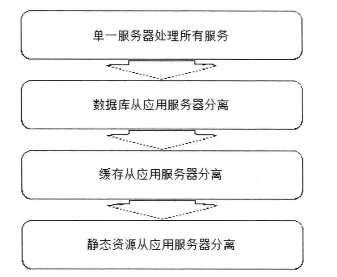

纵向分离：分层后分离是将业务处理流程上的不同部分分离部署，实现系统的伸缩性

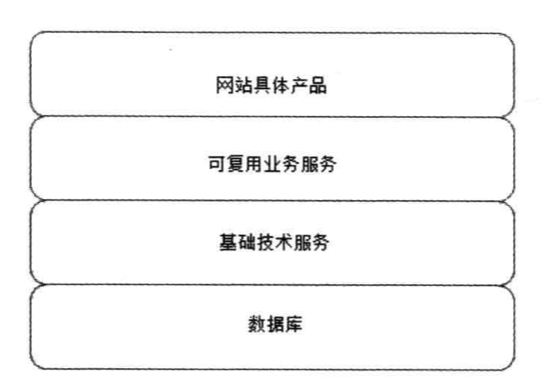

横向分离：将不同的业务模块分离部署，实现系统的伸缩性

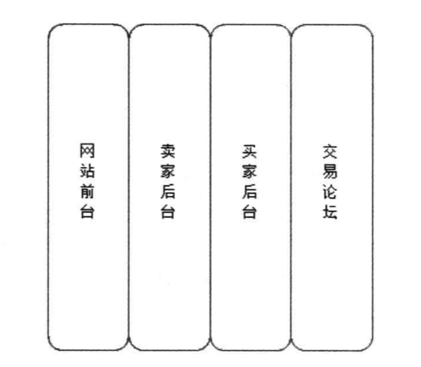

#### 单一功能通过集群规模实现伸缩

相同的服务部署在多台服务器构成的集群上对外提供服务

### 应用服务器集群的伸缩性设计

应用服务器应该设置为无状态的，不存储请求的上下文信息，任何一台服务器对请求的处理结构都是相同的

如果HTTP请求分发装置可以感知或者可以配置集群的服务器数量，那么可以及时发现集群中新上线或则下限的服务器

HTTP请求分发装置被称为负载均衡器

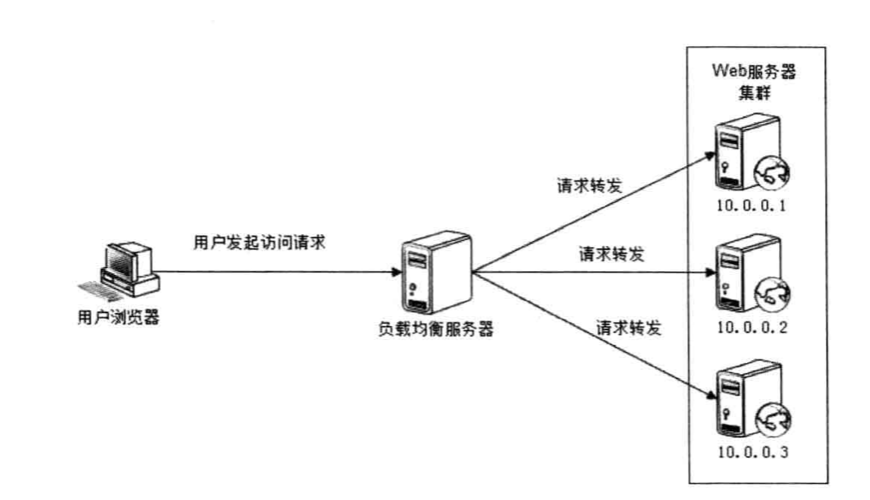

#### HTTP重定向负载均衡

HTTP重定向服务器是一个普通的应用服务器，功能是根据用户的HTTP请求计算一台真实的Web服务器地址，并将该Web服务器地址写入HTTP重定向响应中返回给用户浏览器

比如浏览器请求www.mysite.com,DNS服务器解析IP地址是114.100.80.10，即HTTP重定向服务的IP地址，然后浏览器通过IP地址114.100.80.10访问HTTP重定向负载均衡
服务器的IP地址，然后浏览器通过IP地址114.100.80.10访问HTTP重定向负载均衡服务器后，服务器根据负载均衡算法计算获得一台实际物理器的地址。

这种负载均衡方案的优点是比较简单，缺点是通过两次请求才能访问，性能较差，重定向服务器自身处理能力有限，而且使用HTTP302重定向有可能使搜索引擎判断为SEO作弊
降低搜索排名，因此这种方案使用的不多。

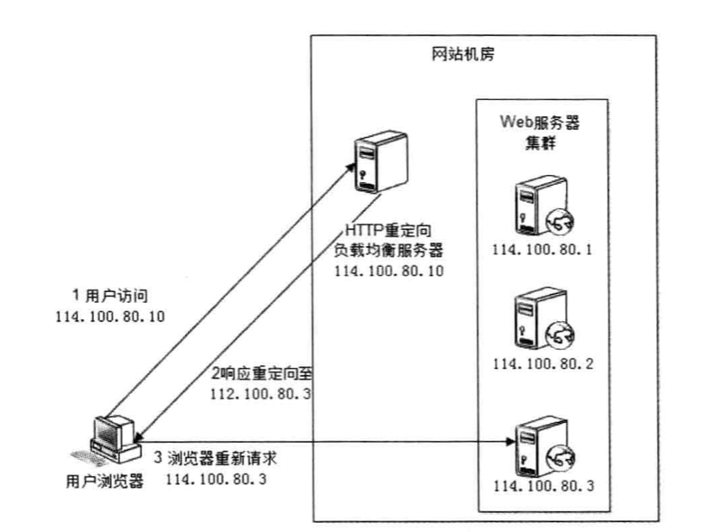

#### DNS域名解析负载均衡

DNS服务器中配置多个A记录 www.mysite.com 配置为114.100.80.10，114.100.80.12，114.100.80.13

DNS会根据记录A计算得到一个IP地址，然后根据真实的IP地址访问

优点：将负载均衡转给DNS，省掉了网站管理维护负载均衡服务器的麻烦；可以解析成距离用户最近的一个服务器地址，加快用户访问速度，改善性能；

缺点：DNS多级解析，都可能缓存A记录，当下线某台服务器后，及时修改了DNS的A记录，导致用户访问失败

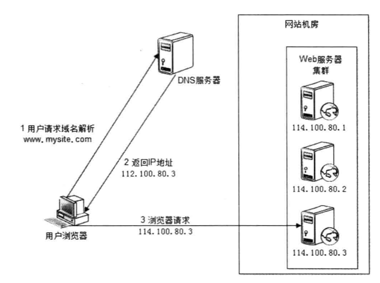

#### 反向代理负载均衡

利用反向代理服务器位于Web服务器前面（缓存Web响应，加速访问），这个位置正好是负载均衡服务器的位置，所以大多数反向代理服务器同时提供了负载均衡的功能
，管理一组Web服务器，将请求根据负载均衡算法转发到不同的Web服务器上。反向代理服务器需要配置双网卡和内部外部两套IP地址。

浏览器访问请求的地址是反向代理服务器地址114.100.80.10，反向代理服务器收到请求后，计算得到一台物理器地址为10.0.0.3 ,并将请求转发给服务器。

由于反向代理服务器转发请求在HTTP协议层面，因此也叫应用层负载均衡，部署简单。但是成了所有请求的中转站，性能成为瓶颈。

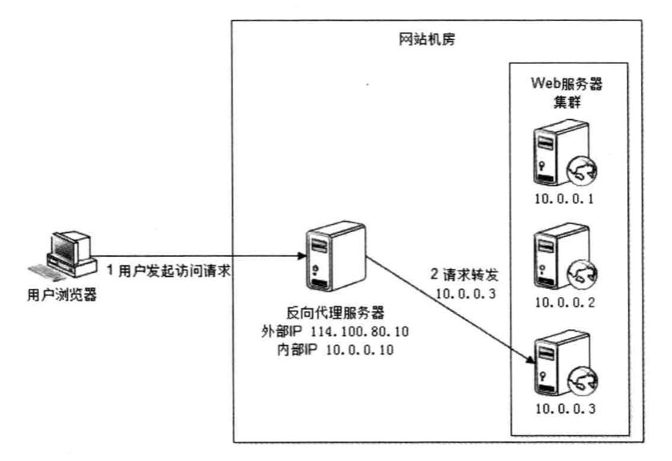

#### IP负载均衡

用户请求数据包到达负载均衡服务器之后，负载均衡器在操作系统内核进程获取网络数据包，根据负载均衡算法计算得到一台真实的Web服务器地址10.0.0.1，
然后将目的地址修改为10.0.0.1，不需要通过用户进程处理，响应完成之后回到负载均衡服务器，再将数据包源地址修改为自身的IP地址返回给用户浏览器。

这里关键在于真实的物理Web服务器响应数据包如何返回给负载均衡服务器。一种方案是负载均衡在修改目的IP地址的同时修改源地址，将数据包源地址设定为自身的IP，即源地址转换SNAT。
这样Web服务器响应会再回到负载均衡服务器，另一种方案是将负载均衡服务器同时作为真实物理服务器集群的网关服务器，这样所有的响应都会到达负载均衡服务器。

IP负载均衡好处是在内核进程完成数据分发，较反向代理服务器有更好的性能，单所有的请求响应都经过负载均衡服务器，集群的最大响应数据吞吐量不得不受制于负载均衡服务器网卡带宽。

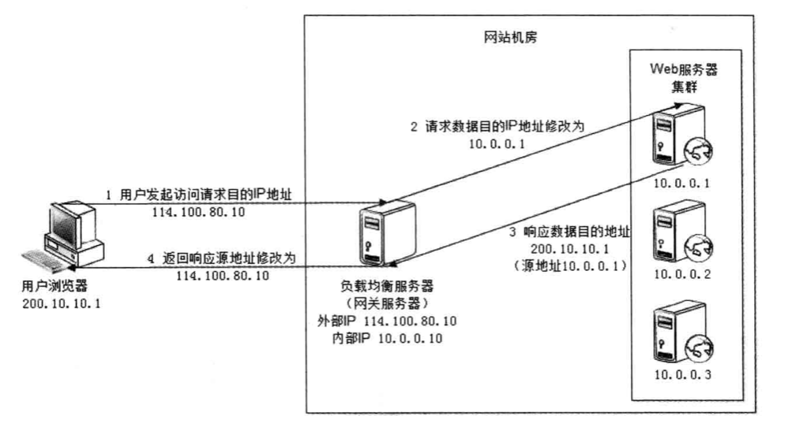

#### 数据链路层负载均衡

数据链路层负载均衡实质在通信协议的数据链路层修改MAC地址进行负载均衡

这种数据传输方式又称作三角传输模式，负载均衡数据分发过程中不修改IP地址，只修改目的MAC地址，由于不修改IP地址，是的实际处理请求的真实服务器IP和数据请求目的IP一致，
不需要通过负载均衡服务器进行地址转换，可将响应数据包直接返回给用户浏览器，避免负载均衡服务器网卡带宽成为瓶颈。

在Linux平台上最好的链路层负载均衡开源产品是LVS（Linux Virtual Server）。

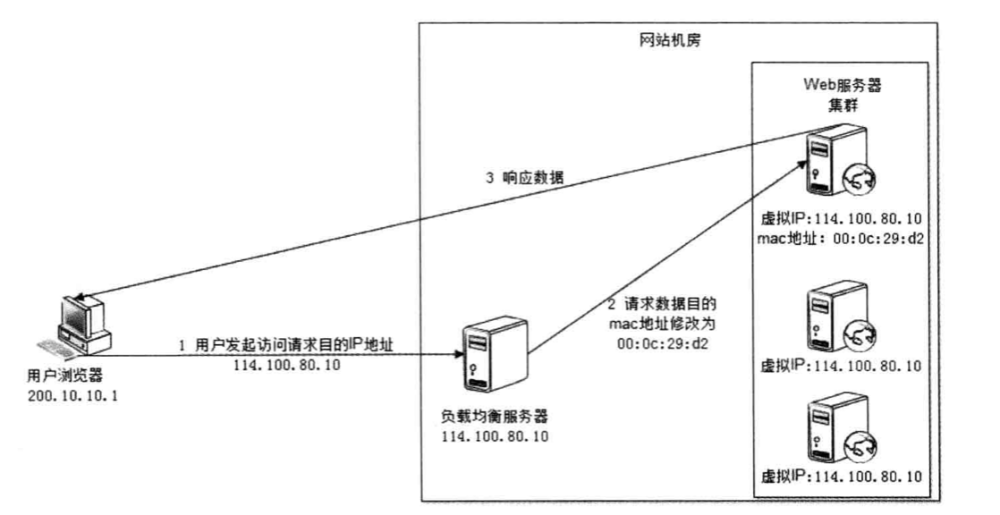

#### 负载均衡算法

负载均衡算法的实现可以分为两个部分：

1. 根据负载均衡算法和Web服务器列表计算得到集群中一台Web服务器地址

2. 将请求数据发送到改地址对应的Web服务器上

常见的负载均衡算法：

1. 轮询 Round Robin

所有请求依次分发，每台机器请求数目大致相同

2. 加权轮询 Weighted Round Robin

根据服务器性能情况，按照权重分发

3. 最少连接 Least Connections

记录每个服务器正在处理的连接数，将新的请求分发到最少连接的服务器上

4. 源地址散列 Source Hashing

根据IP计算hash地址，得到应用服务器，这样可以缓存上下文信息

### 分布式缓存集群的伸缩性设计

由于分布式集群中缓存数据的不同，而且缓存服务器的上线也要尽可能影响最小。

#### Memcached分布式缓存集群访问模型

Memcached客户端访问Memcached服务器集群，客户端主要由API、Memcached服务器理由算法、
Memcached服务器进群列表以及通信模型构成。

路由算法根据应用程序输入的缓存数据KEY计算得到去哪台服务器上写或者读缓存。
这种KEY("item")保证缓存命中。

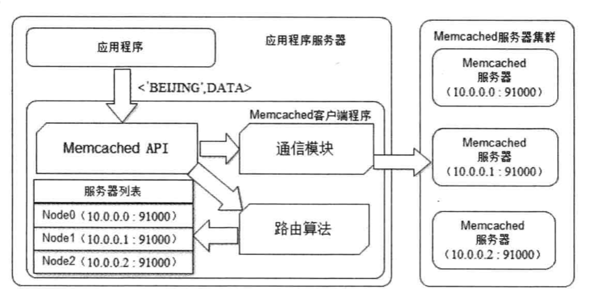

#### Memcached分布式集群缓存伸缩性架构

简单的路由算法可以使用余数Hash，用服务器的数目/缓存数据Key的hash值，余数为服务器列表的编号

当分布式缓存集群需要扩容的时候，会导致由于余数的变更，原来的缓存读取失败，缓存没有命中
3台服务器扩容至4台时，大约有3/4的缓存不能正确命中，但100台服务器中加入1台时，不能命中的概率时99%（N/(N+1)）

如果数据访问不能命中会将压力落在数据库身上，可能会导致宕机，需要在网站访问量最少的情况下进行缓存扩容，这时候压力最小。

#### 分布式缓存的一致性Hash算法

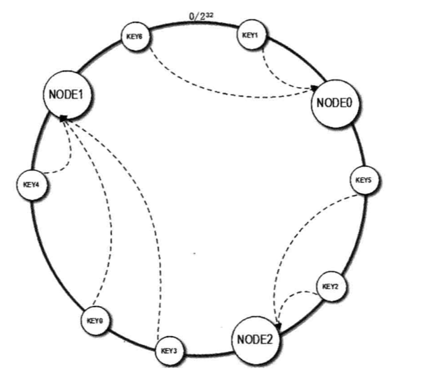

算法流程如下，首先构造一个长度为0——2^32的整数环（一致性hash环），根据节点名称的Hash分布将缓存服务器节点放置在Hash环上，然后根据KEY计算HASH
然后在Hash环上顺时针查找距离这个Key最近的缓存服务器节点，完成映射查找

当缓存服务器需要扩容的时候，只需将新的节点的Hash值放入一致性Hash中，由于Key是顺时针查找距离最近的节点，因此新加入的节点只会影响一小段，100台服务器扩容增加1台的命中率是99%，影响很小

具体应用中，这个长度为2^32的一致性Hash环通常用二叉树查找实现，实质上是在二叉树中查找不小于查找树的最小值，二叉树的最右叶子结点和最左叶子结点构成环

但是新加入节点Node3只影响了原来的节点Node1，也就是说一部分原来需要访问Node1的节点需要访问Node3，但是原来的Node0和Node2不受影响，意味着Node0和Node2的缓存数据和负载压力是Node1和3的两倍

上述问题可以利用虚拟层解决：将每台物理服务器虚拟为一组虚拟缓存服务器，将虚拟服务器的Hash值放置在Hash换上，KEY在环上先找到虚拟服务器节点，然后再得到物理服务器位置。

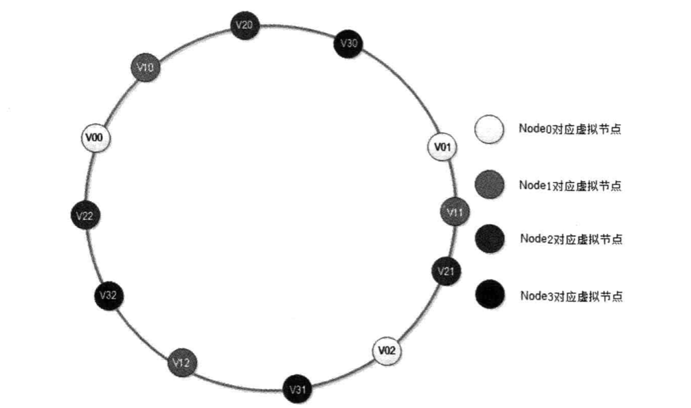

新加入的节点Node3对应的虚拟节点为V30,V31,V32，加入到一致性Hash环之后，影响V01，V12，V22三个虚拟机节点，而这三个虚拟节点分别对应Node0-2三个物理节点
理想情况下，每个物理节点受影响的数据量为其节点缓存数据量的1/4(x/(x+n),说明集群中仍然有75%的节点可以继续命中

物理节点越多，负载越均衡，经验值是150

### 数据存储服务器集群的伸缩性设计

缓存的目的是加速数据读取的速度，减轻服务器的压力，数据存储服务器必须保证数据的可靠性存储。

#### 关系数据库集群的伸缩性设计

数据写操作在主服务器上，从服务器读操作及数据分析等离线操作。
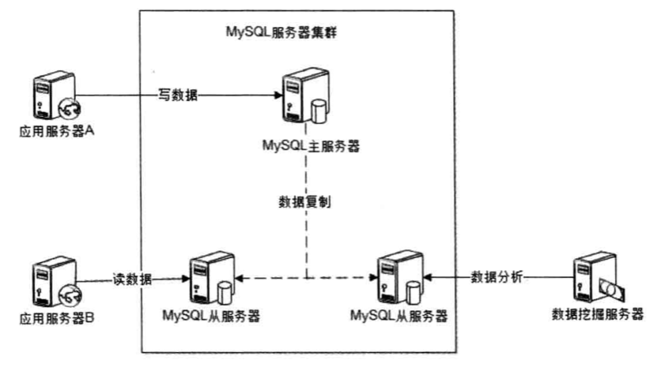

除了主从读写分离外，数据库可以根据业务进行分库，但是跨库的表不能Join操作

Cobar是一个分布式关系数据库代理，介于服务器和数据库之间，应用程序通过JDBC访问cobar集群，Cobar根据SQL和分库规则分解SQL，分到不同的数据库实例上执行，每个实例都是主从结构，保证高可用

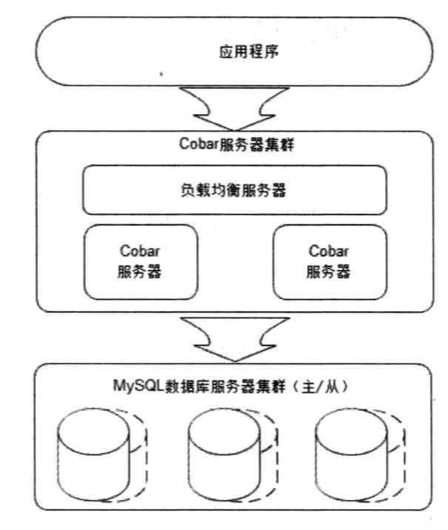

系统组建模型如下，前端通信模块负责和应用程序通信，接收到SQL请求后转给SQL解析模块，SQL根据路由查询条件转交给SQL路由墨菊爱，发送到不同的数据库执行

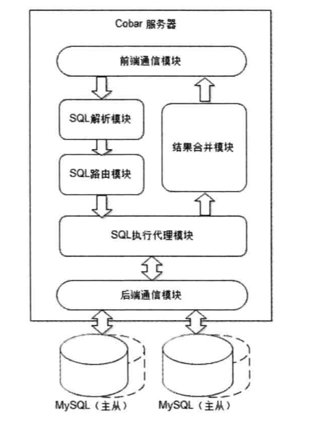

Cobar的伸缩性有两种：

1. Cobar服务器集群伸缩

集群伸缩使用负载均衡手段，首先要做数据迁移，将原来机器的数据迁移到新机器，迁移的数据可以用Hash算法进行计算，尽量迁移较少的数据

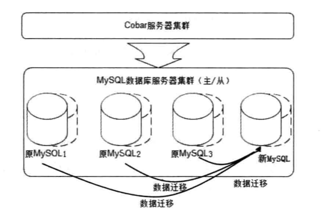

2. MySQL服务器集群伸缩

实际迁移的时候不是以记录为单位而是以Schema为单位，迁移的时候将Schema进行同步，当数据一致后，修改原来的Schema的IP为新机器的IP，然后删除原来的Schema

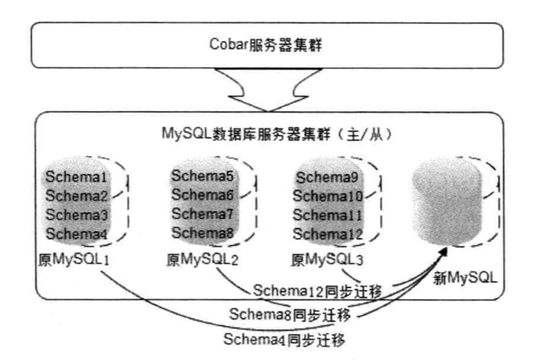

关系型数据库分布式缺点：不好处理事务，需要用事务补偿机制进行管理，分解数据访问避免Join操作

#### NoSQL数据库伸缩性

放弃了SQL和ACID特性，强化了高可用性和可伸缩性

广泛使用的是HBase，为可伸缩海量数据存储而设计，主要依赖可分裂的HRegion和HDFS实现

应用程序如果要访问一个数据，必须先找到HRegion，然后将数据的读写操作交给HRegion,王成存储层面的操作，每个HRegion中存储一段Key值区间的数据，HRegionServer是
物理服务器，可以启动多个HRegion实例，当写入数据过多时，HRegion会分裂为两个，并进行迁移

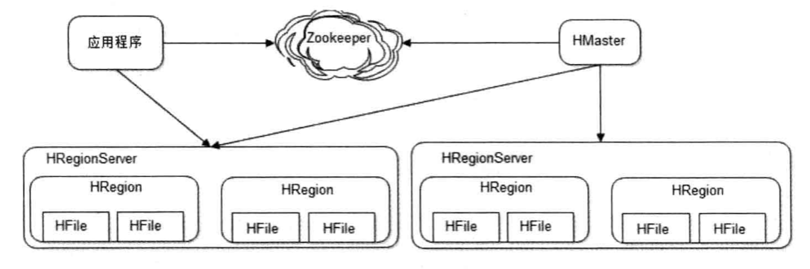

所有HRegion的信息(存储的Key区间，HRegionServer地址，端口和)都记录在HMaster服务器上，为了保证高可用
需要启动多个HMaster，并通过Zookeeper选举出一个主服务器，流程如下：

数据写入的过程也是专业，需要先得到HRegion才能继续操作，会把数据存储在若干个HFile文件里，保证分布式高可用。当访问量较大时会分裂，并对数据进行迁移，保证线性伸缩。

