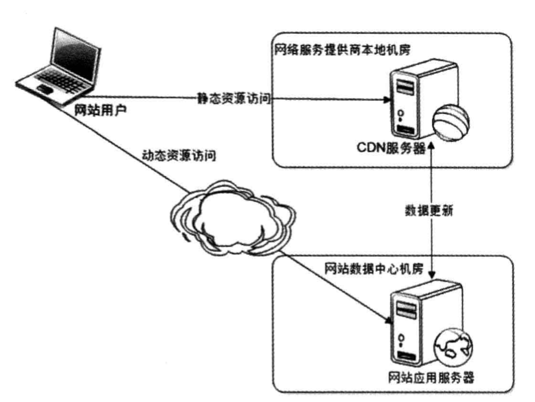
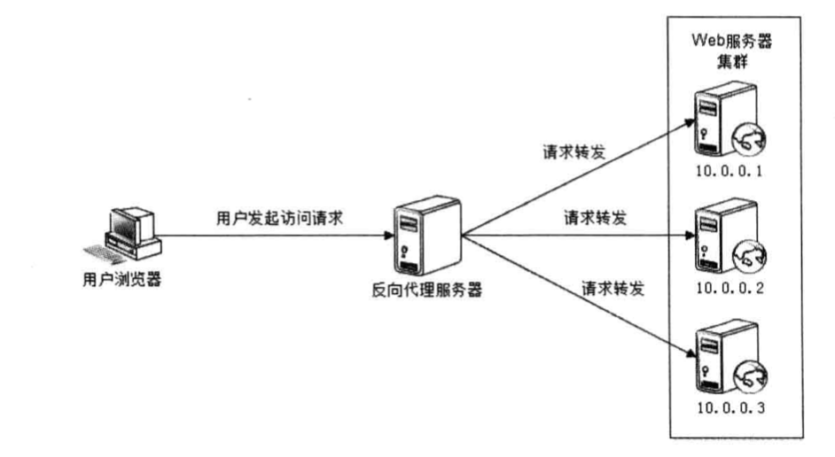
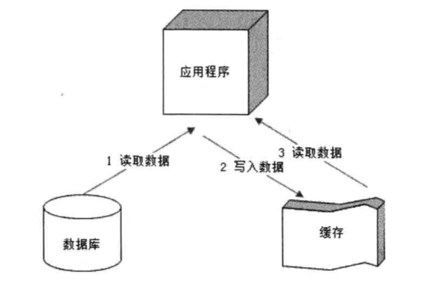
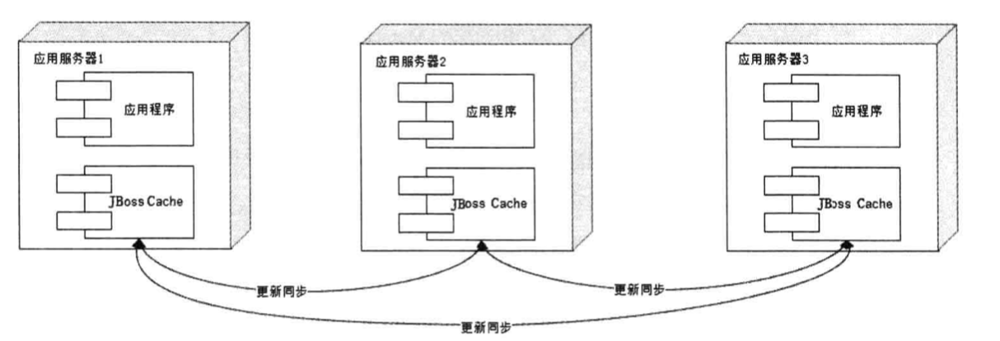
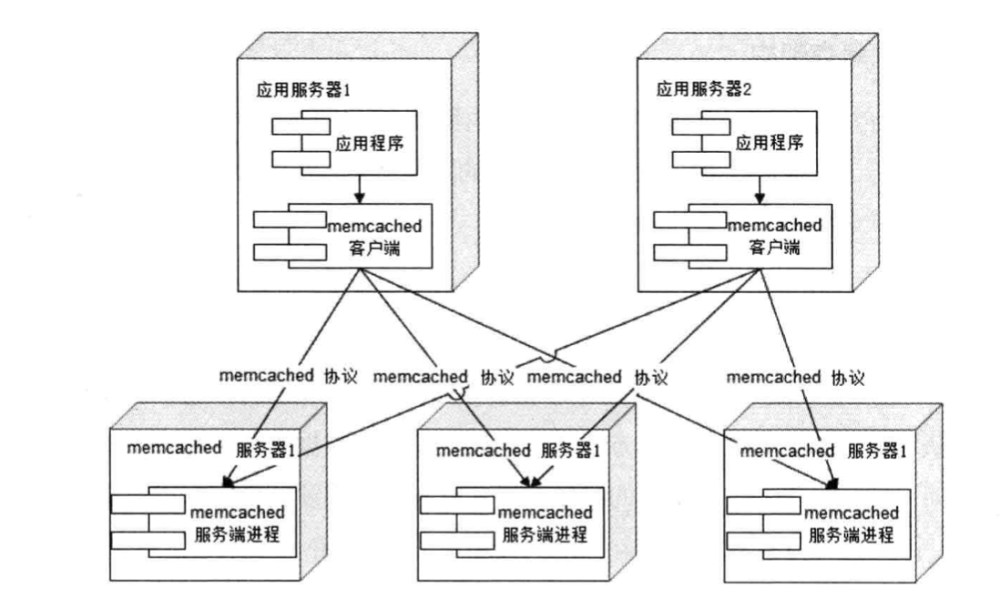
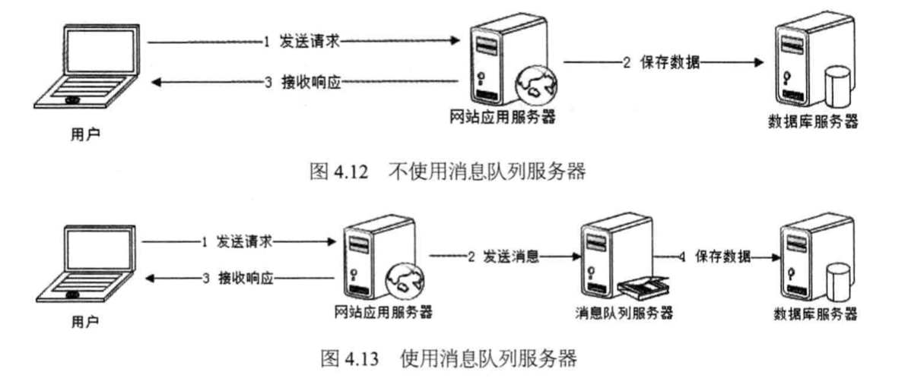

### 网站高性能架构

#### 网站性能测试

不同视角下的网站性能分析：

1. 用户视角的网站性能

用户通过在浏览器上进行请求，然后网站的服务器进行处理，并把结果返回给用户，影响这一过程的因素有浏览器的接
的解析速度，网络带宽、浏览器缓存策略、CDN服务、反向代理等

2. 开发人员视角的网站性能

响应延迟，系统吞吐量、并发处理能力、系统稳定性等，优化缓存加速数据读取，使用集群提高吞吐性能，使用异步消息加快请求响应及实现徐阿削峰

3. 运维人员视角的网站性能

关注基础设施性能和资源利用率，如网站的带宽、服务器硬件配置、数据中心网络架构、带宽资源利用率，可以优化骨干网络建设，定制高性能服务器、利用虚拟化技术优化资源利用

网站性能测试指标：

| 指标 | 含义及指标获取  |
| :--------:   | :----- |
|响应时间 |从发出请求到最后响应数据所需要的时间，一般是重复请求一万次，然后得到响应时间总和，最后除以1万得到单次响应时间 |
|并发数 |指系统能够同时处理的请求树木，反应网站的负载特性。一般采用多线程模拟用户请求，请求之间往往加入一个随机等待时间|
|吞吐量 |单位时间内系统处理的请求数量，体现系统的整体处理能力。TPS(每秒事务数) HPS(每秒HTTP请求数目) QPS(每秒查询数目) |
|性能计数器|描述服务器或者操作系统的一些数据指标，包括System Load、对象与线程数、内存使用、CPU、磁盘IO、网络等|

性能测试的方法：

1. 性能测试：对系统不断施加压力，验证系统在资源可接受范围内，是否可以达到预期峰值
2. 负载测试：对系统不断增加并发请求以增加系统的压力，直到系统的某些指标达到饱和状态，此时继续施加压力，系统的处理能力会下降
3. 压力测试：超过负载安全的情况下，继续施加压力，直到系统崩溃，以此获得系统的最大承受压力
4. 稳定性测试：在特定环境下，给系统一定的业务压力（不均匀的施加压力），使系统运行一段时间，检测系统是否稳定。

性能优化策略：

1. 性能分析：从一次请求的不同环节逐步分析网站的性能和瓶颈，定位问题
2. 性能优化：根据网站的分层架构，根据具体原因优化

#### Web前端性能优化

浏览器访问优化：
1. 减少HTTP请求（减少链路的建立）
2. 使用浏览器缓存（静态资源）
3. 启用压缩（在服务端对数据进行压缩，减少传输的数据量）
4. CSS放在页面最上面，JavaScript放在最下面
5. 减少Cookie传输（减少Cookie的传输次数）

CDN优化：
Content Distribute Network， 内容分发网络。本质上是一个缓存，将缓存放在离用户最近的地方，使用户获得最快的访问速度（主要放静态资源）

反向代理:

传统的代理服务器位于浏览器的一侧，代理浏览器将HTTP请求发送到互联网上，而反向代理服务器位于网站机房的一侧，代理网站web服务器接收HTTP请求

反向代理服务器可以保护网站安全，起到过滤作用，同时可以配置缓存加速web请求，存放静态资源减轻负载压力，可以实现负载均衡的功能，提高系统总体处理能力

#### 应用服务器性能优化

网站业务代码部署在应用服务器上，优化手段可以是缓存、集群、异步等

1. 分布式缓存：

优先考虑缓存优化性能。

缓存可以将数据存储在相对较高访问速度的存储介质中，以供系统处理，减少数据访问时间，较少不必要的重复计算。

缓存的本质是一个内存Hash表，以Key Value的形式存储，读取时间复杂度为O(1)。

缓存主要用来存放那些读写比很高，很少变化的数据，如商品的类目、热门词搜索列表，如果读取不到或者数据已失效，在访问数据库，并将数据写入缓存

2. 合理使用缓存

频繁修改的数据不要写入缓存、没有热点的访问写入缓存没有意义；

缓存可能造成事务不一致的问题；

数据库如果太依赖缓存，当缓存崩溃时，会造成数据库不能承受压力而宕机，这种情况成为缓存雪崩；

缓存预热：缓存中存放的热点数据，利用LRU算法对不断访问的数据进行筛选和淘汰，新启动的缓存中如果没有数据，可以启动的时候把缓存数据加载好。

缓存穿透：如果因为不恰当的业务或者恶意持续攻击某个不存在的数据，会将很多请求落在数据库上，甚至崩溃，简单的对策是将不存在的数据也缓存起来。

3. 分布式缓存架构

分布式缓存是指缓存部署在多个服务器集群上，提供缓存服务。

比如以JBoss Cache为代表的同步分布式缓存：将应用程序和缓存部署在同一个服务器上，应用程序可以从本地快速读取缓存，缺点是当缓存数据过大时，不同
服务器之间更新信息需要较大的代价。

Memcached采用一种集中式缓存集群，称为互不通信的分布式架构方式，缓存与应用分离，混存部署在一组专门的服务器上，应用程序通过一致性Hash算法
等路由策略选择缓存服务器远程访问缓存数据，缓存服务器之间互相不通信，这样可以很容易进行扩容，具有较好的伸缩性。

4. Memcached

简单的通信协议：通信协议选择TCP还是UDP或者HTTP；数据序列号方式选择XML还是JSON或者Google的Protobuffer等二进制序列化协议。
然而Memcached使用TCP(或者UDP)通信，序列化协议是一套基于文本的自定义协议，非常简单，比如get<key>

丰富的客户端程序：支持多种编程语言

高性能网络通信：服务端基于Libevent，一个支持事件出发的网络通信程序库，擅长稳定的长连接。

高效的内存管理：使用固定空间分配，便于内存的碎片化管理，分配按照chunk为单位。

互不通信的服务器集群架构：可以做到无限制的线性伸缩。

5. 异步操作

使用消息队列将调用异步化，改善网站的扩展性。

消息队列有削峰的所用，通过异步化处理，避免直接写入数据库，促销活动中可以通过事务消息削平高峰期的事务。

6. 使用集群

将并发请求通过负载均衡分发到不同的服务器上进行处理

7. 代码优化

多线程：处理好IO阻塞和CPU

启动线程数=\[任务执行时间/(任务执行时间-IO等待时间)\]*CPU内核数

将对象设计为无状态对象：不存储状态信息，这样并发的时候不会出现状态不一致的问题，比如Servlet

使用局部对象：在方法内部创建对象，防止被多个线程并发访问

并发访问时使用锁：通过锁转换成顺序操作，避免资源被并发修改，但是会产生性能影响

资源复用：减少线程的创建和销毁，比如数据库链接、网络连接、线程和复杂对象等，采用单例模式和对象池；Spring采用单例模式，从Service到DAO都是无状态的对象
无需重复创建，通过Spring容器进行管理。对象池模式通过复用对象实例，减少对象的创建和消耗，使用时取，用完后放回线程池。

对于每个Web请求，需要创建一个独立的线程取处理，应用服务器也是采用线程池模式进行管理

数据结构：Hash表存储hash(i) = hash(i-1)*33+str[i]

垃圾回收：JVM对堆和栈进行回收，分代回收，年轻代(Eden, From, To)和老年代

#### 存储性能优化

1. 机械硬盘 VS 固态硬盘

机械硬盘每次访问需要移动磁头臂进行连续访问和随机访问，性能不稳定

固态硬盘将数据存储在硅晶体上，可以像内存一样快速访问

2. B+树 VS LSM树

B+树是针对磁盘存储而优化过的N叉排序树，以树节点为单位存储在磁盘中，从根开始查找数据所在的节点和磁盘位置
目前的数据库都采用两级索引的B+树，树的层次最多三层，所以需要五次访问更新一条记录但是每次磁盘访问都是随机的，所以传统硬盘比较差

很多NoSQL产品采用LSM树，可以看作一个N阶合并树，数据的写操作都在内存中进行，并且创建一个新的记录，这些数据在俄
内存中仍然是一颗排序树，当数据量超过一定的阈值时，和磁盘上下一级的树进行合并，使用新的数据覆盖旧数据或者按照版本号进行管理
数据的读操作会从内存中开始搜索，如果没有找到再去磁盘中进行查找，速度远快于B+树。

3. RAID VS HDFS

RAID：廉价磁盘冗余阵列，改善磁盘访问的延迟，增强磁盘的可用性和容错能力

HDFS：以块为单位管理文件内容，一个文件被分割为若干个Block, 当程序写文件时，每写完一个Block就会自动复制到另外两个机器上，维持三个副本
当文件进行计算时，采用MapReduce框架，启动多个子任务，同时读取多个Block, 并发处理。
HDFS分为NameNode和DataNode，NameNode在整个HDFS中存储一个实例，提供元数据服务，相当于操作系统中的文件分配表，管理Block的分配
DataNode部署在其他服务器上，提供数据存储服务。
应用程序写文件时，首先访问NameNode请求分配数据库，然后提供DataNode服务器，按照负载均衡策略共Client使用
HDFS有三个副本，保证数据的可靠性。

网站性能哟话时改善高并发用户访问情况下网站的响应速度，需要总和考虑技术、成本、架构等等。

