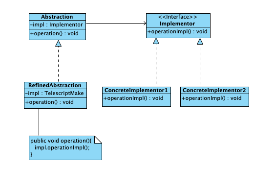

### 桥接模式

将抽象部分与它的实现部分分离，使得它们都可以独立地变化。

桥接模式是关于怎样将抽象部分与它的实现部分分离，使得它们都可以独立地变化的成熟模式。 

### 结构

- 抽象（Abstraction） 是一个抽象类，含有Implementor声明的变量，即维护一个Implementor类型的对象
- 实现者（Implementor） 是一个接口，该接口中的方法不一定与Abstraction中的方法一致。Implementor负责定义基本操作，Abstraction负责定义高级操作
- 细化抽象（Refined Abstraction） 是抽象角色的一个子类，该子类在重写抽象角色的方法是，给出一些必要的操作以后，将委托所维护的Implementor类型调用相应的方法
- 具体实现者（Concrete Implementor） 是扩展Implementor接口的类

类图如下


### 代码

抽象角色ArchitectureCost
```java
public abstract class ArchitectureCost {
    BuildingDesign design;
    double unitPrice;

    public abstract double giveCost();
}
```

问题的实现者
```java
public interface BuildingDesign {
    double computerArea();
}
```

细化抽象
```java
public class BuildingCost extends ArchitectureCost {

    public BuildingCost(BuildingDesign design, double unitPrice) {
        this.design = design;
        this.unitPrice = unitPrice;
    }

    @Override
    public double giveCost() {
        double area = design.computerArea();
        return area * unitPrice;
    }
}
```

具体实现者
```java
public class HouseDesign implements BuildingDesign {
    double width, length;
    int floorNumber;

    HouseDesign(double width, double length, int floorNumber) {
        this.width = width;
        this.length = length;
        this.floorNumber = floorNumber;
    }

    @Override
    public double computerArea() {
        return width * length * floorNumber;
    }
}
```

模式使用
```java
public class Application {
    public static void main(String args[]) {
        double width = 63, height = 30;
        int floorNumber = 8;
        double unitPrice = 6867.38;
        BuildingDesign design = new HouseDesign(width, height, floorNumber);
        System.out.println("宽" + width + "米，高" + height + "米，层数为" + floorNumber);
        ArchitectureCost cost = new BuildingCost(design, unitPrice);
        double price = cost.giveCost();
        System.out.printf("每平米造价：" + unitPrice + "元的商业楼的建设成本：%.2f元\n", price);
        width = 52;
        height = 28;
        floorNumber = 6;
        unitPrice = 2687.88;
        design = new HouseDesign(width, height, floorNumber);
        System.out.println("宽" + width + "米，高" + height + "米，层数为" + floorNumber);
        cost = new BuildingCost(design, unitPrice);
        price = cost.giveCost();
        System.out.printf("每平米造价：" + unitPrice + "元的住宅楼的建设成本：%.2f元\n", price);
    }
}
```

### 优点

- 桥接模式分离实现与抽象，使得抽象和实现可以独立的扩展。当修改实现的代码时，不影响抽象的代码，反之也一样。比如，对于上述例子，如果具体实现者HouseDesign类决定将面积的计算加上一个额外的值，即修改了computerArea()方法，那么并不影响到细化抽象者的代码，反之，如果抽象者决定增加一个参与计算的参数：adjust，即细化抽象者修改代码，在计算成本时通过设置该参数的值来计算成本，那么并不影响实现着者的代码。
- 满足开闭-原则。抽象和实现者处于同层次，使得系统可独立地扩展这两个层次。增加新的具体实现者，不需要修改细化抽象，反之增加新的细化抽象也不需要修改具体实现。


### 适用情景

- 不想让抽象的和某些重要的实现代码是固定的绑定关系，这部分实现可以动态运行时绑定
- 抽象和实现者都可以继承的方式独立扩充而互不影响
- 希望对实现者层次代码的修改对抽象层不产生影响，即抽象层的代码不必重新编译

### 案例分析

制作电视节目

CCTV5负责制作体育节目，CCTV6负责制作电影节目，CCTV类是抽象的类，定义一个抽象方法：makeProgram()。请用桥接模式，将抽象类与它的实现分离，即电视节目中一些重要的制作由一个和CCTV同层次的接口负责定义

