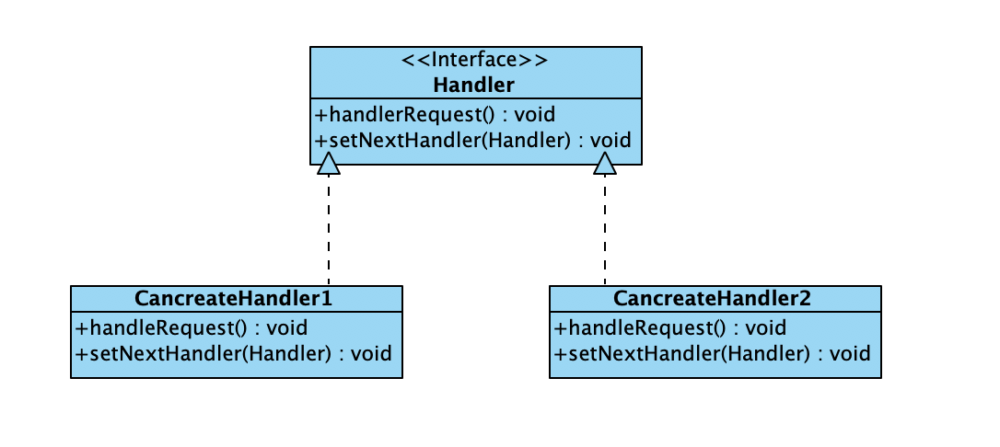
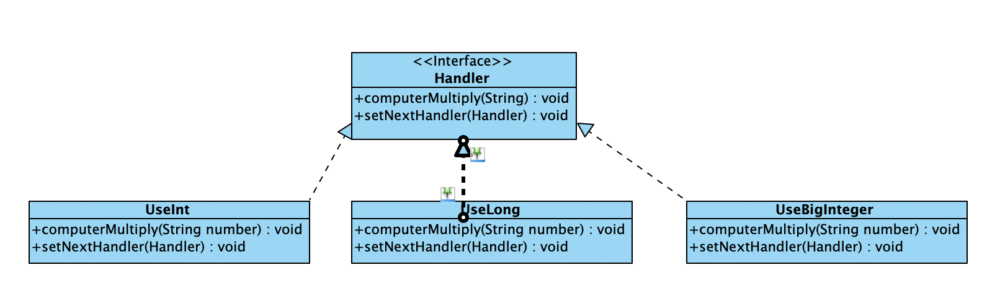

### 责任链模式

使多个对象都有机会处理请求，从而避免请求的发送者和接收者之间的耦合关系，将这些对象形成一条链，并沿着这条链传递该请求，知道有一个对象处理它为止


### 结构

处理者Handler: 处理者是一个接口，负责规定具体处理者处理用户请求的方法以及具体处理者设置后继对象的方法

具体处理者ConcreteHandler：实现处理者接口的实例，处理者通过调用处理者接口的规定方法处理用户的请求，如果能处理则处理，否则反馈无法处理的信息给用户

类图如下：




### 代码

责任链接口
```java
public interface Handler {
    void handleRequest(String number);
    void setNextHandler(Handler handler);
}
```

其中一个实现

```java
public class Beijing implements Handler{
    private Handler handler;

    private ArrayList<String> numberList;

    Beijing(){
        numberList = new ArrayList<>();
        numberList.add("1213123123123");
        numberList.add("5464564004232");
        numberList.add("2108734012383");
        numberList.add("1239977402131");
    }

    @Override
    public void handleRequest(String number) {
        if(numberList.contains(number)){
            System.out.println("该人在北京居住");
        }else{
            System.out.println("该人不在北京居住");
            if(handler!=null){
                //请求传递给下一个处理者
                handler.handleRequest(number);
            }
        }
    }

    @Override
    public void setNextHandler(Handler handler) {
        this.handler = handler;
    }
}
```


创建责任链
```java
public class Application {
    private Handler beijing, shanghai, tianjin;

    public void createChain(){
        beijing = new Beijing();
        shanghai = new Shanghai();
        tianjin = new Tianjin();
        beijing.setNextHandler(shanghai);
        shanghai.setNextHandler(tianjin);
    }

    public void responseClient(String number){
        beijing.handleRequest(number);
    }

    public static void main(String[] args) {
        Application application = new Application();
        application.createChain();
        application.responseClient("2339977402131");
    }
}
```

### 优点

责任链中的对象只和自己和后继是低耦合的关系，和其他对象毫无关系，使得编写非常容易

当在处理者中分配职责时，责任链给应用程序更多的灵活性

应用程序可以动态的增加删除或者重新指派处理者的职责

应用程序可以动态的改变处理者之间的先后顺序

使用责任链的用户无需知道处理者的顺序和信息


### 适用场景

有许多对象处理用户请求，希望程序在运行期间能够自动确定处理用户请求的对象

希望用户不必明确指定接收者的情况下，向多个接收者的一个提交请求

程序希望动态制定可处理用户请求的对象集合

### 案例分析

- 设计一个类，该类对象使用int型的数据计算阶乘，特点是占用内存少，计算速度快

- 设计一个类,该类对象使用long型的数据计算阶乘，虽然占用内存多，但是能计算更大的阶乘

- 设计一个类，该类对象使用BigInteger型的数据计算阶乘，特点是占用内存多，计算速度慢，但是可以计算任意大小的阶乘

- 要求使用责任链模式设计，先使用int然后使用long，最后使用BigInteger,用户请求计算责任链可以计算任意一个数的阶乘

类图如下：



