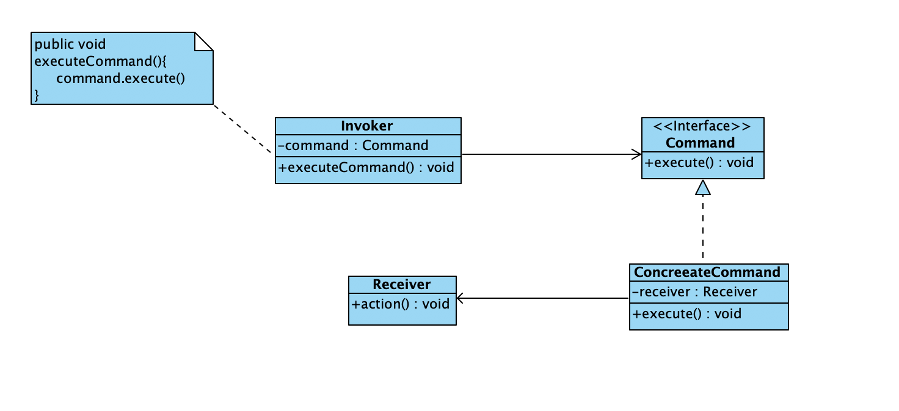
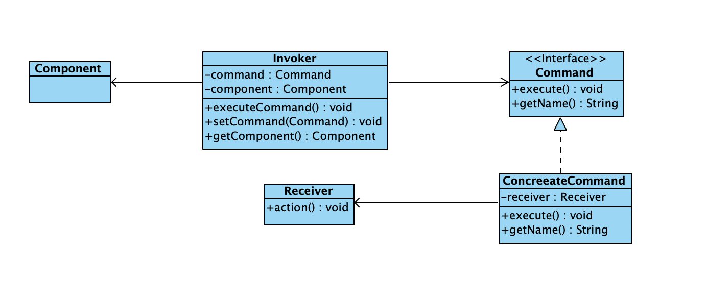
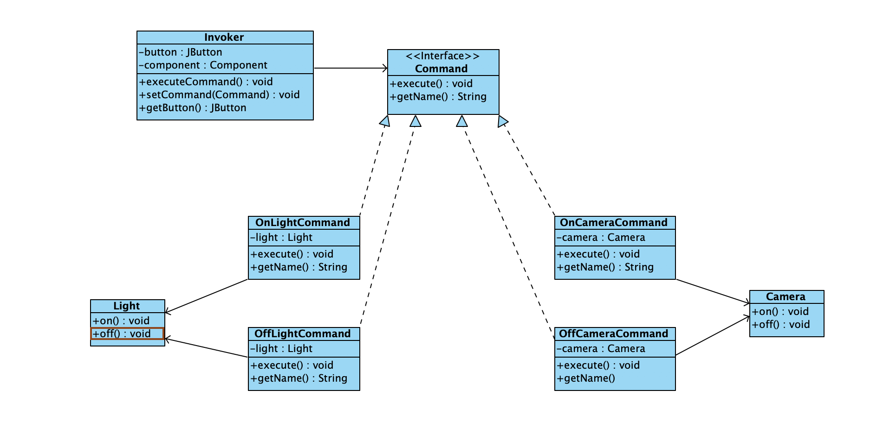

### 命令模式

将一个请求封装为一个对象，从而使用户可用不同的请求对客户进行参数化，对请求排队或者记录请求日志，以及支持可撤销的操作。


### 结构

主要包含四个角色
- 接收者Receiver：接收者是一个类的实例，负责执行与请求相关的操作
- 命令接口Command：命令是一个接口，用于封装请求的若干个方法
- 具体命令ConcreteCommand：实现接口类的实例
- 请求者Invoker：负责调用具体命令




### 案例分析

接收者
```java
public class CompanyArmy {
    public void sneakAttack(){
        System.out.println("我们知道如何偷袭敌人，保证完成任务");
    }
}
```


命令接口
```java
public interface Command {
    void execute();
}
```

具体命令

```java
public class ConcreteCommand implements Command{

    CompanyArmy army;

    public ConcreteCommand(CompanyArmy companyArmy){
        army = companyArmy;
    }

    /**
     * 封装指挥官的指挥请求
     */
    @Override
    public void execute() {
        //偷袭敌人
        army.sneakAttack();
    }
}
```

请求者
```java
public class ArmySuperior {
    Command command;

    public void setCommand(Command command){
        this.command  = command;
    }

    /**
     * 让具体的命令去执行execute()方法
     */
    public void startExecuteCommand(){
        command.execute();
    }
}
```

调用：

```java
public class Application {
    public static void main(String[] args) {
        //创建接收者
        CompanyArmy army = new CompanyArmy();
        //创建具体命令并指定接收者
        Command command = new ConcreteCommand(army);
        //创建请求者
        ArmySuperior superior = new ArmySuperior();
        superior.setCommand(command);
        superior.startExecuteCommand();
    }
}
```

### 优点

- 请求者不直接与接收者交互，解除了彼此之间的耦合
- 满足开闭原则
- 使用命令模式可以记录日志
- 每个请求对应一个具体的命令，因此可以按照一定的顺序执行具体命令


### 适用的情景

程序在不同时刻指定、排列和执行请求
程序需要提供撤销操作
程序需要支持宏操作


### 案例1

使用命令模式改进Java AWT事件，如example4所示， 类图如下



### 案例2

使用命令模式模拟一个带控制开关的小电器

1. 设计Camera类模拟摄像头和Light类模拟照明灯
2. 设计Machine类模拟小电器
3. 要求Machine类有打开、关闭摄像头以及打开关闭照明灯的按钮

类图如下



