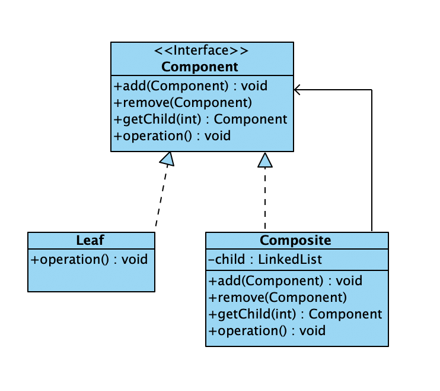

### 组合模式

将对象组合成数形结构以表示“部分-整体”的层次结构。Composite使得用户对单个对象和组合对象的使用具有一致性。

组合模式是关于怎样将对象形成树形结构来表现整体和部分的层次结构的成熟模式。使用组合模式，可以让用户以一致的方式处理个体对象和组合对象。

组合模式的关键在于无论是个体对象还是组合对象都实现了相同的接口或都是同一个抽象类的子类。

### 结构 

抽象组件Component: 定义了个体对象和组合对象需要实现的关于操作其子节点的方法
Composite节点Composite Node: 实现了Component接口，也可以包含其他Composite节点或者Leaf节点的引用
Leaf节点Leaf Node: 实现Composite接口类的实例

如图所示


### 代码

抽象组件

```java
public interface MilitaryPerson {
    void add(MilitaryPerson person) throws NoSuchMethodException;

    void remove(MilitaryPerson person) throws NoSuchMethodException;

    MilitaryPerson getChild(int index) throws NoSuchMethodException;

    Iterator<MilitaryPerson> getAllChildren() throws NoSuchMethodException;

    boolean isLeaf();

    double getSalary();

    void setSalary(double salary);

    @Override
    String toString();
}
```

Composite节点

```java
public class MilitaryOfficer implements MilitaryPerson {
    LinkedList<MilitaryPerson> list;
    String name;
    double salary;

    MilitaryOfficer(String name, double salary) {
        this.name = name;
        this.salary = salary;
        list = new LinkedList<MilitaryPerson>();
    }

    @Override
    public void add(MilitaryPerson person) {
        list.add(person);
    }

    @Override
    public void remove(MilitaryPerson person) {
        list.remove(person);
    }

    @Override
    public MilitaryPerson getChild(int index) {
        return list.get(index);
    }

    @Override
    public Iterator<MilitaryPerson> getAllChildren() {
        return list.iterator();
    }

    @Override
    public boolean isLeaf() {
        return false;
    }

    @Override
    public double getSalary() {
        return salary;
    }

    @Override
    public void setSalary(double salary) {
        this.salary = salary;
    }
}
```

Leaf节点：MilitarySoldier的实例

```java
public class MilitarySoldier implements MilitaryPerson {
    double salary;
    String name;

    MilitarySoldier(String name, double salary) {
        this.name = name;
        this.salary = salary;
    }

    @Override
    public void add(MilitaryPerson person) {
    }

    @Override
    public void remove(MilitaryPerson person) {
    }

    @Override
    public MilitaryPerson getChild(int index) {
        return null;
    }

    @Override
    public Iterator<MilitaryPerson> getAllChildren() {
        return null;
    }

    @Override
    public boolean isLeaf() {
        return true;
    }

    @Override
    public double getSalary() {
        return salary;
    }

    @Override
    public void setSalary(double salary) {
        this.salary = salary;
    }
}
```

军饷计算
```java
public class ComputerSalary {
    public static double computerSalary(MilitaryPerson person) throws NoSuchMethodException {
        double sum=0;
        if(person.isLeaf()==true){
            sum=sum+person.getSalary();
        }
        if(person.isLeaf()==false){
            sum=sum+person.getSalary();
            Iterator<MilitaryPerson> iterator=person.getAllChildren();
            while(iterator.hasNext()){
                MilitaryPerson p= iterator.next();
                sum=sum+computerSalary(p);;
            }
        }
        return sum;
    }
}
```

实际使用
```java
public class Application {
    public static void main(String args[]) throws NoSuchMethodException {
        MilitaryPerson 连长 = new MilitaryOfficer("连长", 5000);
        MilitaryPerson 排长1 = new MilitaryOfficer("一排长", 4000);
        MilitaryPerson 排长2 = new MilitaryOfficer("二排长", 4000);
        MilitaryPerson 班长11 = new MilitaryOfficer("一班长", 2000);
        MilitaryPerson 班长12 = new MilitaryOfficer("二班长", 2000);
        MilitaryPerson 班长13 = new MilitaryOfficer("三班长", 2000);
        MilitaryPerson 班长21 = new MilitaryOfficer("一班长", 2000);
        MilitaryPerson 班长22 = new MilitaryOfficer("二班长", 2000);
        MilitaryPerson 班长23 = new MilitaryOfficer("三班长", 2000);
        MilitaryPerson[] 士兵 = new MilitarySoldier[60];
        for (int i = 0; i < 士兵.length; i++) {
            士兵[i] = new MilitarySoldier("小兵", 1000);
        }
        连长.add(排长1);
        连长.add(排长2);
        排长1.add(班长11);
        排长1.add(班长12);
        排长1.add(班长13);
        排长2.add(班长21);
        排长2.add(班长22);
        排长2.add(班长23);
        for (int i = 0; i <= 9; i++) {
            班长11.add(士兵[i]);
            班长12.add(士兵[i + 10]);
            班长13.add(士兵[i + 20]);
            班长21.add(士兵[i + 30]);
            班长22.add(士兵[i + 40]);
            班长23.add(士兵[i + 50]);
        }
        System.out.println("一排的军饷:" + ComputerSalary.computerSalary(排长1));
        System.out.println("一班的军饷:" + ComputerSalary.computerSalary(班长11));
        System.out.println("全连的军饷:" + ComputerSalary.computerSalary(连长));
    }
}
```

### 优点

- 组合模式中包含有个体对象和组合对象，并形成树形结构，使用户可以方便地处理个体对象和组合对象。
- 组合对象和个体对象实现了相同的接口，用户一般不需区分个体对象和组合对象。
- 当增加新的Composite节点和Leaf节点时，用户的重要代码不需要作出修改。

### 适用场景
- 当想要表示对象的整体和部分层次结构时
- 希望用户采用一致的方法处理个体和组合对象

### 案例分析

一棵苹果树上有2个分支，一个分支上结了10个苹果，另一个分支上结了8个苹果，每个苹果4元钱，当用户发现新的苹果分支时，不需要修改原来的代码即可计算新分支上的苹果重量和价格


