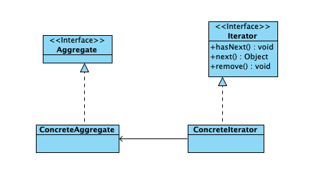

### 迭代器模式

提供一种方法可以顺序访问一个聚合对象中的各个元素，而又不需要暴露对象的内部表示

### 结构

- 集合Aggregate：一个接口，规定了集合需要实现的操作
- 具体集合ConcreteAggregate：实现集合接口的具体实例，按照一定的结构存储对象，具体集合应该有一个方法，返回针对该集合的迭代器
- 迭代器Iterator：一个接口，规定了遍历具体集合的方法，比如next()方法
- 具体迭代器ConcreteIterator: 实现迭代器接口的具体实例

类图



### 代码

使用迭代器遍历元素
```java
public class Application {
    public static void main(String[] args) {
        int n = 20;
        int sum = 0;
        Collection<RenMinMoney> set = new HashSet<>();
        for (int i = 0; i <= n; i++) {
            if (i == n / 2 || i == n / 5 || i == n / 6) {
                set.add(new RenMinMoney(100, false));
            } else {
                set.add(new RenMinMoney(100, true));
            }
        }
        Iterator<RenMinMoney> iterator = set.iterator();
        System.out.println("保险箱中共有" + set.size() + "张人民币。");
        int k = 0;
        while (iterator.hasNext()) {
            RenMinMoney money = iterator.next();
            k++;
            if (!money.isTrue()) {
                System.out.println("第" + k + "张是假币，被销毁");
                iterator.remove();
            }
        }
        System.out.print("保险箱中有真币" + set.size() + "张，共：");
        iterator = set.iterator();
        while (iterator.hasNext()) {
            RenMinMoney money = iterator.next();
            sum += money.getValue();
        }
        System.out.println(sum + "元");
    }
}

class RenMinMoney {
    int value;
    private boolean isTrue;

    public RenMinMoney(int value, boolean isTrue) {
        this.value = value;
        this.isTrue = isTrue;
    }

    public int getValue() {
        return value;
    }

    public boolean isTrue() {
        return isTrue;
    }
}
```

### 优点

- 用户可以实现用迭代器访问其中的元素，而不需要知道这些对象在集合中是如何表示和存储的
- 用户可以同时使用多个迭代器遍历一个集合

### 应用场景

- 让用户访问一个集合中的对象，但不想暴露对象在集合中的存储结构
- 希望对遍历不同的集合提供一个统一的接口


### 应用案例

使用多个集合存储对象

链表适合插入删除等操作，但不适合查找和排序。现在有若干个学生，他们有姓名、学号和出生日期等属性。

1. 使用链表存放学生对象
2. 用一个散列表和一个树集合存放链表中的对象
3. 使用散列表查询某个学生
4. 通过树集合将学生按照成绩排序

