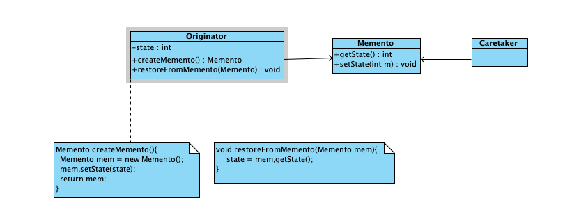

### 备忘录模式

表示一个作用于某对象结构中的各个元素的操作。它使你可以在不改变各个元素的类的前提下定义作用于这些元素的新操作。

备忘录模式是关于怎样保存对象状态的成熟模式，其关键是提供一个备忘录对象，该备忘录负责存储一个对象的状态，程序可以在磁盘或内存中保存这个备忘录，这样一来，程序就可以根据对象的备忘录将该对象恢复到备忘录中所存储的状态。 


### 结构
- 原发者（Originator） 需要在某个时刻保存其状态的对象。负责创建备忘录，然后使用该备忘录记录自己的状态
- 备忘录（Memento） 负责存储原发者状态的对象
- 负责人（Caretaker） 负责管理保存备忘录的对象，可以通过使用对象流将备忘录写入文件




### 代码

原发者是ReadPhrase的实例负责按行读取名字为phrase.txt文件的每一行
```java
public class ReadPhrase implements Serializable {
    long readPosition;     //在文件中的读取的位置
    File file;
    RandomAccessFile in;
    String phrase = null;

    public ReadPhrase(File file) {
        this.file = file;
        try {
            in = new RandomAccessFile(file, "r");
        } catch (IOException exp) {
        }
    }

    public Memento createMemento() {
        Memento mem = new Memento();
        mem.setPositionState(readPosition);
        return mem;
    }

    public void restoreFromMemento(Memento mem) {
        readPosition = mem.getPositionState();
    }

    public String readLine() {
        try {
            in.seek(readPosition);
            phrase = in.readLine();
            if (phrase != null) {
                byte b[] = phrase.getBytes("iso-8859-1");
                phrase = new String(b);
            }
            readPosition = in.getFilePointer();    //获取当前的读取位置
        } catch (IOException exp) {
        }
        return phrase;
    }

    public void closeRead() {
        try {
            in.close();
        } catch (IOException exp) {
        }
    }
}
```

备忘录：备忘录需要保存到com.shgx目录下，这样和ReadPhrase在同一个包下面，可以访问备忘录中的数据，否则不可以访问

```java
public class Memento implements Serializable {
    private long state;

    void setPositionState(long state) {
        this.state = state;
    }

    long getPositionState() {
        return state;
    }
}
```

负责人：Caretaker, 负责管理备忘录

```java
public class Caretaker {
    File file;
    private Memento memento = null;

    Caretaker() {
        file = new File("saveObject.txt");
    }

    public Memento getMemento() {
        if (file.exists()) {
            try {
                FileInputStream in = new FileInputStream("saveObject.txt");
                ObjectInputStream inObject = new ObjectInputStream(in);
                memento = (Memento) inObject.readObject();
            } catch (Exception exp) {
            }
        }
        return memento;
    }

    public void saveMemento(Memento memento) {
        try {
            FileOutputStream out = new FileOutputStream("saveObject.txt");
            ObjectOutputStream outObject = new ObjectOutputStream(out);
            outObject.writeObject(memento);
        } catch (Exception exp) {
        }
    }
}
```

模式的使用
```java
public class Application {
    public static void main(String args[]) {
        Scanner reader = new Scanner(System.in);
        ReadPhrase readPhrase = new ReadPhrase(new File("phrase.txt"));
        File favorPhrase = new File("favorPhrase.txt");
        RandomAccessFile out = null;
        try {
            out = new RandomAccessFile(favorPhrase, "rw");
        } catch (IOException exp) {
        }
        System.out.println("是否从上次读取的位置继续读取成语（输入y或n）");
        String answer = reader.nextLine();
        if (answer.startsWith("y") || answer.startsWith("Y")) {
            Caretaker caretaker = new Caretaker();
            Memento memento = caretaker.getMemento();     //得到备忘录
            if (memento != null)
                readPhrase.restoreFromMemento(memento);  //让readPhrase恢复到备忘录中所存储的状态
        }
        String phrase = null;
        while ((phrase = readPhrase.readLine()) != null) {
            System.out.println(phrase);
            System.out.println("是否将该成语保存到" + favorPhrase.getName() + "(输入y或n)");
            answer = reader.nextLine();
            if (answer.startsWith("y") || answer.startsWith("Y")) {
                try {
                    out.seek(favorPhrase.length());
                    byte[] b = phrase.getBytes();
                    out.write(b);
                    out.writeChar('\n');
                } catch (IOException exp) {
                }
            }
            System.out.println("是否继续读取成语？(输入y或n)");
            answer = reader.nextLine();
            if (answer.startsWith("y") || answer.startsWith("Y"))
                continue;
            else {
                readPhrase.closeRead();
                Caretaker caretaker = new Caretaker();
                caretaker.saveMemento(readPhrase.createMemento());   //将备忘录保存到文件中
                try {
                    out.close();
                } catch (IOException exp) {
                }
                System.exit(0);
            }
        }
        System.out.println("读完全部成语");
    }
}
```


### 优缺点

- 备忘录模式使用备忘录可以把原发者的内部状态保存起来，使得只有很“亲密的”的对象可以访问备忘录中的数据。
- 备忘录模式强调了类设计单一责任原则，即将状态的刻画和保存分开。


### 适用场景
- 必须保存一个对象在某一个时刻的全部或者部分状态，以便在需要时回复该对象先前的状态
- 一个对象不想通过提供能够让其他对象得到自己状态的public权限,比如get***()

### 案例

程序窗体有一个标签组件，可以在标签上单击鼠标左键随机显示一个汉字，但标签上只保存最后一次单击鼠标留下的汉字

程序提供undo操作，当用户在标签上单击鼠标右键时，将取消最近一次单击左键的效果，恢复上一次单击得到的汉字，用户可以多次单击右键取消鼠标左键产生的效果

代码见example