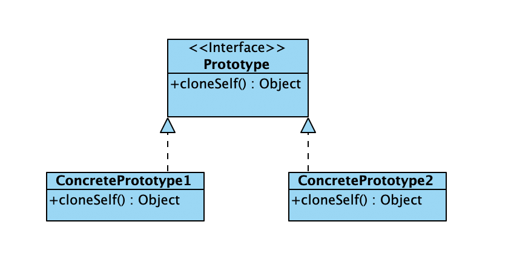

### 原型模式

用原型实例指定创建对象的种类，并且通过拷贝这些原型创建新的对象。原型模式是从一个对象出发得到一个和自己有相同状态的新对象的成熟模式，该模式的关键是将一个对象定义为原型，并为其提供复制自己的方法。 


### clone()方法

实现Cloneable接口，重写clone方法

浅克隆
```java
public class ExampleOne {
    public static void main(String args[]){
        Circle circle=new Circle();
        circle.setRadius(198.99);
        try{
            Circle circleCopy=(Circle)circle.clone();//调用clone()复制自己
            System.out.println("circle对象中的数据："+circle.getRadius());
            System.out.println("circleCopy对象中的数据："+circle.getRadius());
        }
        catch(CloneNotSupportedException exp){}
    }
}

class Circle implements Cloneable{   //实现Cloneable接口
    private double radius;
    public void setRadius(double r){
        radius=r;
    }
    public double getRadius(){
        return radius;
    }
    @Override
    public Object clone() throws CloneNotSupportedException{ //重写clone方法
        Object  object=super.clone();
        return object;
    }
}
```

深克隆

```java
public class ExampleTwo {
    public static void main(String[] args) {
        Geometry geometry = new Geometry(new Rectangle(10, 20), 200);
        System.out.println(geometry.rectangle.m + " " + geometry.rectangle.n);
        try {
            Geometry geometryCopy = (Geometry) geometry.clone();
            System.out.println(geometryCopy.rectangle.m + " " + geometryCopy.rectangle.n);

            geometry.rectangle.m = 111;
            geometry.rectangle.n = 222;
            System.out.println(geometry.rectangle.m + " " + geometry.rectangle.n);
            System.out.println(geometryCopy.rectangle.m + " " + geometryCopy.rectangle.n);
            
        } catch (CloneNotSupportedException exp) {
            System.out.println(exp);
        }
    }
}

class Geometry implements Cloneable {
    int height;
    Rectangle rectangle;

    public Geometry(Rectangle rectangle, int height) {
        this.height = height;
        this.rectangle = rectangle;
    }

    @Override
    public Object clone() throws CloneNotSupportedException {
        Geometry object = (Geometry) super.clone();
        object.rectangle = (Rectangle) rectangle.clone();
        return object;
    }
}

class Rectangle implements Cloneable {
    double m, n;

    public Rectangle(double m, double n) {
        this.m = m;
        this.n = n;
    }

    @Override
    public Object clone() throws CloneNotSupportedException {
        Object object = super.clone();
        return object;
    }
}
```

### 角色

- 抽象原型Prototype：一个接口负责调用对象复制自身的方法
- 具体原型Concrete Prototype：实现抽象原型中的方法

具体的实现类图


### 代码

抽象原型
```java
public interface Prototype {
    Object cloneMe() throws CloneNotSupportedException;
}
```

具体原型
Cubic
```java
public class Cubic implements Prototype, Cloneable{
    double  length,width,height;
    Cubic(double a,double b,double c){
        length=a;
        width=b;
        height=c;
    }
    @Override
    public Object cloneMe() throws CloneNotSupportedException{
        //调用从Object类继承的clone()方法
        Cubic object=(Cubic)clone();
        return object;
    }
}

```

Goat
```java
public class Goat implements Prototype, Serializable {
    StringBuffer color;

    public void setColor(StringBuffer c) {
        color = c;
    }

    public StringBuffer getColor() {
        return color;
    }

    @Override
    public Object cloneMe() throws CloneNotSupportedException { //实现接口中的方法
        Object object = null;
        try {
            ByteArrayOutputStream outOne = new ByteArrayOutputStream();
            ObjectOutputStream outTwo = new ObjectOutputStream(outOne);
            outTwo.writeObject(this);     //将原型对象写入对象输出流
            ByteArrayInputStream inOne =
                    new ByteArrayInputStream(outOne.toByteArray());
            ObjectInputStream inTwo = new ObjectInputStream(inOne);
            object = inTwo.readObject();    //创建新的对象：原型的复制品
        } catch (Exception event) {
            System.out.println(event);
        }
        return object;
    }
}
```

模式的使用

```java
public class Application {
    public static void main(String args[]) {
        Cubic cubic = new Cubic(12, 20, 66);
        System.out.println("cubic的长、宽和高：");
        System.out.println(cubic.length + "," + cubic.width + "," + cubic.height);
        try {
            Cubic cubicCopy = (Cubic) cubic.cloneMe();
            System.out.println("cubicCopy的长、宽和高：");
            System.out.println(cubicCopy.length + "," + cubicCopy.width + ","
                    + cubicCopy.height);
        } catch (CloneNotSupportedException exp) {
        }
        Goat goat = new Goat();
        goat.setColor(new StringBuffer("白颜色的山羊"));
        System.out.println("goat是" + goat.getColor());
        try {
            Goat goatCopy = (Goat) goat.cloneMe();
            System.out.println("goatCopy是" + goatCopy.getColor());
            System.out.println("goatCopy将自己的颜色改变成黑色");
            goatCopy.setColor(new StringBuffer("黑颜色的山羊"));
            System.out.println("goat仍然是" + goat.getColor());
            System.out.println("goatCopy是" + goatCopy.getColor());
        } catch (CloneNotSupportedException exp) {
        }
    }
}
```

### 优点

- 创建新的类需要很大的代价时，需要复制一个已有的实例提高创建的效率
- 可以动态的保存当前对象的状态，运行时可以使用对象流保存当前对象的一个复制品
- 可以在运行时创建新的对象，无需采用类和继承的结构
- 可以动态的增加删除复制品

### 适用场景
- 从一个对象出发得到若干个与其状态相同的对象，并可以独立变化其状态的对象时
- 当创建对象需要独立与它的构造过程和表示时


