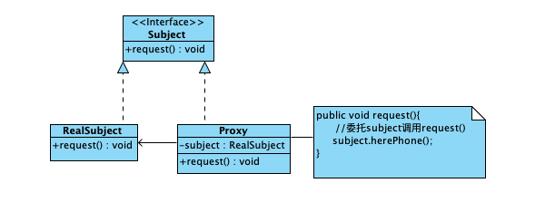

### 代理模式

为其他对象提供一种代理以控制对这个对象的访问。

代理模式是为对象提供一个代理，代理可以控制对它所代理的对象的访问。 

代理模式最常见的两种情况：远程代理和虚拟代理。 


### 结构

- 抽象主题（Subject） 该接口是对象和它的代理共同的接口。
- 实际主题（RealSubject） 实际主题是实现抽象主题接口的类，是代理角色实例所要代理的对象。
- 代理（Proxy） 是实现抽象主题接口的类，可以控制对他所包含的角色的实例的访问。

如图所示：



### 代码

抽象主题的角色是Geometry接口, 用来计算面积

```java
public interface Geometry {
    double getArea();
}
```

具体模板, 计算面积

```java
public class Triangle implements Geometry {
    double sideA, sideB, sideC, area;

    public Triangle(double a, double b, double c) {
        sideA = a;
        sideB = b;
        sideC = c;
    }

    @Override
    public double getArea() {
        double p = (sideA + sideB + sideC) / 2.0;
        area = Math.sqrt(p * (p - sideA) * (p - sideB) * (p - sideC));
        return area;
    }
}

```

代理,让代理对象掉用getArea()方法

```java
public class TriangleProxy implements Geometry {
    double sideA, sideB, sideC;
    Triangle triangle;

    public void setABC(double a, double b, double c) {
        sideA = a;
        sideB = b;
        sideC = c;
    }

    @Override
    public double getArea() {
        if (sideA + sideB > sideC && sideA + sideC > sideB && sideB + sideC > sideA) {
            triangle = new Triangle(sideA, sideB, sideC);
            //让所代理的对象调用getArea()方法
            double area = triangle.getArea();
            return area;
        } else {
            return -1;
        }
    }
}
```

应用
```java
public class Application {
    public static void main(String args[]) {
        Scanner reader = new Scanner(System.in);
        System.out.println("请输入三个数，每输入一个数回车确认");
        double a = -1, b = -1, c = -1;
        a = reader.nextDouble();
        b = reader.nextDouble();
        c = reader.nextDouble();
        TriangleProxy proxy = new TriangleProxy();
        proxy.setABC(a, b, c);
        double area = proxy.getArea();
        System.out.println("面积是：" + area);
    }
}
```

### Java在RMI中如何使用代理模式

服务器端
```java
public interface RemoteSubject extends Remote {
    double getArea() throws RemoteException;
}
```

```java
public class RemoteConcreteSubject extends UnicastRemoteObject implements RemoteSubject {
    double width, height;

    RemoteConcreteSubject(double width, double height) throws RemoteException {
        this.width = width;
        this.height = height;
    }

    @Override
    public double getArea() throws RemoteException {
        return width * height;
    }
}
```

```java
public class RegisterRemoteObject {
    public static void main(String args[]) {
        try {
            RemoteConcreteSubject remoteObject =
                    new RemoteConcreteSubject(12, 88);
            Naming.rebind("rmi://127.0.0.1/rect", remoteObject);
            System.out.println("ready for you server...");
        } catch (Exception exp) {
            System.out.println(exp);
        }
    }
}
```


客户端

```java
public class ClientApplication {
    public static void main(String[] args) {
        try {
            Remote remoteObject = Naming.lookup("rmi://127.0.0.1/rect");
            RemoteSubject remoteSubject = (RemoteSubject) remoteObject;
            double area = remoteSubject.getArea();
            System.out.println("面积：" + area);
        } catch (Exception exp) {
            System.out.println(exp);
        }
    }
}
```

代码见example

### 虚拟代理

创建对象时间太长的时候，使用代理类

代理角色
```java
public class ImageIconProxy implements Icon, Runnable {
    ImageIcon icon;
    URL imageURL;
    Thread loadImage;
    Component c;
    Graphics g;
    int x, y, w = 200, h = 200;

    ImageIconProxy(URL imageURL) {
        this.imageURL = imageURL;
        loadImage = new Thread(this);
    }

    @Override
    public int getIconHeight() {
        if (icon != null)
            h = icon.getIconHeight();
        return h;
    }

    @Override
    public int getIconWidth() {
        if (icon != null)
            w = icon.getIconWidth();
        return w;
    }

    @Override
    public void paintIcon(Component c, Graphics g, int x, int y) {
        if (icon != null) {
            if (icon.getImageLoadStatus() == MediaTracker.COMPLETE)
                icon.paintIcon(c, g, x, y);
            else
                doWork(c, g, x, y);
        } else
            doWork(c, g, x, y);
    }

    private void doWork(Component c, Graphics g, int x, int y) {
        g.drawString("请稍等...", 200, 150);
        this.c = c;
        this.g = g;
        this.x = x;
        this.y = y;
        if (!loadImage.isAlive()) {
            loadImage = new Thread(this);
        }
        try {
            loadImage.start();
        } catch (Exception exp) {
        }
    }

    @Override
    public void run() {
        try {
            icon = new ImageIcon(imageURL);
            if (icon.getImageLoadStatus() == MediaTracker.COMPLETE)
                c.repaint();
        } catch (Exception exp) {
        }
    }
}
```

应用程序
```java
public class Application extends JFrame {
    ImageIconProxy icon;
    JButton button;

    Application() {
        try {
            icon = new ImageIconProxy(new URL("http://127.0.0.1:8080/tv.jpg"));
        } catch (Exception exp) {
        }
        button = new JButton();
        add(button, BorderLayout.CENTER);
        button.setIcon(icon);
        setSize(400, 600);
        setVisible(true);
        setDefaultCloseOperation(JFrame.DISPOSE_ON_CLOSE);
    }

    public static void main(String args[]) {
        new Application();
    }
}
```

代码见example1

### 优缺点

- 代理模式可以屏蔽用户真正请求的对象，使用户程序和真正的对象之间解耦。
- 使用代理来担当那些创建耗时的对象的替身。


### 适用场景

- 程序可能不希望用户直接访问该对象，而是提供一个特殊的对象控制对当前对象的访问
- 如果一个对象需要很长时间才能加载完成
- 对象位于远程主机，需要为用户提供访问远程对象的能力


### 对比

外观模式PK中介者模式：

1.外观模式是结构型模式，中介者模式是行为型模式。

2.外观模式是对子系统提供统一的接口，中介者模式是用一个中介对象来封装一系列同事对象的交互行为。

3.外观模式协议是单向，中介者模式协议是双向。

4.外观模式所有的请求处理都委托给子系统完成，而中介者模式则由中心协调同事类和中心本身共同完成业务。


外观模式PK代理模式：

1.代理模式中的代理角色和真实角色都继承于同一类。而外观模式是多个类的集合。

2.代理角色与真实角色接口相同，功能一致，代理角色实现的是真实角色的功能。外观者模式的子系统功能不同，根据用户不同需要与外观类统一配置。


代理模式PK中介者模式：

1.代理模式是一对一，一个代理只能代表一个对象。中介者模式则是多对多，中介者的功能多样，客户也可以多个。

2.只能代理一方。如果PB是A的代理，那么C可以通过PB访问A，但是A不能通过PB访问B。对于中介者模式而言，A可以通过中介访问B，B也可以通过中介访问A。


### 案例

使用远程代理让用户使用远程机器阅读文件内容

代码见example2


