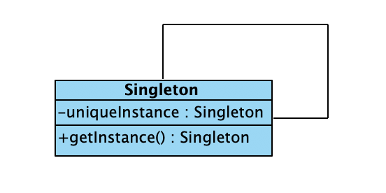

### 单例模式

保证一个类仅有一个实例，并提供一个访问它的全局访问点，单件模式是关于怎样设计一个类，并使得该类只有一个实例的成熟模式，该模式的关键是将类的构造方法设置为private权限，并提供一个返回它的唯一实例的类方法。 

### 结构以及特点

- 包含自身声明的类变量
- 构造函数访问权限为private
- 负责创建自己唯一的一个实例，并提供该实例的类方法

结构图如下



### 代码

创建一个单例的月亮

```java
public class Moon {
    private static Moon uniqueMoon;
    double radius;
    double distanceToEarth;

    private Moon() {
        uniqueMoon = this;
        radius = 1738;
        distanceToEarth = 363300;
    }

    public static synchronized Moon getMoon() {   //这是一个同步方法
        if (uniqueMoon == null) {
            uniqueMoon = new Moon();
        }
        return uniqueMoon;
    }

    public String show() {
        String s = "月亮的半径是" + radius + "km,距地球是" + distanceToEarth + "km";
        return s;
    }
}

```

### 应用举例

设计一个单件类Champion以及多个线程，每个线程从左向右水平移动属于自己的按钮，最先将按钮移动到指定位置的线程为冠军。

