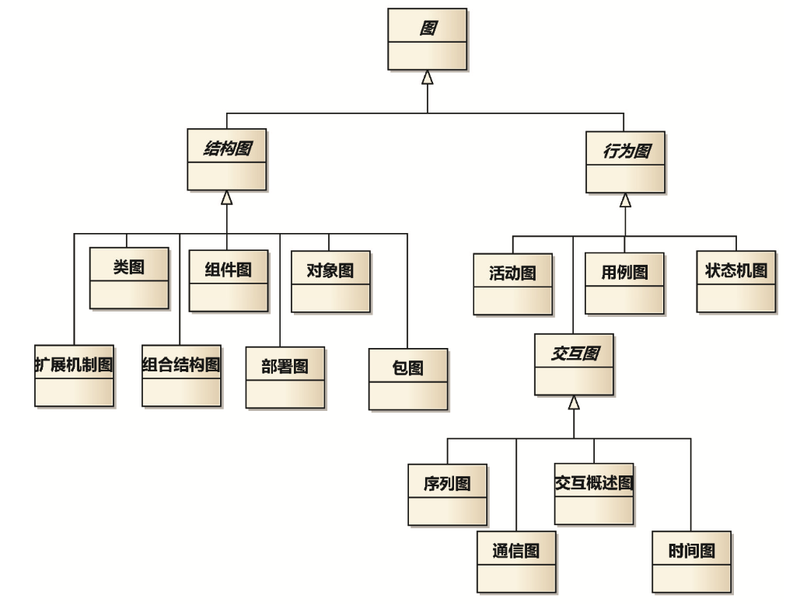

## 建模与UML

### 利润=需求-设计

需求要具体，设计要抽象。或者说，需求，要把产品当项目做;设计，要把项目当产品做。

### 核心工作流

1. 业务建模――描述组织内部各系统如何协作，使得组织可以对外提供服务。新系统只不过是组织为更好提供服务，对自己的内部重新设计而购买的一个零件。如果能学会通过业务建模去推导新系统的需求，而不是拍脑袋得出需求，假的“需求变更”会大大减少。
2. 需求――聚焦于待开发系统的边界，详细描述系统要卖得出去必须具有的外部表现――功能和性能。这项技能 的意义在于强迫我们从“卖”的角度思考哪些是涉众在意的、不能改变的契约，哪些不是，严防“做”污染“卖”。需求工作流的结果――需求规格说明书是“卖”和“做”的衔接点。
3. 分析――提炼系统内需要封装的核心领域机制。可运行的系统需要封装各个领域的知识，其中只有一个领域(核 心域)的知识是系统能在市场上生存的理由。对核心领域作研究，可以帮助我们获得基于核心域的复用。
4. 设计——为了满足质量需求和设计约束，核心领域机制如何映射到选定平台上实现。

“需求”和“设计”两个术语有两种用途。一种用于表达建模得到的结果，例如“需求 和设计不是一一对应的”;另一种用于表达建模的工作流，即需求工作流和设计工作流，例如“我正 在做需求”。希望下面的话能帮助理解:为了得到需求，需要做的建模工作流有业务建模和需求，为
了得到设计，需要做的建模工作流有分析和设计。

### UML 应用于建模工作流

常用的 UML 图形是用例图、类图、序列图三种。针对特 定类型的项目，可以按需要添加图形。例如，开发复杂组织的运营系统，如果在业务建模时不喜欢用 序列图，可以用活动图取代;对于系统中的核心类，可以着重画出状态机图来建模类内部的逻辑;针 对质量要求很高的系统，每一个类可能都需要画状态机图，甚至还要画时间图。

### 基本共识上的沟通

开发人员让我看他的模型时，如果开口说“我先来给你讲讲”，我都会拦住“如果还需要你先 讲讲，说明你所想的没有体现在模型中。”

### 建模和敏捷(Agile)

建模为口号提供了方法。愿景、业务建模方法，帮助迅速定位最重要的需求;领域分析方法，帮 助厘清各种概念的变和不变。

